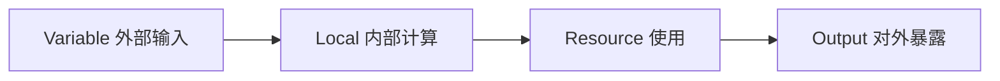

# Variable、Local 与 Output 的正确分工

理解三种数据在配置中承担的不同角色，避免滥用。

## 核心要点

* Variable 适合外部输入：Region、Compartment OCID、环境名称、CIDR、实例规格等，可用 validation 校验取值范围
* Local 适合内部计算：如 name_prefix 拼接、common_tags 统一标签，避免重复书写
* Output 用于对外暴露结果，sensitive = true 只是减少终端显示，不代表数据不会进入 State
* environment 变量常用 validation + contains([...]) 限制取值只能是 dev/stg/prod

---

## 本章测验

本章共 5 道单项选择题。

### 第 1 题

下列哪一项最适合定义为 Variable？

- A. 根据项目名和环境名拼接出的资源前缀
- B. 从 Data Source 查询出的镜像 ID
- C. 统一的标签字典
- D. Compartment OCID 这样的外部输入

选择答案后查看结果

正确答案：D

答案解析：Variable 适合承载外部输入，如 Region、Compartment OCID、环境名称等；拼接前缀和统一标签更适合用 Local 处理。

### 第 2 题

Local 在配置中的主要作用是什么？

- A. 承担内部计算，例如拼接名称前缀或定义公共标签
- B. 接收命令行传入的外部参数
- C. 对外暴露最终结果
- D. 存储敏感密码明文

选择答案后查看结果

正确答案：A

答案解析：文中给出的 Local 示例是 name_prefix 拼接和 common_tags 定义，用于避免在多处重复书写相同逻辑。

### 第 3 题

output 中设置 sensitive = true 的实际效果是什么？

- A. 该数据会被加密后存入 State
- B. 只是减少终端显示，不代表数据不会进入 State
- C. 该数据完全不会被保存
- D. 该输出无法被其他 Module 引用

选择答案后查看结果

正确答案：B

答案解析：文中特别提醒 sensitive = true 只是减少终端显示，并不代表这些数据不会进入 State 文件，仍需注意敏感信息的保护。

### 第 4 题

限制 environment 变量取值只能是 dev、stg 或 prod，应该使用什么方式？

- A. 在 Output 中判断
- B. 在 Provider 中配置
- C. validation 块配合 contains([...], var.environment)
- D. 无法在配置层面限制，只能靠人工检查

选择答案后查看结果

正确答案：C

答案解析：文中示例使用 validation 块，condition = contains(["dev", "stg", "prod"], var.environment) 来限制变量取值范围。

### 第 5 题

下列哪种场景最适合使用 Output？

- A. 接收用户输入的 Region
- B. 拼接资源名称前缀
- C. 定义统一的标签字典
- D. 把 Compute 实例的公网 IP 暴露给使用者或其他 Module

选择答案后查看结果

正确答案：D

答案解析：Output 的作用是对外暴露结果，例如 instance_public_ip 这样的输出，方便使用者或其他 Module 引用。

<!-- QUIZ_DATA_START
{
  "chapter": "12",
  "questions": [
    {
      "id": 1,
      "question": "下列哪一项最适合定义为 Variable？",
      "options": {
        "D": "Compartment OCID 这样的外部输入",
        "A": "根据项目名和环境名拼接出的资源前缀",
        "B": "从 Data Source 查询出的镜像 ID",
        "C": "统一的标签字典"
      },
      "answer": "D",
      "explanation": "Variable 适合承载外部输入，如 Region、Compartment OCID、环境名称等；拼接前缀和统一标签更适合用 Local 处理。"
    },
    {
      "id": 2,
      "question": "Local 在配置中的主要作用是什么？",
      "options": {
        "A": "承担内部计算，例如拼接名称前缀或定义公共标签",
        "B": "接收命令行传入的外部参数",
        "C": "对外暴露最终结果",
        "D": "存储敏感密码明文"
      },
      "answer": "A",
      "explanation": "文中给出的 Local 示例是 name_prefix 拼接和 common_tags 定义，用于避免在多处重复书写相同逻辑。"
    },
    {
      "id": 3,
      "question": "output 中设置 sensitive = true 的实际效果是什么？",
      "options": {
        "B": "只是减少终端显示，不代表数据不会进入 State",
        "A": "该数据会被加密后存入 State",
        "C": "该数据完全不会被保存",
        "D": "该输出无法被其他 Module 引用"
      },
      "answer": "B",
      "explanation": "文中特别提醒 sensitive = true 只是减少终端显示，并不代表这些数据不会进入 State 文件，仍需注意敏感信息的保护。"
    },
    {
      "id": 4,
      "question": "限制 environment 变量取值只能是 dev、stg 或 prod，应该使用什么方式？",
      "options": {
        "C": "validation 块配合 contains([...], var.environment)",
        "A": "在 Output 中判断",
        "B": "在 Provider 中配置",
        "D": "无法在配置层面限制，只能靠人工检查"
      },
      "answer": "C",
      "explanation": "文中示例使用 validation 块，condition = contains([\"dev\", \"stg\", \"prod\"], var.environment) 来限制变量取值范围。"
    },
    {
      "id": 5,
      "question": "下列哪种场景最适合使用 Output？",
      "options": {
        "D": "把 Compute 实例的公网 IP 暴露给使用者或其他 Module",
        "A": "接收用户输入的 Region",
        "B": "拼接资源名称前缀",
        "C": "定义统一的标签字典"
      },
      "answer": "D",
      "explanation": "Output 的作用是对外暴露结果，例如 instance_public_ip 这样的输出，方便使用者或其他 Module 引用。"
    }
  ]
}
QUIZ_DATA_END -->
