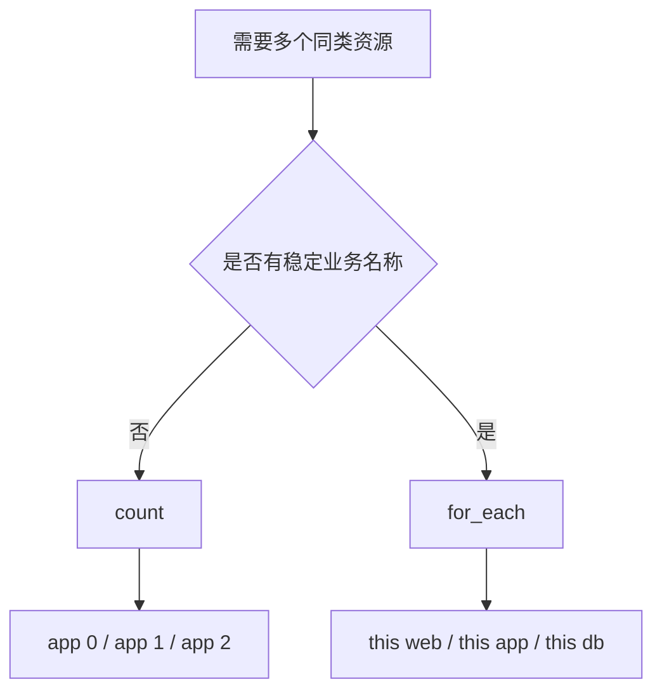

# count 与 for_each：如何创建多个同类资源

对比两种批量创建资源的方式，理解各自的适用场景与风险。

## 核心要点

* count 适合创建同类型、没有稳定业务名称的资源，地址形如 oci_core_instance.app[0]
* count 的问题是：删除列表中间元素时，索引可能变化，导致意外的资源重建
* for_each 使用 map(object({...})) 定义资源集合，地址形如 oci_core_subnet.this["web"]，更稳定
* 生产环境通常更推荐 for_each，因为资源地址不受顺序影响

---

## 本章测验

本章共 5 道单项选择题。

### 第 1 题

使用 count 创建资源时，删除列表中间的一个元素可能导致什么问题？

- A. 后续元素的索引可能变化，导致意外的资源重建
- B. 不会有任何影响
- C. 会自动转换成 for_each
- D. State 文件会被清空

选择答案后查看结果

正确答案：A

答案解析：文中指出 count 的问题是：删除列表中间元素时，索引可能变化，从而影响到本不该变化的其他资源。

### 第 2 题

使用 for_each 时，资源地址的形式是怎样的？

- A. oci_core_subnet.this[0]
- B. oci_core_subnet.this["web"]
- C. oci_core_subnet.web.this
- D. oci_core_subnet[this].web

选择答案后查看结果

正确答案：B

答案解析：for_each 遍历的是 map，因此资源地址使用 key 作为索引，例如 oci_core_subnet.this["web"]，地址更稳定。

### 第 3 题

生产环境中，为什么通常更推荐使用 for_each 而不是 count？

- A. for_each 语法更短
- B. count 已经被官方废弃
- C. for_each 的资源地址不受顺序影响，更稳定
- D. for_each 不需要声明变量类型

选择答案后查看结果

正确答案：C

答案解析：文中明确说明生产环境通常更推荐 for_each，因为资源地址稳定，不会因为中间元素的增删而受到顺序影响。

### 第 4 题

使用 for_each 时，subnets 变量通常定义为怎样的类型？

- A. list(string)
- B. number
- C. bool
- D. map(object({ cidr = string, public = bool }))

选择答案后查看结果

正确答案：D

答案解析：示例中 subnets 变量定义为 map(object({cidr = string, public = bool}))，每个 key（如 web、app、db）对应一组配置。

### 第 5 题

下列哪种场景更适合使用 count 而不是 for_each？

- A. 创建三个完全同质、没有稳定业务名称的实例
- B. 创建 web、app、db 三个具有不同 CIDR 的子网
- C. 为不同环境创建不同配置的资源
- D. 需要用 key 精确引用某个资源

选择答案后查看结果

正确答案：A

答案解析：文中说明 count 适合创建同类型、没有稳定业务名称的资源，比如简单地创建三台配置相同的实例，用索引区分即可。

<!-- QUIZ_DATA_START
{
  "chapter": "13",
  "questions": [
    {
      "id": 1,
      "question": "使用 count 创建资源时，删除列表中间的一个元素可能导致什么问题？",
      "options": {
        "A": "后续元素的索引可能变化，导致意外的资源重建",
        "B": "不会有任何影响",
        "C": "会自动转换成 for_each",
        "D": "State 文件会被清空"
      },
      "answer": "A",
      "explanation": "文中指出 count 的问题是：删除列表中间元素时，索引可能变化，从而影响到本不该变化的其他资源。"
    },
    {
      "id": 2,
      "question": "使用 for_each 时，资源地址的形式是怎样的？",
      "options": {
        "B": "oci_core_subnet.this[\"web\"]",
        "A": "oci_core_subnet.this[0]",
        "C": "oci_core_subnet.web.this",
        "D": "oci_core_subnet[this].web"
      },
      "answer": "B",
      "explanation": "for_each 遍历的是 map，因此资源地址使用 key 作为索引，例如 oci_core_subnet.this[\"web\"]，地址更稳定。"
    },
    {
      "id": 3,
      "question": "生产环境中，为什么通常更推荐使用 for_each 而不是 count？",
      "options": {
        "C": "for_each 的资源地址不受顺序影响，更稳定",
        "A": "for_each 语法更短",
        "B": "count 已经被官方废弃",
        "D": "for_each 不需要声明变量类型"
      },
      "answer": "C",
      "explanation": "文中明确说明生产环境通常更推荐 for_each，因为资源地址稳定，不会因为中间元素的增删而受到顺序影响。"
    },
    {
      "id": 4,
      "question": "使用 for_each 时，subnets 变量通常定义为怎样的类型？",
      "options": {
        "D": "map(object({ cidr = string, public = bool }))",
        "A": "list(string)",
        "B": "number",
        "C": "bool"
      },
      "answer": "D",
      "explanation": "示例中 subnets 变量定义为 map(object({cidr = string, public = bool}))，每个 key（如 web、app、db）对应一组配置。"
    },
    {
      "id": 5,
      "question": "下列哪种场景更适合使用 count 而不是 for_each？",
      "options": {
        "A": "创建三个完全同质、没有稳定业务名称的实例",
        "B": "创建 web、app、db 三个具有不同 CIDR 的子网",
        "C": "为不同环境创建不同配置的资源",
        "D": "需要用 key 精确引用某个资源"
      },
      "answer": "A",
      "explanation": "文中说明 count 适合创建同类型、没有稳定业务名称的资源，比如简单地创建三台配置相同的实例，用索引区分即可。"
    }
  ]
}
QUIZ_DATA_END -->
