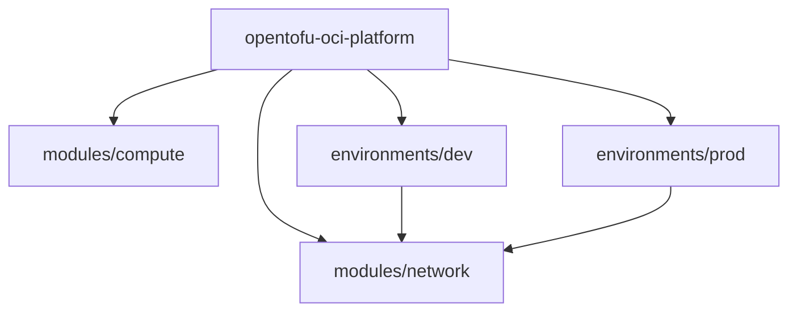

# Module 设计：从单文件走向可复用架构

当代码越来越多，应该把资源拆分为可复用的 Module，而不是全部堆在一个目录。

## 核心要点

* 推荐结构：modules/ 下存放 network、compute、database、monitoring 等可复用模块，environments/ 下存放 dev、stg、prod
* Module 可以来自本地目录、Registry、GitHub 或其他 Git 地址
* Root Module 调用子模块时通过 source 指定路径，例如 source = "../../modules/network"
* Provider 配置应主要放在 Root Module 中，因为它是整个配置范围内的全局对象，可以跨模块传递

---

## 本章测验

本章共 5 道单项选择题。

### 第 1 题

推荐的项目结构中，environments/ 目录下通常存放什么？

- A. 不同云厂商的 Provider 插件
- B. dev、stg、prod 等不同环境各自的配置
- C. 所有的 .terraform.lock.hcl 文件
- D. 所有的 State 备份

选择答案后查看结果

正确答案：B

答案解析：推荐结构中 environments/ 下按 dev、stg、prod 划分子目录，每个环境有自己的 main.tf、variables.tf 和 terraform.tfvars。

### 第 2 题

Module 的来源可以是下列哪些？

- A. 只能是本地目录
- B. 只能是官方 Registry
- C. 本地目录、Registry、GitHub 或其他 Git 地址
- D. 只能通过邮件发送的压缩包

选择答案后查看结果

正确答案：C

答案解析：文中说明 OpenTofu Module 可以来自本地目录、Registry、GitHub 或其他 Git 地址，具有较大的灵活性。

### 第 3 题

Root Module 调用子模块时，通过什么参数指定模块路径？

- A. path
- B. location
- C. import
- D. source

选择答案后查看结果

正确答案：D

答案解析：示例中 module "network" 块使用 source = "../../modules/network" 指定子模块的位置。

### 第 4 题

关于 Provider 配置的放置位置，文中的建议是什么？

- A. 应主要放在 Root Module 中，因为它是全局对象，可以跨模块传递
- B. 应该分散放在每个子模块中
- C. Provider 配置不需要出现在任何地方
- D. 只能放在 State 文件里

选择答案后查看结果

正确答案：A

答案解析：文中强调 Provider 配置应主要放在 Root Module 中，因为它是整个配置范围内的全局对象，可以跨模块传递。

### 第 5 题

Root Module 与 Child Module 的分工原则是什么？

- A. 两者职责完全相同，可以互换
- B. Root Module 负责 Provider、环境配置、模块组合；Child Module 负责某一类可复用基础设施
- C. Child Module 负责认证信息，Root Module 负责业务逻辑
- D. Root Module 不能引用任何 Child Module 的输出

选择答案后查看结果

正确答案：B

答案解析：文中明确指出这一重要原则：Root Module 负责 Provider、环境配置和模块组合，Child Module 负责某一类可复用的基础设施。

<!-- QUIZ_DATA_START
{
  "chapter": "14",
  "questions": [
    {
      "id": 1,
      "question": "推荐的项目结构中，environments/ 目录下通常存放什么？",
      "options": {
        "B": "dev、stg、prod 等不同环境各自的配置",
        "A": "不同云厂商的 Provider 插件",
        "C": "所有的 .terraform.lock.hcl 文件",
        "D": "所有的 State 备份"
      },
      "answer": "B",
      "explanation": "推荐结构中 environments/ 下按 dev、stg、prod 划分子目录，每个环境有自己的 main.tf、variables.tf 和 terraform.tfvars。"
    },
    {
      "id": 2,
      "question": "Module 的来源可以是下列哪些？",
      "options": {
        "C": "本地目录、Registry、GitHub 或其他 Git 地址",
        "A": "只能是本地目录",
        "B": "只能是官方 Registry",
        "D": "只能通过邮件发送的压缩包"
      },
      "answer": "C",
      "explanation": "文中说明 OpenTofu Module 可以来自本地目录、Registry、GitHub 或其他 Git 地址，具有较大的灵活性。"
    },
    {
      "id": 3,
      "question": "Root Module 调用子模块时，通过什么参数指定模块路径？",
      "options": {
        "D": "source",
        "A": "path",
        "B": "location",
        "C": "import"
      },
      "answer": "D",
      "explanation": "示例中 module \"network\" 块使用 source = \"../../modules/network\" 指定子模块的位置。"
    },
    {
      "id": 4,
      "question": "关于 Provider 配置的放置位置，文中的建议是什么？",
      "options": {
        "A": "应主要放在 Root Module 中，因为它是全局对象，可以跨模块传递",
        "B": "应该分散放在每个子模块中",
        "C": "Provider 配置不需要出现在任何地方",
        "D": "只能放在 State 文件里"
      },
      "answer": "A",
      "explanation": "文中强调 Provider 配置应主要放在 Root Module 中，因为它是整个配置范围内的全局对象，可以跨模块传递。"
    },
    {
      "id": 5,
      "question": "Root Module 与 Child Module 的分工原则是什么？",
      "options": {
        "B": "Root Module 负责 Provider、环境配置、模块组合；Child Module 负责某一类可复用基础设施",
        "A": "两者职责完全相同，可以互换",
        "C": "Child Module 负责认证信息，Root Module 负责业务逻辑",
        "D": "Root Module 不能引用任何 Child Module 的输出"
      },
      "answer": "B",
      "explanation": "文中明确指出这一重要原则：Root Module 负责 Provider、环境配置和模块组合，Child Module 负责某一类可复用的基础设施。"
    }
  ]
}
QUIZ_DATA_END -->
