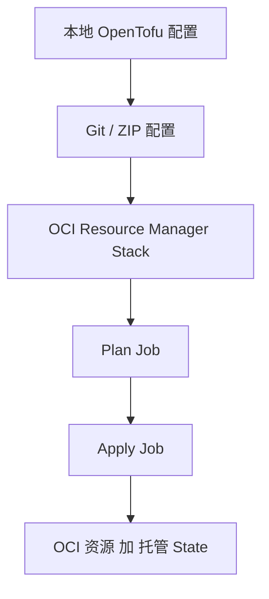

# State 管理与 OCI Resource Manager

本地 State 在团队协作中会带来哪些风险，OCI Resource Manager 又能提供什么。

## 核心要点

* 本地 State 的风险：不同开发者电脑上的 State 可能不一致，导致重复创建、误删除或并发 Apply
* OCI Resource Manager 是 Oracle 提供的基础设施自动化服务，可以集中管理配置、运行任务以及 State
* 采用 Resource Manager 前，应确认它当前支持的 Terraform/OpenTofu 版本和 Provider 版本
* Resource Manager 的执行环境不一定与本地最新 OpenTofu 完全一致

---

## 本章测验

本章共 5 道单项选择题。

### 第 1 题

本地 State 在团队协作中可能带来的风险不包括下列哪一项？

- A. 重复创建资源
- B. 误删除资源
- C. 自动生成账单报表
- D. 并发 Apply 冲突

选择答案后查看结果

正确答案：C

答案解析：文中列出的本地 State 风险是重复创建资源、误删除资源、并发 Apply、State 丢失、敏感数据泄漏，并未提到自动生成账单报表。

### 第 2 题

OCI Resource Manager 的主要作用是什么？

- A. 只能用来监控网络流量
- B. 替代 OCI IAM 进行权限管理
- C. 专门用于备份数据库
- D. 集中管理配置、运行任务以及 State，供多团队共享

选择答案后查看结果

正确答案：D

答案解析：文中说明 OCI Resource Manager 是 Oracle 提供的基础设施自动化服务，可以集中管理配置、运行任务以及 State，使多个团队和平台共享基础设施配置与状态。

### 第 3 题

在采用 OCI Resource Manager 之前，文中建议先确认什么？

- A. 确认它当前支持的 Terraform/OpenTofu 版本和 Provider 版本
- B. 确认公司股价
- C. 确认所有员工是否已离职
- D. 无需确认任何内容，直接使用即可

选择答案后查看结果

正确答案：A

答案解析：文中提醒 Resource Manager 的执行环境不一定与本地最新 OpenTofu 完全一致，采用前应确认其支持的版本。

### 第 4 题

使用 OCI Resource Manager 的典型流程顺序是什么？

- A. Apply Job → Plan Job → Stack
- B. 本地配置 → Git/ZIP → Resource Manager Stack → Plan Job → Apply Job
- C. 直接跳过 Plan，只有 Apply
- D. State 先手工创建，再上传配置

选择答案后查看结果

正确答案：B

答案解析：文中流程图展示的顺序是：本地 OpenTofu/Terraform → Git 或 ZIP 配置 → OCI Resource Manager Stack → Plan Job → Apply Job → OCI 资源与托管 State。

### 第 5 题

为什么多个开发者各自维护本地 State 容易出问题？

- A. 因为本地电脑没有网络
- B. 因为本地无法安装 OpenTofu
- C. 因为每个人的 State 可能完全不同，却都以为自己在管理同一套资源
- D. 因为本地 State 会自动同步到云端

选择答案后查看结果

正确答案：C

答案解析：文中举例说明默认情况下开发者 A、开发者 B 和 CI 服务器各自的 terraform.tfstate 可能完全不同，结果是三方都以为自己管理同一套 OCI 资源，实际上并不同步。

<!-- QUIZ_DATA_START
{
  "chapter": "15",
  "questions": [
    {
      "id": 1,
      "question": "本地 State 在团队协作中可能带来的风险不包括下列哪一项？",
      "options": {
        "C": "自动生成账单报表",
        "A": "重复创建资源",
        "B": "误删除资源",
        "D": "并发 Apply 冲突"
      },
      "answer": "C",
      "explanation": "文中列出的本地 State 风险是重复创建资源、误删除资源、并发 Apply、State 丢失、敏感数据泄漏，并未提到自动生成账单报表。"
    },
    {
      "id": 2,
      "question": "OCI Resource Manager 的主要作用是什么？",
      "options": {
        "D": "集中管理配置、运行任务以及 State，供多团队共享",
        "A": "只能用来监控网络流量",
        "B": "替代 OCI IAM 进行权限管理",
        "C": "专门用于备份数据库"
      },
      "answer": "D",
      "explanation": "文中说明 OCI Resource Manager 是 Oracle 提供的基础设施自动化服务，可以集中管理配置、运行任务以及 State，使多个团队和平台共享基础设施配置与状态。"
    },
    {
      "id": 3,
      "question": "在采用 OCI Resource Manager 之前，文中建议先确认什么？",
      "options": {
        "A": "确认它当前支持的 Terraform/OpenTofu 版本和 Provider 版本",
        "B": "确认公司股价",
        "C": "确认所有员工是否已离职",
        "D": "无需确认任何内容，直接使用即可"
      },
      "answer": "A",
      "explanation": "文中提醒 Resource Manager 的执行环境不一定与本地最新 OpenTofu 完全一致，采用前应确认其支持的版本。"
    },
    {
      "id": 4,
      "question": "使用 OCI Resource Manager 的典型流程顺序是什么？",
      "options": {
        "B": "本地配置 → Git/ZIP → Resource Manager Stack → Plan Job → Apply Job",
        "A": "Apply Job → Plan Job → Stack",
        "C": "直接跳过 Plan，只有 Apply",
        "D": "State 先手工创建，再上传配置"
      },
      "answer": "B",
      "explanation": "文中流程图展示的顺序是：本地 OpenTofu/Terraform → Git 或 ZIP 配置 → OCI Resource Manager Stack → Plan Job → Apply Job → OCI 资源与托管 State。"
    },
    {
      "id": 5,
      "question": "为什么多个开发者各自维护本地 State 容易出问题？",
      "options": {
        "C": "因为每个人的 State 可能完全不同，却都以为自己在管理同一套资源",
        "A": "因为本地电脑没有网络",
        "B": "因为本地无法安装 OpenTofu",
        "D": "因为本地 State 会自动同步到云端"
      },
      "answer": "C",
      "explanation": "文中举例说明默认情况下开发者 A、开发者 B 和 CI 服务器各自的 terraform.tfstate 可能完全不同，结果是三方都以为自己管理同一套 OCI 资源，实际上并不同步。"
    }
  ]
}
QUIZ_DATA_END -->
