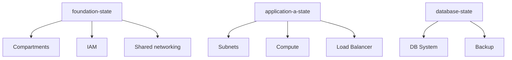

# State 拆分原则

不要把整个公司的所有 OCI 资源放进一个 State，理解如何按边界拆分。

## 核心要点

* 不要把整个公司所有 OCI 资源放进一个 State
* 示例拆分：foundation-state（Compartments/IAM/共享网络）、application-a-state（Subnet/Compute/LB）、database-state（DB System/Backup/Vault）
* 拆分依据：生命周期不同、权限边界不同、团队不同、变更频率不同、故障影响范围不同
* State 拆分是 State 管理从“能用”走向“能在生产环境安全使用”的关键一步

---

## 本章测验

本章共 5 道单项选择题。

### 第 1 题

文中反对的做法是什么？

- A. 按团队拆分 State
- B. 为数据库单独建立 State
- C. 为共享网络单独建立 State
- D. 把整个公司所有 OCI 资源放进一个 State

选择答案后查看结果

正确答案：D

答案解析：文中明确指出“不要把整个公司所有 OCI 资源放进一个 State”，这是 State 拆分一章的核心原则。

### 第 2 题

foundation-state 示例中通常包含哪些内容？

- A. Compartments、IAM、共享网络
- B. DB System 和 Backup
- C. Subnet 和 Load Balancer
- D. Vault 集成

选择答案后查看结果

正确答案：A

答案解析：示例中 foundation-state 包含 Compartments、IAM、Shared networking，属于最底层、变更频率较低的基础设施。

### 第 3 题

下列哪一项不是文中列出的 State 拆分依据？

- A. 生命周期不同
- B. 服务器品牌不同
- C. 权限边界不同
- D. 团队不同

选择答案后查看结果

正确答案：B

答案解析：文中列出的拆分依据是生命周期不同、权限边界不同、团队不同、变更频率不同、故障影响范围不同，没有提到服务器品牌。

### 第 4 题

application-a-state 示例中通常包含什么？

- A. Compartments 和 IAM
- B. DB System 和 Backup
- C. Subnets、Compute、Load Balancer
- D. Vault Secrets 和 Notifications

选择答案后查看结果

正确答案：C

答案解析：示例中 application-a-state 包含 Subnets、Compute、Load Balancer，属于应用层的基础设施。

### 第 5 题

为什么要按“故障影响范围”拆分 State？

- A. 为了让所有资源都在同一个 State 里更方便查看
- B. 因为 OCI 强制要求这样做
- C. 因为拆分后不再需要 Plan
- D. 为了避免一个 State 出问题时影响到不相关的资源

选择答案后查看结果

正确答案：D

答案解析：拆分 State 的核心目的之一就是缩小单个 State 出问题（如损坏、误操作）时波及的资源范围，这正是“故障影响范围不同”这一依据的意义。

<!-- QUIZ_DATA_START
{
  "chapter": "16",
  "questions": [
    {
      "id": 1,
      "question": "文中反对的做法是什么？",
      "options": {
        "D": "把整个公司所有 OCI 资源放进一个 State",
        "A": "按团队拆分 State",
        "B": "为数据库单独建立 State",
        "C": "为共享网络单独建立 State"
      },
      "answer": "D",
      "explanation": "文中明确指出“不要把整个公司所有 OCI 资源放进一个 State”，这是 State 拆分一章的核心原则。"
    },
    {
      "id": 2,
      "question": "foundation-state 示例中通常包含哪些内容？",
      "options": {
        "A": "Compartments、IAM、共享网络",
        "B": "DB System 和 Backup",
        "C": "Subnet 和 Load Balancer",
        "D": "Vault 集成"
      },
      "answer": "A",
      "explanation": "示例中 foundation-state 包含 Compartments、IAM、Shared networking，属于最底层、变更频率较低的基础设施。"
    },
    {
      "id": 3,
      "question": "下列哪一项不是文中列出的 State 拆分依据？",
      "options": {
        "B": "服务器品牌不同",
        "A": "生命周期不同",
        "C": "权限边界不同",
        "D": "团队不同"
      },
      "answer": "B",
      "explanation": "文中列出的拆分依据是生命周期不同、权限边界不同、团队不同、变更频率不同、故障影响范围不同，没有提到服务器品牌。"
    },
    {
      "id": 4,
      "question": "application-a-state 示例中通常包含什么？",
      "options": {
        "C": "Subnets、Compute、Load Balancer",
        "A": "Compartments 和 IAM",
        "B": "DB System 和 Backup",
        "D": "Vault Secrets 和 Notifications"
      },
      "answer": "C",
      "explanation": "示例中 application-a-state 包含 Subnets、Compute、Load Balancer，属于应用层的基础设施。"
    },
    {
      "id": 5,
      "question": "为什么要按“故障影响范围”拆分 State？",
      "options": {
        "D": "为了避免一个 State 出问题时影响到不相关的资源",
        "A": "为了让所有资源都在同一个 State 里更方便查看",
        "B": "因为 OCI 强制要求这样做",
        "C": "因为拆分后不再需要 Plan"
      },
      "answer": "D",
      "explanation": "拆分 State 的核心目的之一就是缩小单个 State 出问题（如损坏、误操作）时波及的资源范围，这正是“故障影响范围不同”这一依据的意义。"
    }
  ]
}
QUIZ_DATA_END -->
