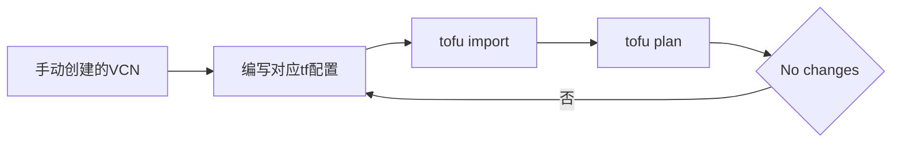

# 导入现有 OCI 资源：tofu import

很多公司不是从零开始，学习如何把手动创建的资源接管进 OpenTofu 管理。

## 核心要点

* 先写出与现有资源匹配的资源配置块，再执行 tofu import 资源地址 真实OCID
* 导入后运行 tofu plan，持续调整代码，直到出现 No changes
* No changes 才表示代码、State 和真实 OCI 资源基本一致
* 这是一个需要反复迭代的过程，而不是一次导入就能完全匹配

---

## 本章测验

本章共 5 道单项选择题。

### 第 1 题

导入现有 OCI 资源的第一步是什么？

- A. 先写出与现有资源匹配的资源配置块
- B. 直接执行 tofu import，不需要先写配置
- C. 先删除现有资源再重新创建
- D. 先修改 State 文件

选择答案后查看结果

正确答案：A

答案解析：文中示例先写出 resource "oci_core_vcn" "existing" 配置块，再执行 tofu import 命令进行导入。

### 第 2 题

tofu import 命令需要提供哪两项参数？

- A. Region 和用户名
- B. 资源地址和真实 OCID
- C. 文件名和端口号
- D. Provider 名称和密码

选择答案后查看结果

正确答案：B

答案解析：示例命令是 tofu import oci_core_vcn.existing ocid1.vcn.oc1.ap-tokyo-1.xxxxx，需要提供资源地址和对应的真实 OCID。

### 第 3 题

导入后如何判断代码与真实资源已经完全匹配？

- A. 运行 tofu destroy 没有报错
- B. 运行 tofu fmt 没有报错
- C. 运行 tofu plan 显示 No changes
- D. State 文件大小不再变化

选择答案后查看结果

正确答案：C

答案解析：文中说明持续调整代码，直到 tofu plan 输出 No changes，才表示代码、State 和真实 OCI 资源基本一致。

### 第 4 题

如果导入后第一次 tofu plan 显示有差异，应该怎么做？

- A. 忽略差异，直接 apply
- B. 删除该资源重新创建
- C. 放弃使用 OpenTofu 管理该资源
- D. 持续调整配置代码，直到差异消失

选择答案后查看结果

正确答案：D

答案解析：文中描述的过程是“持续调整代码，直到 No changes”，说明导入通常需要反复迭代配置才能与真实资源完全对齐。

### 第 5 题

为什么很多公司需要用到 tofu import？

- A. 因为很多公司已经手动创建了资源，需要接管进 OpenTofu
- B. 因为所有公司都是从零开始搭建基础设施
- C. 因为 import 是创建新资源的唯一方式
- D. 因为 import 可以跳过认证配置

选择答案后查看结果

正确答案：A

答案解析：文中开篇指出“很多公司不是从零开始，OCI 中可能已经手动创建了 VCN”，这正是需要导入功能的原因。

<!-- QUIZ_DATA_START
{
  "chapter": "17",
  "questions": [
    {
      "id": 1,
      "question": "导入现有 OCI 资源的第一步是什么？",
      "options": {
        "A": "先写出与现有资源匹配的资源配置块",
        "B": "直接执行 tofu import，不需要先写配置",
        "C": "先删除现有资源再重新创建",
        "D": "先修改 State 文件"
      },
      "answer": "A",
      "explanation": "文中示例先写出 resource \"oci_core_vcn\" \"existing\" 配置块，再执行 tofu import 命令进行导入。"
    },
    {
      "id": 2,
      "question": "tofu import 命令需要提供哪两项参数？",
      "options": {
        "B": "资源地址和真实 OCID",
        "A": "Region 和用户名",
        "C": "文件名和端口号",
        "D": "Provider 名称和密码"
      },
      "answer": "B",
      "explanation": "示例命令是 tofu import oci_core_vcn.existing ocid1.vcn.oc1.ap-tokyo-1.xxxxx，需要提供资源地址和对应的真实 OCID。"
    },
    {
      "id": 3,
      "question": "导入后如何判断代码与真实资源已经完全匹配？",
      "options": {
        "C": "运行 tofu plan 显示 No changes",
        "A": "运行 tofu destroy 没有报错",
        "B": "运行 tofu fmt 没有报错",
        "D": "State 文件大小不再变化"
      },
      "answer": "C",
      "explanation": "文中说明持续调整代码，直到 tofu plan 输出 No changes，才表示代码、State 和真实 OCI 资源基本一致。"
    },
    {
      "id": 4,
      "question": "如果导入后第一次 tofu plan 显示有差异，应该怎么做？",
      "options": {
        "D": "持续调整配置代码，直到差异消失",
        "A": "忽略差异，直接 apply",
        "B": "删除该资源重新创建",
        "C": "放弃使用 OpenTofu 管理该资源"
      },
      "answer": "D",
      "explanation": "文中描述的过程是“持续调整代码，直到 No changes”，说明导入通常需要反复迭代配置才能与真实资源完全对齐。"
    },
    {
      "id": 5,
      "question": "为什么很多公司需要用到 tofu import？",
      "options": {
        "A": "因为很多公司已经手动创建了资源，需要接管进 OpenTofu",
        "B": "因为所有公司都是从零开始搭建基础设施",
        "C": "因为 import 是创建新资源的唯一方式",
        "D": "因为 import 可以跳过认证配置"
      },
      "answer": "A",
      "explanation": "文中开篇指出“很多公司不是从零开始，OCI 中可能已经手动创建了 VCN”，这正是需要导入功能的原因。"
    }
  ]
}
QUIZ_DATA_END -->
