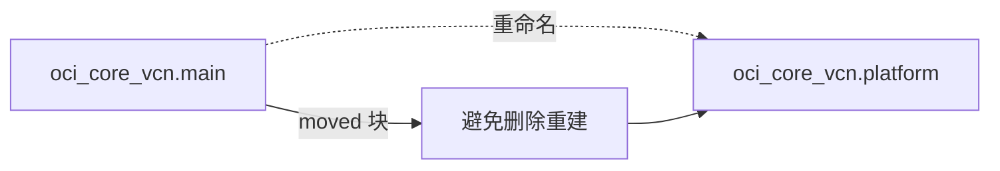

# 重构资源而不破坏基础设施：moved 块

重命名资源或迁移到模块时，如何避免 OpenTofu 误判为删除重建。

## 核心要点

* 直接重命名资源（如 main 改为 platform），OpenTofu 默认可能理解为删除 main、创建 platform
* 正确方法是增加 moved 块：from = 旧地址，to = 新地址
* 模块重构也可以用 moved 块处理，例如从根资源迁移到 module.network 内部资源
* 这是生产环境中非常重要的能力，避免因代码整理而意外重建关键资源

---

## 本章测验

本章共 5 道单项选择题。

### 第 1 题

如果直接把 resource "oci_core_vcn" "main" 重命名为 "platform"，OpenTofu 默认会怎么理解？

- A. 自动识别为重命名，不会有任何变化
- B. 默认可能理解为删除 main、创建 platform
- C. 会报错并拒绝执行
- D. 自动生成 moved 块

选择答案后查看结果

正确答案：B

答案解析：文中说明 OpenTofu 默认可能把这种重命名理解为“删除 main，创建 platform”，这在生产环境中是危险的。

### 第 2 题

正确处理资源重命名、避免删除重建的方法是什么？

- A. 手工编辑 State 文件
- B. 先 destroy 再 apply
- C. 增加 moved 块，指定 from 和 to
- D. 修改 Provider 版本

选择答案后查看结果

正确答案：C

答案解析：文中示例展示了 moved { from = oci_core_vcn.main; to = oci_core_vcn.platform }，这是正确的重构方式。

### 第 3 题

moved 块是否也可以用于模块重构？

- A. 不可以，只能用于同一层级的资源重命名
- B. 只能用于删除资源
- C. 只能用于变量重命名
- D. 可以，例如从根资源迁移到 module.network 内部资源

选择答案后查看结果

正确答案：D

答案解析：文中给出示例 moved { from = oci_core_vcn.main; to = module.network.oci_core_vcn.this }，说明 moved 块也适用于模块重构场景。

### 第 4 题

为什么说 moved 块在生产环境中非常重要？

- A. 因为它能避免代码整理导致关键资源被意外删除重建
- B. 因为它可以加快 apply 速度
- C. 因为它可以替代认证配置
- D. 因为它可以跳过 State 文件

选择答案后查看结果

正确答案：A

答案解析：文中强调这是生产环境非常重要的能力，目的是在重构代码结构时不破坏已经运行的真实基础设施。

### 第 5 题

使用 moved 块时，from 和 to 分别代表什么？

- A. from 是新地址，to 是旧地址
- B. from 是旧的资源地址，to 是新的资源地址
- C. from 和 to 都必须是模块名称
- D. from 表示 Provider，to 表示 Region

选择答案后查看结果

正确答案：B

答案解析：示例中 from 指向重命名或迁移前的资源地址，to 指向重命名或迁移后的资源地址。

<!-- QUIZ_DATA_START
{
  "chapter": "18",
  "questions": [
    {
      "id": 1,
      "question": "如果直接把 resource \"oci_core_vcn\" \"main\" 重命名为 \"platform\"，OpenTofu 默认会怎么理解？",
      "options": {
        "B": "默认可能理解为删除 main、创建 platform",
        "A": "自动识别为重命名，不会有任何变化",
        "C": "会报错并拒绝执行",
        "D": "自动生成 moved 块"
      },
      "answer": "B",
      "explanation": "文中说明 OpenTofu 默认可能把这种重命名理解为“删除 main，创建 platform”，这在生产环境中是危险的。"
    },
    {
      "id": 2,
      "question": "正确处理资源重命名、避免删除重建的方法是什么？",
      "options": {
        "C": "增加 moved 块，指定 from 和 to",
        "A": "手工编辑 State 文件",
        "B": "先 destroy 再 apply",
        "D": "修改 Provider 版本"
      },
      "answer": "C",
      "explanation": "文中示例展示了 moved { from = oci_core_vcn.main; to = oci_core_vcn.platform }，这是正确的重构方式。"
    },
    {
      "id": 3,
      "question": "moved 块是否也可以用于模块重构？",
      "options": {
        "D": "可以，例如从根资源迁移到 module.network 内部资源",
        "A": "不可以，只能用于同一层级的资源重命名",
        "B": "只能用于删除资源",
        "C": "只能用于变量重命名"
      },
      "answer": "D",
      "explanation": "文中给出示例 moved { from = oci_core_vcn.main; to = module.network.oci_core_vcn.this }，说明 moved 块也适用于模块重构场景。"
    },
    {
      "id": 4,
      "question": "为什么说 moved 块在生产环境中非常重要？",
      "options": {
        "A": "因为它能避免代码整理导致关键资源被意外删除重建",
        "B": "因为它可以加快 apply 速度",
        "C": "因为它可以替代认证配置",
        "D": "因为它可以跳过 State 文件"
      },
      "answer": "A",
      "explanation": "文中强调这是生产环境非常重要的能力，目的是在重构代码结构时不破坏已经运行的真实基础设施。"
    },
    {
      "id": 5,
      "question": "使用 moved 块时，from 和 to 分别代表什么？",
      "options": {
        "B": "from 是旧的资源地址，to 是新的资源地址",
        "A": "from 是新地址，to 是旧地址",
        "C": "from 和 to 都必须是模块名称",
        "D": "from 表示 Provider，to 表示 Region"
      },
      "answer": "B",
      "explanation": "示例中 from 指向重命名或迁移前的资源地址，to 指向重命名或迁移后的资源地址。"
    }
  ]
}
QUIZ_DATA_END -->
