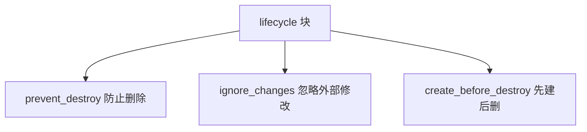

# 生命周期控制：lifecycle 块

通过 prevent_destroy、ignore_changes 和 create_before_destroy 精细控制资源行为。

## 核心要点

* prevent_destroy = true 可以防止关键资源被 tofu destroy 删除，适合生产数据库、核心 VCN、Vault 等
* prevent_destroy 只是 OpenTofu 侧的保护，不是 OCI Console 或 API 层面的绝对保护
* ignore_changes 用于忽略外部系统修改的属性，但不要滥用 ignore_changes = all，否则失去漂移检测意义
* create_before_destroy 适合支持新旧资源并存的场景，但要确认名称、配额、IP/DNS 是否会冲突

---

## 本章测验

本章共 5 道单项选择题。

### 第 1 题

prevent_destroy = true 的作用是什么？

- A. 让资源自动备份
- B. 让资源自动扩容
- C. 防止该资源被 tofu destroy 删除
- D. 让资源免费使用

选择答案后查看结果

正确答案：C

答案解析：文中说明设置 prevent_destroy = true 后，即使运行 tofu destroy，也会因为该资源而失败，从而起到保护作用。

### 第 2 题

prevent_destroy 提供的保护是什么级别的？

- A. OCI API 层面的绝对保护，任何人都无法删除
- B. 只在开发环境生效
- C. 只对 Compute 资源生效
- D. 只是 OpenTofu 侧的保护，不是 OCI Console 或 API 层面的绝对保护

选择答案后查看结果

正确答案：D

答案解析：文中特别提醒，prevent_destroy 只是 OpenTofu 侧的保护，并不能阻止有人直接在 OCI Console 或通过 API 删除该资源。

### 第 3 题

关于 ignore_changes，文中提醒不要怎样使用？

- A. 不要滥用 ignore_changes = all
- B. 不要用于任何标签属性
- C. 不要与 lifecycle 块一起使用
- D. 不要用于生产环境资源

选择答案后查看结果

正确答案：A

答案解析：文中明确提醒不要滥用 ignore_changes = all，否则 OpenTofu 几乎失去检测漂移的意义。

### 第 4 题

使用 create_before_destroy 时，需要额外确认什么？

- A. 只需要确认网络带宽是否足够
- B. 资源名称是否允许重复、配额是否足够、IP/DNS 是否冲突
- C. 只需要确认 State 文件大小
- D. 不需要任何额外确认

选择答案后查看结果

正确答案：B

答案解析：文中提醒使用 create_before_destroy 时必须确认资源名称是否允许重复、配额是否足够、IP、DNS 或唯一标识是否冲突。

### 第 5 题

prevent_destroy 适合用于下列哪类资源？

- A. 临时测试用的 Compute 实例
- B. 任何计划很快就要删除的资源
- C. 生产数据库、核心 VCN、Vault、重要 Object Storage Bucket
- D. 所有资源，无一例外

选择答案后查看结果

正确答案：C

答案解析：文中列出的适用场景是生产数据库、核心 VCN、Vault、重要 Object Storage Bucket 这类需要重点保护的关键资源。

<!-- QUIZ_DATA_START
{
  "chapter": "19",
  "questions": [
    {
      "id": 1,
      "question": "prevent_destroy = true 的作用是什么？",
      "options": {
        "C": "防止该资源被 tofu destroy 删除",
        "A": "让资源自动备份",
        "B": "让资源自动扩容",
        "D": "让资源免费使用"
      },
      "answer": "C",
      "explanation": "文中说明设置 prevent_destroy = true 后，即使运行 tofu destroy，也会因为该资源而失败，从而起到保护作用。"
    },
    {
      "id": 2,
      "question": "prevent_destroy 提供的保护是什么级别的？",
      "options": {
        "D": "只是 OpenTofu 侧的保护，不是 OCI Console 或 API 层面的绝对保护",
        "A": "OCI API 层面的绝对保护，任何人都无法删除",
        "B": "只在开发环境生效",
        "C": "只对 Compute 资源生效"
      },
      "answer": "D",
      "explanation": "文中特别提醒，prevent_destroy 只是 OpenTofu 侧的保护，并不能阻止有人直接在 OCI Console 或通过 API 删除该资源。"
    },
    {
      "id": 3,
      "question": "关于 ignore_changes，文中提醒不要怎样使用？",
      "options": {
        "A": "不要滥用 ignore_changes = all",
        "B": "不要用于任何标签属性",
        "C": "不要与 lifecycle 块一起使用",
        "D": "不要用于生产环境资源"
      },
      "answer": "A",
      "explanation": "文中明确提醒不要滥用 ignore_changes = all，否则 OpenTofu 几乎失去检测漂移的意义。"
    },
    {
      "id": 4,
      "question": "使用 create_before_destroy 时，需要额外确认什么？",
      "options": {
        "B": "资源名称是否允许重复、配额是否足够、IP/DNS 是否冲突",
        "A": "只需要确认网络带宽是否足够",
        "C": "只需要确认 State 文件大小",
        "D": "不需要任何额外确认"
      },
      "answer": "B",
      "explanation": "文中提醒使用 create_before_destroy 时必须确认资源名称是否允许重复、配额是否足够、IP、DNS 或唯一标识是否冲突。"
    },
    {
      "id": 5,
      "question": "prevent_destroy 适合用于下列哪类资源？",
      "options": {
        "C": "生产数据库、核心 VCN、Vault、重要 Object Storage Bucket",
        "A": "临时测试用的 Compute 实例",
        "B": "任何计划很快就要删除的资源",
        "D": "所有资源，无一例外"
      },
      "answer": "C",
      "explanation": "文中列出的适用场景是生产数据库、核心 VCN、Vault、重要 Object Storage Bucket 这类需要重点保护的关键资源。"
    }
  ]
}
QUIZ_DATA_END -->
