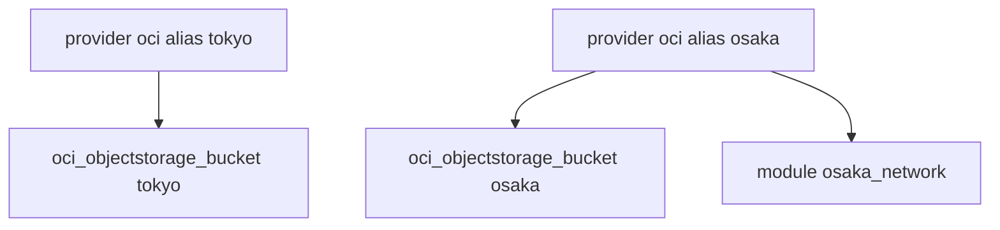

# 多区域与 Provider Alias

如何用同一套代码同时管理东京和大阪两个区域的资源。

## 核心要点

* 通过 alias 定义多个 Provider 实例，如 alias = "tokyo" 和 alias = "osaka"，各自指定不同 region
* 资源通过 provider = oci.tokyo 或 provider = oci.osaka 指定使用哪个 Provider 实例
* 传给 Module 时使用 providers = { oci = oci.osaka } 这种映射语法
* 多区域架构常用于灾备（DR）场景，如 dr-osaka 前缀命名

---

## 本章测验

本章共 5 道单项选择题。

### 第 1 题

如何在同一份配置中定义指向不同 Region 的多个 Provider？

- A. 必须为每个 Region 创建单独的项目
- B. OpenTofu 不支持多 Region 配置
- C. 通过修改 State 文件手动区分
- D. 使用 alias 参数定义多个 Provider 实例

选择答案后查看结果

正确答案：D

答案解析：文中示例使用 alias = "tokyo" 和 alias = "osaka" 分别定义了两个指向不同 Region 的 Provider 实例。

### 第 2 题

资源要使用大阪区域的 Provider，应该怎样声明？

- A. provider = oci.osaka
- B. region = "osaka"
- C. alias = "osaka"
- D. location = "osaka"

选择答案后查看结果

正确答案：A

答案解析：示例中 oci_objectstorage_bucket "osaka" 资源块内使用 provider = oci.osaka 来指定使用哪个 Provider 实例。

### 第 3 题

将带 alias 的 Provider 传给子 Module 时，使用什么语法？

- A. alias = oci.osaka
- B. providers = { oci = oci.osaka }
- C. provider_map = osaka
- D. region_override = osaka

选择答案后查看结果

正确答案：B

答案解析：文中示例在 module "osaka_network" 块中使用 providers = { oci = oci.osaka } 将特定 Provider 实例传给子模块。

### 第 4 题

文中提到的多区域架构常用于什么场景？

- A. 仅用于测试环境
- B. 仅用于开发者个人练习
- C. 灾备（DR）场景，如 dr-osaka 前缀命名
- D. 用于替代 IAM 权限管理

选择答案后查看结果

正确答案：C

答案解析：示例中 module "osaka_network" 使用了 name_prefix = "dr-osaka"，体现出多区域架构常用于灾备（DR）场景。

### 第 5 题

不使用 alias 的默认 Provider 与带 alias 的 Provider 有什么关系？

- A. 带 alias 的 Provider 会覆盖默认 Provider
- B. 一份配置中只能存在一个 Provider，不能共存
- C. alias 只能用于同一个 Region
- D. 两者完全独立，互不影响，可以同时在同一份配置中共存

选择答案后查看结果

正确答案：D

答案解析：文中示例中 provider "oci"（alias = tokyo）和 provider "oci"（alias = osaka）是两个独立的 Provider 实例，可以在同一份配置中共存，分别管理不同区域的资源。

<!-- QUIZ_DATA_START
{
  "chapter": "20",
  "questions": [
    {
      "id": 1,
      "question": "如何在同一份配置中定义指向不同 Region 的多个 Provider？",
      "options": {
        "D": "使用 alias 参数定义多个 Provider 实例",
        "A": "必须为每个 Region 创建单独的项目",
        "B": "OpenTofu 不支持多 Region 配置",
        "C": "通过修改 State 文件手动区分"
      },
      "answer": "D",
      "explanation": "文中示例使用 alias = \"tokyo\" 和 alias = \"osaka\" 分别定义了两个指向不同 Region 的 Provider 实例。"
    },
    {
      "id": 2,
      "question": "资源要使用大阪区域的 Provider，应该怎样声明？",
      "options": {
        "A": "provider = oci.osaka",
        "B": "region = \"osaka\"",
        "C": "alias = \"osaka\"",
        "D": "location = \"osaka\""
      },
      "answer": "A",
      "explanation": "示例中 oci_objectstorage_bucket \"osaka\" 资源块内使用 provider = oci.osaka 来指定使用哪个 Provider 实例。"
    },
    {
      "id": 3,
      "question": "将带 alias 的 Provider 传给子 Module 时，使用什么语法？",
      "options": {
        "B": "providers = { oci = oci.osaka }",
        "A": "alias = oci.osaka",
        "C": "provider_map = osaka",
        "D": "region_override = osaka"
      },
      "answer": "B",
      "explanation": "文中示例在 module \"osaka_network\" 块中使用 providers = { oci = oci.osaka } 将特定 Provider 实例传给子模块。"
    },
    {
      "id": 4,
      "question": "文中提到的多区域架构常用于什么场景？",
      "options": {
        "C": "灾备（DR）场景，如 dr-osaka 前缀命名",
        "A": "仅用于测试环境",
        "B": "仅用于开发者个人练习",
        "D": "用于替代 IAM 权限管理"
      },
      "answer": "C",
      "explanation": "示例中 module \"osaka_network\" 使用了 name_prefix = \"dr-osaka\"，体现出多区域架构常用于灾备（DR）场景。"
    },
    {
      "id": 5,
      "question": "不使用 alias 的默认 Provider 与带 alias 的 Provider 有什么关系？",
      "options": {
        "D": "两者完全独立，互不影响，可以同时在同一份配置中共存",
        "A": "带 alias 的 Provider 会覆盖默认 Provider",
        "B": "一份配置中只能存在一个 Provider，不能共存",
        "C": "alias 只能用于同一个 Region"
      },
      "answer": "D",
      "explanation": "文中示例中 provider \"oci\"（alias = tokyo）和 provider \"oci\"（alias = osaka）是两个独立的 Provider 实例，可以在同一份配置中共存，分别管理不同区域的资源。"
    }
  ]
}
QUIZ_DATA_END -->
