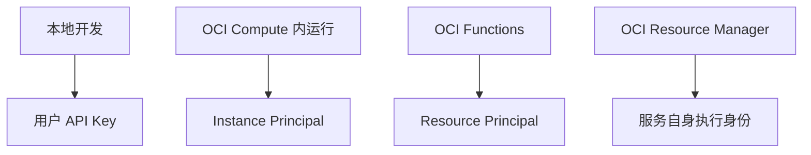

# 生产环境认证方式的选择

本地开发用 API Key 没问题，但生产 CI/CD 需要更谨慎的认证策略。

## 核心要点

* 生产 CI/CD 不应该把长期私钥直接写进 GitHub Repository
* GitHub Actions 建议使用加密 Secrets 或短期认证机制
* OCI Compute 内运行的工作负载可以使用 Instance Principal，OCI Functions 可以使用 Resource Principal
* 总原则：本地开发用用户 API Key，OCI 工作负载用动态身份，CI/CD 优先使用最小权限、短期凭证

---

## 本章测验

本章共 5 道单项选择题。

### 第 1 题

生产 CI/CD 环境中，文中明确不建议的做法是什么？

- A. 把长期私钥直接写进 GitHub Repository
- B. 使用加密 Secrets
- C. 使用短期认证机制
- D. 使用最小权限原则

选择答案后查看结果

正确答案：A

答案解析：文中明确指出生产 CI/CD 不应该把长期私钥直接写进 GitHub Repository，这是明显的安全风险。

### 第 2 题

在 OCI Compute 内运行的工作负载，推荐使用什么认证机制？

- A. 用户 API Key
- B. Instance Principal
- C. 短信验证码
- D. 匿名访问

选择答案后查看结果

正确答案：B

答案解析：文中列出 OCI Compute 内运行的工作负载适合使用 Instance Principal 这种动态身份认证机制。

### 第 3 题

OCI Functions 适合使用哪种认证机制？

- A. Instance Principal
- B. 用户 API Key
- C. Resource Principal
- D. 匿名访问

选择答案后查看结果

正确答案：C

答案解析：文中列出 OCI Functions 适合使用 Resource Principal，这是专门为 Functions 设计的身份机制。

### 第 4 题

文中总结的认证原则中，本地开发应该使用什么？

- A. Instance Principal
- B. Resource Principal
- C. 共享账号密码
- D. 用户 API Key

选择答案后查看结果

正确答案：D

答案解析：文中总结的原则是：本地开发用用户 API Key，OCI 工作负载用动态身份，CI/CD 优先使用最小权限、短期凭证。

### 第 5 题

CI/CD 环境认证的总体原则是什么？

- A. 最小权限、短期凭证优先
- B. 使用尽可能长期有效的凭证以减少维护成本
- C. 所有 CI/CD 任务共用一个管理员账号
- D. 不需要任何认证即可运行

选择答案后查看结果

正确答案：A

答案解析：文中总结原则明确指出 CI/CD 应优先使用最小权限、短期凭证，而不是长期存在的高权限凭证。

<!-- QUIZ_DATA_START
{
  "chapter": "21",
  "questions": [
    {
      "id": 1,
      "question": "生产 CI/CD 环境中，文中明确不建议的做法是什么？",
      "options": {
        "A": "把长期私钥直接写进 GitHub Repository",
        "B": "使用加密 Secrets",
        "C": "使用短期认证机制",
        "D": "使用最小权限原则"
      },
      "answer": "A",
      "explanation": "文中明确指出生产 CI/CD 不应该把长期私钥直接写进 GitHub Repository，这是明显的安全风险。"
    },
    {
      "id": 2,
      "question": "在 OCI Compute 内运行的工作负载，推荐使用什么认证机制？",
      "options": {
        "B": "Instance Principal",
        "A": "用户 API Key",
        "C": "短信验证码",
        "D": "匿名访问"
      },
      "answer": "B",
      "explanation": "文中列出 OCI Compute 内运行的工作负载适合使用 Instance Principal 这种动态身份认证机制。"
    },
    {
      "id": 3,
      "question": "OCI Functions 适合使用哪种认证机制？",
      "options": {
        "C": "Resource Principal",
        "A": "Instance Principal",
        "B": "用户 API Key",
        "D": "匿名访问"
      },
      "answer": "C",
      "explanation": "文中列出 OCI Functions 适合使用 Resource Principal，这是专门为 Functions 设计的身份机制。"
    },
    {
      "id": 4,
      "question": "文中总结的认证原则中，本地开发应该使用什么？",
      "options": {
        "D": "用户 API Key",
        "A": "Instance Principal",
        "B": "Resource Principal",
        "C": "共享账号密码"
      },
      "answer": "D",
      "explanation": "文中总结的原则是：本地开发用用户 API Key，OCI 工作负载用动态身份，CI/CD 优先使用最小权限、短期凭证。"
    },
    {
      "id": 5,
      "question": "CI/CD 环境认证的总体原则是什么？",
      "options": {
        "A": "最小权限、短期凭证优先",
        "B": "使用尽可能长期有效的凭证以减少维护成本",
        "C": "所有 CI/CD 任务共用一个管理员账号",
        "D": "不需要任何认证即可运行"
      },
      "answer": "A",
      "explanation": "文中总结原则明确指出 CI/CD 应优先使用最小权限、短期凭证，而不是长期存在的高权限凭证。"
    }
  ]
}
QUIZ_DATA_END -->
