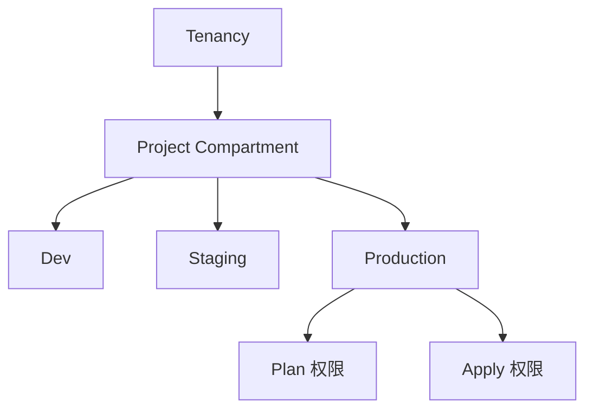

# OCI IAM 权限设计

认证成功不代表有权限创建资源，理解如何设计合理的 IAM Policy。

## 核心要点

* 认证成功不代表有权限创建资源，需要单独设计 IAM Policy
* 推荐逐步缩小权限，按 Compartment 层级划分 Dev / Staging / Production
* 示例 Policy 只授予特定 family（如 virtual-network-family、instance-family）在特定 Compartment 的权限
* 生产环境最好把“能够生成 Plan 的权限”和“能够执行 Apply 的权限”在流程上分开

---

## 本章测验

本章共 5 道单项选择题。

### 第 1 题

文中反对的权限设计做法是什么？

- A. 按 Compartment 逐步缩小权限
- B. 直接给 Allow group Developers to manage all-resources in tenancy
- C. 为不同环境设置不同的组
- D. 把 Plan 权限和 Apply 权限分开

选择答案后查看结果

正确答案：B

答案解析：文中明确指出“不要学习时就直接给 Allow group Developers to manage all-resources in tenancy”这种过大的权限。

### 第 2 题

推荐的权限设计思路是什么？

- A. 所有环境共用同一组权限
- B. 只在 Tenancy 层级设置一次权限即可
- C. 按 Tenancy → Project Compartment → Dev/Staging/Production 逐步缩小权限
- D. 不需要区分环境

选择答案后查看结果

正确答案：C

答案解析：文中推荐按 Compartment 层级组织，Tenancy 下有 Project Compartment，再细分 Dev、Staging、Production，并按环境设置不同的组。

### 第 3 题

示例 Policy 中，Allow group OpenTofuDevelopers to manage virtual-network-family in compartment Development 的含义是什么？

- A. 允许该组管理整个租户的所有资源
- B. 允许该组删除数据库
- C. 允许该组管理账单
- D. 允许该组在 Development Compartment 中管理网络相关资源

选择答案后查看结果

正确答案：D

答案解析：这条 Policy 只授予 OpenTofuDevelopers 组在 Development Compartment 中管理 virtual-network-family（网络相关资源）的权限，范围明确受限。

### 第 4 题

生产环境中，文中建议把哪两种权限在流程上分开？

- A. 能够生成 Plan 的权限和能够执行 Apply 的权限
- B. 读权限和写权限
- C. 开发权限和测试权限
- D. 网络权限和存储权限

选择答案后查看结果

正确答案：A

答案解析：文中明确建议生产环境最好把“能够生成 Plan 的权限”和“能够执行 Apply 的权限”在流程上分开，以增加变更的可控性。

### 第 5 题

下列哪一组更符合文中推荐的按环境分组的命名思路？

- A. Admin1、Admin2、Admin3
- B. OpenTofu-Dev-Admin、OpenTofu-Staging-Operator、OpenTofu-Prod-Plan、OpenTofu-Prod-Apply
- C. 所有环境共用一个组 AllAccess
- D. 按字母表随机命名

选择答案后查看结果

正确答案：B

答案解析：文中示例给出的分组正是 OpenTofu-Dev-Admin、OpenTofu-Staging-Operator、OpenTofu-Prod-Plan、OpenTofu-Prod-Apply 这种按环境和权限细分的命名方式。

<!-- QUIZ_DATA_START
{
  "chapter": "22",
  "questions": [
    {
      "id": 1,
      "question": "文中反对的权限设计做法是什么？",
      "options": {
        "B": "直接给 Allow group Developers to manage all-resources in tenancy",
        "A": "按 Compartment 逐步缩小权限",
        "C": "为不同环境设置不同的组",
        "D": "把 Plan 权限和 Apply 权限分开"
      },
      "answer": "B",
      "explanation": "文中明确指出“不要学习时就直接给 Allow group Developers to manage all-resources in tenancy”这种过大的权限。"
    },
    {
      "id": 2,
      "question": "推荐的权限设计思路是什么？",
      "options": {
        "C": "按 Tenancy → Project Compartment → Dev/Staging/Production 逐步缩小权限",
        "A": "所有环境共用同一组权限",
        "B": "只在 Tenancy 层级设置一次权限即可",
        "D": "不需要区分环境"
      },
      "answer": "C",
      "explanation": "文中推荐按 Compartment 层级组织，Tenancy 下有 Project Compartment，再细分 Dev、Staging、Production，并按环境设置不同的组。"
    },
    {
      "id": 3,
      "question": "示例 Policy 中，Allow group OpenTofuDevelopers to manage virtual-network-family in compartment Development 的含义是什么？",
      "options": {
        "D": "允许该组在 Development Compartment 中管理网络相关资源",
        "A": "允许该组管理整个租户的所有资源",
        "B": "允许该组删除数据库",
        "C": "允许该组管理账单"
      },
      "answer": "D",
      "explanation": "这条 Policy 只授予 OpenTofuDevelopers 组在 Development Compartment 中管理 virtual-network-family（网络相关资源）的权限，范围明确受限。"
    },
    {
      "id": 4,
      "question": "生产环境中，文中建议把哪两种权限在流程上分开？",
      "options": {
        "A": "能够生成 Plan 的权限和能够执行 Apply 的权限",
        "B": "读权限和写权限",
        "C": "开发权限和测试权限",
        "D": "网络权限和存储权限"
      },
      "answer": "A",
      "explanation": "文中明确建议生产环境最好把“能够生成 Plan 的权限”和“能够执行 Apply 的权限”在流程上分开，以增加变更的可控性。"
    },
    {
      "id": 5,
      "question": "下列哪一组更符合文中推荐的按环境分组的命名思路？",
      "options": {
        "B": "OpenTofu-Dev-Admin、OpenTofu-Staging-Operator、OpenTofu-Prod-Plan、OpenTofu-Prod-Apply",
        "A": "Admin1、Admin2、Admin3",
        "C": "所有环境共用一个组 AllAccess",
        "D": "按字母表随机命名"
      },
      "answer": "B",
      "explanation": "文中示例给出的分组正是 OpenTofu-Dev-Admin、OpenTofu-Staging-Operator、OpenTofu-Prod-Plan、OpenTofu-Prod-Apply 这种按环境和权限细分的命名方式。"
    }
  ]
}
QUIZ_DATA_END -->
