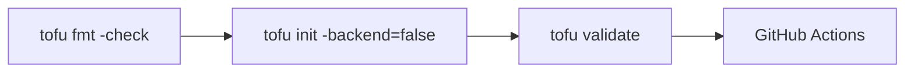

# 代码质量与 CI 自动检查

在提交代码前和 CI 流水线中，如何自动发现问题、保证代码质量。

## 核心要点

* 提交前建议运行：tofu fmt -check -recursive、tofu init -backend=false、tofu validate
* 完整 CI 可以加入 TFLint、Checkov、Trivy config、OPA/Conftest 以及自定义命名和标签检查
* GitHub Actions 示例：checkout → setup-opentofu → fmt check → init → validate
* 实际 plan 需要 OCI 凭证，应配置为受控环境，避免不可信 Fork 的代码直接读取生产 Secrets

---

## 本章测验

本章共 5 道单项选择题。

### 第 1 题

提交代码前建议运行的三个命令组合是什么？

- A. tofu apply、tofu destroy、tofu import
- B. 只运行 tofu apply 即可
- C. 只运行 git commit 即可
- D. tofu fmt -check -recursive、tofu init -backend=false、tofu validate

选择答案后查看结果

正确答案：D

答案解析：文中建议每次提交前运行 tofu fmt -check -recursive、tofu init -backend=false、tofu validate 这三步。

### 第 2 题

下列哪一项不是文中提到的完整 CI 检查工具？

- A. Photoshop
- B. TFLint
- C. Checkov
- D. OPA / Conftest

选择答案后查看结果

正确答案：A

答案解析：文中列出的完整 CI 检查工具包括 TFLint、Checkov、Trivy config、OPA/Conftest 以及自定义命名和标签检查，没有 Photoshop。

### 第 3 题

GitHub Actions 示例工作流中，检查代码格式使用的命令是什么？

- A. tofu apply -check
- B. tofu fmt -check -recursive
- C. tofu destroy -check
- D. tofu import -check

选择答案后查看结果

正确答案：B

答案解析：示例 workflow 的 Format check 步骤运行的正是 tofu fmt -check -recursive。

### 第 4 题

为什么 CI 中执行 tofu init 时常加上 -backend=false？

- A. 因为这样可以直接创建资源
- B. 因为这是唯一的初始化方式
- C. 因为这样可以跳过初始化 Backend，仅做格式与语法层面的检查
- D. 因为这样可以自动生成 Secrets

选择答案后查看结果

正确答案：C

答案解析：在只做 validate 之类静态检查的 CI 阶段，用 -backend=false 可以跳过需要真实凭证的 Backend 初始化，专注于语法和格式检查。

### 第 5 题

关于实际执行 plan 的 CI 环境，文中提醒需要注意什么？

- A. 不需要任何权限控制，所有 Fork 都可以直接读取生产 Secrets
- B. plan 阶段完全不需要 OCI 凭证
- C. plan 只能在本地执行，不能放入 CI
- D. 应配置为受控环境，避免不可信 Fork 的代码直接读取生产 Secrets

选择答案后查看结果

正确答案：D

答案解析：文中提醒实际 plan 需要 OCI 凭证，应配置为受控环境，并避免来自不可信 Fork 的代码直接读取生产 Secrets，这是 CI/CD 安全的重要考量。

<!-- QUIZ_DATA_START
{
  "chapter": "24",
  "questions": [
    {
      "id": 1,
      "question": "提交代码前建议运行的三个命令组合是什么？",
      "options": {
        "D": "tofu fmt -check -recursive、tofu init -backend=false、tofu validate",
        "A": "tofu apply、tofu destroy、tofu import",
        "B": "只运行 tofu apply 即可",
        "C": "只运行 git commit 即可"
      },
      "answer": "D",
      "explanation": "文中建议每次提交前运行 tofu fmt -check -recursive、tofu init -backend=false、tofu validate 这三步。"
    },
    {
      "id": 2,
      "question": "下列哪一项不是文中提到的完整 CI 检查工具？",
      "options": {
        "A": "Photoshop",
        "B": "TFLint",
        "C": "Checkov",
        "D": "OPA / Conftest"
      },
      "answer": "A",
      "explanation": "文中列出的完整 CI 检查工具包括 TFLint、Checkov、Trivy config、OPA/Conftest 以及自定义命名和标签检查，没有 Photoshop。"
    },
    {
      "id": 3,
      "question": "GitHub Actions 示例工作流中，检查代码格式使用的命令是什么？",
      "options": {
        "B": "tofu fmt -check -recursive",
        "A": "tofu apply -check",
        "C": "tofu destroy -check",
        "D": "tofu import -check"
      },
      "answer": "B",
      "explanation": "示例 workflow 的 Format check 步骤运行的正是 tofu fmt -check -recursive。"
    },
    {
      "id": 4,
      "question": "为什么 CI 中执行 tofu init 时常加上 -backend=false？",
      "options": {
        "C": "因为这样可以跳过初始化 Backend，仅做格式与语法层面的检查",
        "A": "因为这样可以直接创建资源",
        "B": "因为这是唯一的初始化方式",
        "D": "因为这样可以自动生成 Secrets"
      },
      "answer": "C",
      "explanation": "在只做 validate 之类静态检查的 CI 阶段，用 -backend=false 可以跳过需要真实凭证的 Backend 初始化，专注于语法和格式检查。"
    },
    {
      "id": 5,
      "question": "关于实际执行 plan 的 CI 环境，文中提醒需要注意什么？",
      "options": {
        "D": "应配置为受控环境，避免不可信 Fork 的代码直接读取生产 Secrets",
        "A": "不需要任何权限控制，所有 Fork 都可以直接读取生产 Secrets",
        "B": "plan 阶段完全不需要 OCI 凭证",
        "C": "plan 只能在本地执行，不能放入 CI"
      },
      "answer": "D",
      "explanation": "文中提醒实际 plan 需要 OCI 凭证，应配置为受控环境，并避免来自不可信 Fork 的代码直接读取生产 Secrets，这是 CI/CD 安全的重要考量。"
    }
  ]
}
QUIZ_DATA_END -->
