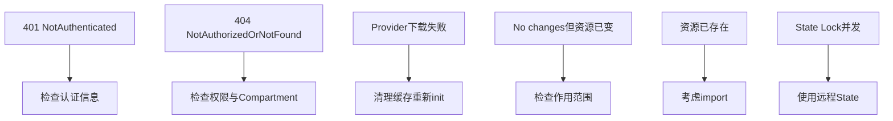

# 常见错误及排查方法

汇总实践中最常遇到的六类问题，以及对应的排查思路。

## 核心要点

* 401 NotAuthenticated：检查 User/Tenancy OCID、Fingerprint、私钥路径、公钥是否已上传、系统时间是否准确
* 404 NotAuthorizedOrNotFound：OCI 经常把“资源不存在”和“无权查看”表现为类似的 404，需检查 Compartment、Region、IAM Policy
* Provider 下载失败：可尝试 rm -rf .terraform 后 tofu init -upgrade，不要轻易删除 .terraform.lock.hcl
* "No changes"但 OCI 明明变了：可能是修改了 OpenTofu 不管理的属性，或用了 ignore_changes，可用 tofu plan -refresh-only 排查
* State Lock 或并发问题：不要让两个人同时 apply，团队环境必须使用具有并发保护机制的远程 State 或托管执行平台

---

## 本章测验

本章共 5 道单项选择题。

### 第 1 题

遇到 401 NotAuthenticated 错误时，不需要检查的是？

- A. VCN 的 CIDR 是否合理
- B. Fingerprint 是否正确
- C. 私钥路径是否正确
- D. 系统时间是否准确

选择答案后查看结果

正确答案：A

答案解析：401 NotAuthenticated 属于认证问题，需要检查 User/Tenancy OCID、Fingerprint、私钥路径、公钥上传情况和系统时间，与 VCN CIDR 设计无关。

### 第 2 题

404 NotAuthorizedOrNotFound 错误的特点是什么？

- A. 只可能是资源真的不存在
- B. OCI 经常把“资源不存在”和“无权查看”表现为类似的 404
- C. 只在创建资源时出现
- D. 与 IAM Policy 完全无关

选择答案后查看结果

正确答案：B

答案解析：文中特别说明 OCI 经常把资源不存在和无权访问都表现为类似的 404，需要同时检查 Compartment、Region 和 IAM Policy。

### 第 3 题

遇到 Provider 下载失败时，文中建议的排查步骤是什么？

- A. 直接卸载 OpenTofu 重装系统
- B. 立刻删除 .terraform.lock.hcl
- C. rm -rf .terraform 后 tofu init -upgrade，同时检查网络代理、DNS、证书等
- D. 忽略错误直接 apply

选择答案后查看结果

正确答案：C

答案解析：文中建议执行 rm -rf .terraform 和 tofu init -upgrade，并检查网络代理、DNS、证书、Provider source 和版本约束，同时提醒不要轻易删除 lock 文件。

### 第 4 题

如果 tofu plan 显示 "No changes"，但 OCI 上明明有变化，应该怎么排查？

- A. 直接认为 OpenTofu 出故障了
- B. 立刻删除 State 文件重新开始
- C. 忽略这个现象继续工作
- D. 执行 tofu plan -refresh-only 排查

选择答案后查看结果

正确答案：D

答案解析：文中提到可能是修改了 OpenTofu 不管理的属性，或者用了 ignore_changes，也可能是查看了错误的 Region/Profile/Compartment，可以用 tofu plan -refresh-only 排查。

### 第 5 题

团队环境中避免 State Lock 或并发问题的正确做法是什么？

- A. 使用具有并发保护机制的远程 State 或托管执行平台
- B. 让多人同时运行 tofu apply 提高效率
- C. 关闭 State 文件的锁机制
- D. 每个人各自维护一份本地 State，互不干扰

选择答案后查看结果

正确答案：A

答案解析：文中明确指出不要让两个人同时 apply，团队环境必须使用具有并发保护机制的远程 State 或托管执行平台。

<!-- QUIZ_DATA_START
{
  "chapter": "25",
  "questions": [
    {
      "id": 1,
      "question": "遇到 401 NotAuthenticated 错误时，不需要检查的是？",
      "options": {
        "A": "VCN 的 CIDR 是否合理",
        "B": "Fingerprint 是否正确",
        "C": "私钥路径是否正确",
        "D": "系统时间是否准确"
      },
      "answer": "A",
      "explanation": "401 NotAuthenticated 属于认证问题，需要检查 User/Tenancy OCID、Fingerprint、私钥路径、公钥上传情况和系统时间，与 VCN CIDR 设计无关。"
    },
    {
      "id": 2,
      "question": "404 NotAuthorizedOrNotFound 错误的特点是什么？",
      "options": {
        "B": "OCI 经常把“资源不存在”和“无权查看”表现为类似的 404",
        "A": "只可能是资源真的不存在",
        "C": "只在创建资源时出现",
        "D": "与 IAM Policy 完全无关"
      },
      "answer": "B",
      "explanation": "文中特别说明 OCI 经常把资源不存在和无权访问都表现为类似的 404，需要同时检查 Compartment、Region 和 IAM Policy。"
    },
    {
      "id": 3,
      "question": "遇到 Provider 下载失败时，文中建议的排查步骤是什么？",
      "options": {
        "C": "rm -rf .terraform 后 tofu init -upgrade，同时检查网络代理、DNS、证书等",
        "A": "直接卸载 OpenTofu 重装系统",
        "B": "立刻删除 .terraform.lock.hcl",
        "D": "忽略错误直接 apply"
      },
      "answer": "C",
      "explanation": "文中建议执行 rm -rf .terraform 和 tofu init -upgrade，并检查网络代理、DNS、证书、Provider source 和版本约束，同时提醒不要轻易删除 lock 文件。"
    },
    {
      "id": 4,
      "question": "如果 tofu plan 显示 \"No changes\"，但 OCI 上明明有变化，应该怎么排查？",
      "options": {
        "D": "执行 tofu plan -refresh-only 排查",
        "A": "直接认为 OpenTofu 出故障了",
        "B": "立刻删除 State 文件重新开始",
        "C": "忽略这个现象继续工作"
      },
      "answer": "D",
      "explanation": "文中提到可能是修改了 OpenTofu 不管理的属性，或者用了 ignore_changes，也可能是查看了错误的 Region/Profile/Compartment，可以用 tofu plan -refresh-only 排查。"
    },
    {
      "id": 5,
      "question": "团队环境中避免 State Lock 或并发问题的正确做法是什么？",
      "options": {
        "A": "使用具有并发保护机制的远程 State 或托管执行平台",
        "B": "让多人同时运行 tofu apply 提高效率",
        "C": "关闭 State 文件的锁机制",
        "D": "每个人各自维护一份本地 State，互不干扰"
      },
      "answer": "A",
      "explanation": "文中明确指出不要让两个人同时 apply，团队环境必须使用具有并发保护机制的远程 State 或托管执行平台。"
    }
  ]
}
QUIZ_DATA_END -->
