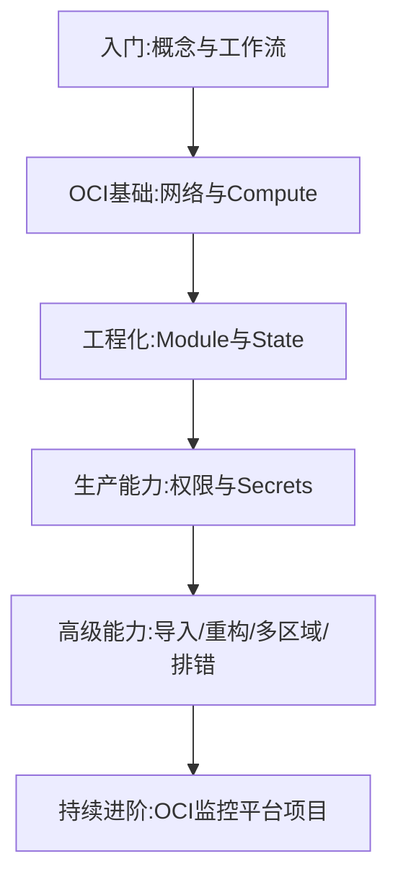

# 课程总结：从会写 Resource 到真正精通 OpenTofu

回顾整个课程的知识结构，理解初学者与高级工程师思维方式的差异，并规划下一步学习方向。

## 核心要点

* 初学者关注“这个 Resource 怎么写”，高级工程师关注资源属于哪个生命周期边界、放在哪个 State、由哪个团队管理
* 真正的精通不是记住所有 Resource 参数，而是掌握六个能力：基础设施建模、State 生命周期设计、Module 接口设计、权限与 Secret 管理、变更审核和 CI/CD、导入迁移重构与故障恢复
* 推荐的后续实战项目是 OCI Monitoring Platform，覆盖 IAM、Network、Compute、Load Balancing、Data、Monitoring、Kubernetes 七大模块
* 建议的学习路径是先打通 VCN、子网、Compute、Nginx，再逐步加入 Monitoring、Alarm、Notifications，最后进入 OKE

---

## 本章测验

本章共 5 道单项选择题。

### 第 1 题

文中认为高级工程师与初学者相比，更关注什么？

- A. 只关注某个 Resource 参数怎么写
- B. 关注资源属于哪个生命周期边界、放在哪个 State、由哪个团队管理
- C. 只关注界面颜色是否好看
- D. 只关注代码行数是否够多

选择答案后查看结果

正确答案：B

答案解析：文中对比指出，初学者通常关注“这个 Resource 怎么写”，而高级工程师更关注生命周期边界、State 归属、团队职责、权限控制等系统性问题。

### 第 2 题

文中总结的真正“精通”所需的六个能力不包括下列哪一项？

- A. 基础设施建模
- B. State 生命周期设计
- C. 记住所有 Resource 的全部参数名称
- D. 导入、迁移、重构与故障恢复

选择答案后查看结果

正确答案：C

答案解析：文中明确说“真正的精通不是记住所有 Resource 参数”，六个能力是基础设施建模、State 生命周期设计、Module 接口设计、权限与 Secret 管理、变更审核和 CI/CD、导入迁移重构与故障恢复。

### 第 3 题

文中推荐的后续实战项目 OCI Monitoring Platform 不包含下列哪个模块？

- A. IAM
- B. Load Balancing
- C. Kubernetes
- D. Photoshop 设计

选择答案后查看结果

正确答案：D

答案解析：OCI Monitoring Platform 项目涵盖 IAM、Network、Compute、Load Balancing、Data、Monitoring、Kubernetes 七大模块，不涉及设计软件。

### 第 4 题

建议的学习路径中，最适合的第一套实战顺序是什么？

- A. OpenTofu → OCI认证 → VCN → 子网 → NAT/Service Gateway → Compute → Nginx → Monitoring → 最后进入OKE
- B. 直接从 OKE 开始
- C. 先学 Monitoring 再学网络
- D. 跳过认证直接创建数据库

选择答案后查看结果

正确答案：A

答案解析：文中明确给出这条路径：不是直接上 OKE，而是从 OpenTofu、OCI 认证、VCN、子网，一路到 Compute、Nginx、Monitoring、Alarm、Notifications，最后再进入 OKE。

### 第 5 题

下列关于本课程整体脉络的说法，哪一项是正确的？

- A. 课程只讲了 OCI Console 的点击操作，没有涉及代码
- B. 课程从基础概念和工作流出发，逐步深入到 OCI 基础资源、工程化实践、生产能力和高级能力
- C. 课程完全不涉及 State 管理
- D. 课程只适合完全不懂云计算的人，不涉及生产环境话题

选择答案后查看结果

正确答案：B

答案解析：回顾整个课程结构，从第一阶段的入门概念和工作流，到第二阶段的 OCI 基础资源，再到工程化、生产能力和高级能力，是一个逐步深入的完整脉络，其中也包含了大量 State 管理和生产环境相关的内容。

<!-- QUIZ_DATA_START
{
  "chapter": "26",
  "questions": [
    {
      "id": 1,
      "question": "文中认为高级工程师与初学者相比，更关注什么？",
      "options": {
        "B": "关注资源属于哪个生命周期边界、放在哪个 State、由哪个团队管理",
        "A": "只关注某个 Resource 参数怎么写",
        "C": "只关注界面颜色是否好看",
        "D": "只关注代码行数是否够多"
      },
      "answer": "B",
      "explanation": "文中对比指出，初学者通常关注“这个 Resource 怎么写”，而高级工程师更关注生命周期边界、State 归属、团队职责、权限控制等系统性问题。"
    },
    {
      "id": 2,
      "question": "文中总结的真正“精通”所需的六个能力不包括下列哪一项？",
      "options": {
        "C": "记住所有 Resource 的全部参数名称",
        "A": "基础设施建模",
        "B": "State 生命周期设计",
        "D": "导入、迁移、重构与故障恢复"
      },
      "answer": "C",
      "explanation": "文中明确说“真正的精通不是记住所有 Resource 参数”，六个能力是基础设施建模、State 生命周期设计、Module 接口设计、权限与 Secret 管理、变更审核和 CI/CD、导入迁移重构与故障恢复。"
    },
    {
      "id": 3,
      "question": "文中推荐的后续实战项目 OCI Monitoring Platform 不包含下列哪个模块？",
      "options": {
        "D": "Photoshop 设计",
        "A": "IAM",
        "B": "Load Balancing",
        "C": "Kubernetes"
      },
      "answer": "D",
      "explanation": "OCI Monitoring Platform 项目涵盖 IAM、Network、Compute、Load Balancing、Data、Monitoring、Kubernetes 七大模块，不涉及设计软件。"
    },
    {
      "id": 4,
      "question": "建议的学习路径中，最适合的第一套实战顺序是什么？",
      "options": {
        "A": "OpenTofu → OCI认证 → VCN → 子网 → NAT/Service Gateway → Compute → Nginx → Monitoring → 最后进入OKE",
        "B": "直接从 OKE 开始",
        "C": "先学 Monitoring 再学网络",
        "D": "跳过认证直接创建数据库"
      },
      "answer": "A",
      "explanation": "文中明确给出这条路径：不是直接上 OKE，而是从 OpenTofu、OCI 认证、VCN、子网，一路到 Compute、Nginx、Monitoring、Alarm、Notifications，最后再进入 OKE。"
    },
    {
      "id": 5,
      "question": "下列关于本课程整体脉络的说法，哪一项是正确的？",
      "options": {
        "B": "课程从基础概念和工作流出发，逐步深入到 OCI 基础资源、工程化实践、生产能力和高级能力",
        "A": "课程只讲了 OCI Console 的点击操作，没有涉及代码",
        "C": "课程完全不涉及 State 管理",
        "D": "课程只适合完全不懂云计算的人，不涉及生产环境话题"
      },
      "answer": "B",
      "explanation": "回顾整个课程结构，从第一阶段的入门概念和工作流，到第二阶段的 OCI 基础资源，再到工程化、生产能力和高级能力，是一个逐步深入的完整脉络，其中也包含了大量 State 管理和生产环境相关的内容。"
    }
  ]
}
QUIZ_DATA_END -->
