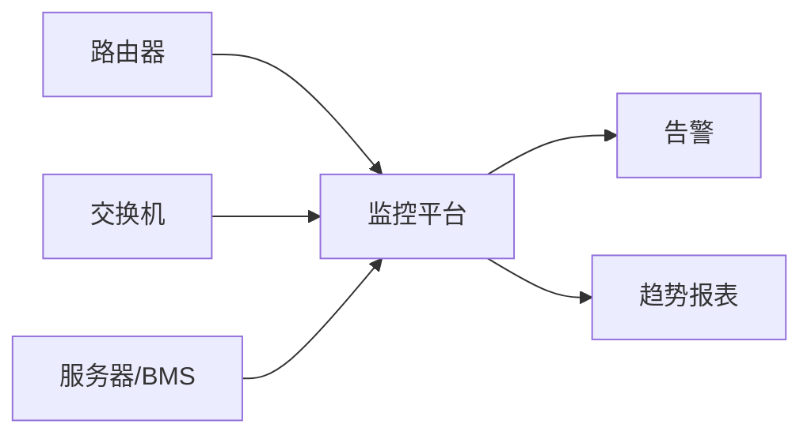

# 为什么需要一套网络设备监控平台

企业内部有大量交换机、路由器和服务器，需要一套系统持续掌握它们的状态。

## 核心要点

* 监控平台需要同时支持主动探测和被动接收两类通信方式
* 四种通信方式：TCP Ping、SNMP GET、SNMP Trap、Syslog
* TCP Ping 与 SNMP GET 是平台主动访问设备（出站）
* SNMP Trap 与 Syslog 是设备主动上报（入站）

---

## 本章测验

本章共 5 道单项选择题。

### 第 1 题

下列哪一项属于监控平台“主动访问设备”的方式？

- A. SNMP GET
- B. SNMP Trap
- C. Syslog
- D. 以上都不是

选择答案后查看结果

正确答案：A

答案解析：SNMP GET 是监控平台主动向设备发起查询，Trap 和 Syslog 都是设备主动上报。

### 第 2 题

SNMP Trap 和 Syslog 的共同特点是什么？

- A. 都需要监控平台主动发起连接
- B. 都是设备主动向平台发送消息
- C. 都只能使用HTTP协议
- D. 都不需要网络连通性

选择答案后查看结果

正确答案：B

答案解析：两者都属于设备主动上报，方向与SNMP GET/TCP Ping相反。

### 第 3 题

为什么不能把四种通信方式全部放在同一个负载均衡器后面？

- A. 因为Kubernetes不支持多个Service
- B. 因为OCI禁止创建多个负载均衡器
- C. 因为它们的网络流量方向和协议类型不同
- D. 因为四种协议使用同一个端口

选择答案后查看结果

正确答案：C

答案解析：出站探测不需要负载均衡器，入站的Trap/Syslog是TCP/UDP协议，需要NLB而不是HTTP LB。

### 第 4 题

以下哪种情况最符合“入站流量”的场景？

- A. 平台定时对设备执行SNMP GET
- B. 平台对设备发起TCP Connect
- C. 平台读取数据库中的历史数据
- D. 设备发生故障后主动发送Trap

选择答案后查看结果

正确答案：D

答案解析：设备主动发送Trap是入站流量，其余选项都是平台主动发起的出站行为。

### 第 5 题

这套系统整体上可以理解为哪种性质的平台？

- A. 包含IaC、网络、Kubernetes、协议和数据库的云原生监控平台
- B. 纯前端展示工具
- C. 仅用于日志存储的数据库系统
- D. 只处理HTTP请求的Web网站

选择答案后查看结果

正确答案：A

答案解析：项目涵盖OpenTofu、OCI网络、OKE、四种协议、Spring Boot、Oracle数据库等多个层面。

<!-- QUIZ_DATA_START
{
  "chapter": "01",
  "questions": [
    {
      "id": 1,
      "question": "下列哪一项属于监控平台“主动访问设备”的方式？",
      "options": {
        "A": "SNMP GET",
        "B": "SNMP Trap",
        "C": "Syslog",
        "D": "以上都不是"
      },
      "answer": "A",
      "explanation": "SNMP GET 是监控平台主动向设备发起查询，Trap 和 Syslog 都是设备主动上报。"
    },
    {
      "id": 2,
      "question": "SNMP Trap 和 Syslog 的共同特点是什么？",
      "options": {
        "A": "都需要监控平台主动发起连接",
        "B": "都是设备主动向平台发送消息",
        "C": "都只能使用HTTP协议",
        "D": "都不需要网络连通性"
      },
      "answer": "B",
      "explanation": "两者都属于设备主动上报，方向与SNMP GET/TCP Ping相反。"
    },
    {
      "id": 3,
      "question": "为什么不能把四种通信方式全部放在同一个负载均衡器后面？",
      "options": {
        "A": "因为Kubernetes不支持多个Service",
        "B": "因为OCI禁止创建多个负载均衡器",
        "C": "因为它们的网络流量方向和协议类型不同",
        "D": "因为四种协议使用同一个端口"
      },
      "answer": "C",
      "explanation": "出站探测不需要负载均衡器，入站的Trap/Syslog是TCP/UDP协议，需要NLB而不是HTTP LB。"
    },
    {
      "id": 4,
      "question": "以下哪种情况最符合“入站流量”的场景？",
      "options": {
        "A": "平台定时对设备执行SNMP GET",
        "B": "平台对设备发起TCP Connect",
        "C": "平台读取数据库中的历史数据",
        "D": "设备发生故障后主动发送Trap"
      },
      "answer": "D",
      "explanation": "设备主动发送Trap是入站流量，其余选项都是平台主动发起的出站行为。"
    },
    {
      "id": 5,
      "question": "这套系统整体上可以理解为哪种性质的平台？",
      "options": {
        "A": "包含IaC、网络、Kubernetes、协议和数据库的云原生监控平台",
        "B": "纯前端展示工具",
        "C": "仅用于日志存储的数据库系统",
        "D": "只处理HTTP请求的Web网站"
      },
      "answer": "A",
      "explanation": "项目涵盖OpenTofu、OCI网络、OKE、四种协议、Spring Boot、Oracle数据库等多个层面。"
    }
  ]
}
QUIZ_DATA_END -->
