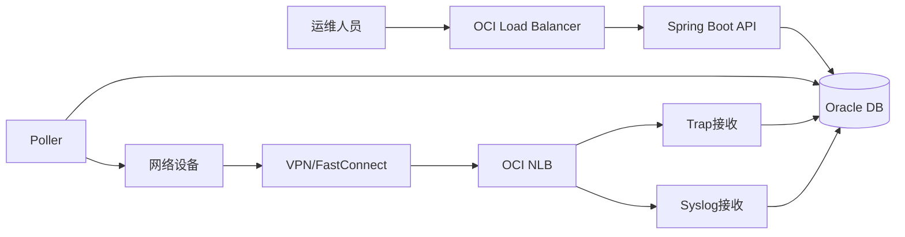

# 整体系统架构总览

在深入细节之前，先看清整套系统从设备到数据库的完整链路。

## 核心要点

* 用户通过HTTPS访问Spring Boot API，走OCI Load Balancer
* 设备通过VPN/FastConnect接入，Trap和Syslog走OCI NLB
* TCP Ping和SNMP GET由Poller主动向设备发起，不经过负载均衡器
* 所有数据最终汇总进入Oracle数据库

---

## 本章测验

本章共 5 道单项选择题。

### 第 1 题

用户访问Web界面时，流量经过的负载均衡器类型是？

- A. OCI Network Load Balancer
- B. OCI Load Balancer（HTTP/HTTPS）
- C. 不需要负载均衡器
- D. 只能用DNS轮询

选择答案后查看结果

正确答案：B

答案解析：用户的HTTPS请求走的是面向HTTP/HTTPS的OCI Load Balancer。

### 第 2 题

Poller访问设备时是否需要经过负载均衡器？

- A. 需要经过NLB
- B. 需要经过HTTP LB
- C. 不需要，因为是平台主动发起的出站连接
- D. 需要经过API网关

选择答案后查看结果

正确答案：C

答案解析：TCP Ping和SNMP GET是出站流量，平台主动连接设备，不需要负载均衡器。

### 第 3 题

设备主动发送的Trap和Syslog经过什么组件进入系统？

- A. OCI Load Balancer
- B. Object Storage
- C. OCIR
- D. OCI Network Load Balancer

选择答案后查看结果

正确答案：D

答案解析：Trap和Syslog是TCP/UDP的入站流量，适合用OCI NLB接收。

### 第 4 题

设备接入OCI网络通常依赖什么机制？

- A. VPN或FastConnect等专线/隧道接入
- B. 公网直接暴露端口
- C. Object Storage预签名URL
- D. 直接SSH隧道

选择答案后查看结果

正确答案：A

答案解析：企业设备网络通常通过IPSec VPN或FastConnect接入OCI，而不是直接暴露在公网。

### 第 5 题

TCP Ping、SNMP GET、SNMP Trap、Syslog采集的数据最终存放在哪里？

- A. 只保存在本地文件
- B. Oracle数据库
- C. 只保存在内存中
- D. 不需要持久化

选择答案后查看结果

正确答案：B

答案解析：所有采集和接收到的数据最终都会写入Oracle数据库，供查询、告警和趋势分析使用。

<!-- QUIZ_DATA_START
{
  "chapter": "02",
  "questions": [
    {
      "id": 1,
      "question": "用户访问Web界面时，流量经过的负载均衡器类型是？",
      "options": {
        "A": "OCI Network Load Balancer",
        "B": "OCI Load Balancer（HTTP/HTTPS）",
        "C": "不需要负载均衡器",
        "D": "只能用DNS轮询"
      },
      "answer": "B",
      "explanation": "用户的HTTPS请求走的是面向HTTP/HTTPS的OCI Load Balancer。"
    },
    {
      "id": 2,
      "question": "Poller访问设备时是否需要经过负载均衡器？",
      "options": {
        "A": "需要经过NLB",
        "B": "需要经过HTTP LB",
        "C": "不需要，因为是平台主动发起的出站连接",
        "D": "需要经过API网关"
      },
      "answer": "C",
      "explanation": "TCP Ping和SNMP GET是出站流量，平台主动连接设备，不需要负载均衡器。"
    },
    {
      "id": 3,
      "question": "设备主动发送的Trap和Syslog经过什么组件进入系统？",
      "options": {
        "A": "OCI Load Balancer",
        "B": "Object Storage",
        "C": "OCIR",
        "D": "OCI Network Load Balancer"
      },
      "answer": "D",
      "explanation": "Trap和Syslog是TCP/UDP的入站流量，适合用OCI NLB接收。"
    },
    {
      "id": 4,
      "question": "设备接入OCI网络通常依赖什么机制？",
      "options": {
        "A": "VPN或FastConnect等专线/隧道接入",
        "B": "公网直接暴露端口",
        "C": "Object Storage预签名URL",
        "D": "直接SSH隧道"
      },
      "answer": "A",
      "explanation": "企业设备网络通常通过IPSec VPN或FastConnect接入OCI，而不是直接暴露在公网。"
    },
    {
      "id": 5,
      "question": "TCP Ping、SNMP GET、SNMP Trap、Syslog采集的数据最终存放在哪里？",
      "options": {
        "A": "只保存在本地文件",
        "B": "Oracle数据库",
        "C": "只保存在内存中",
        "D": "不需要持久化"
      },
      "answer": "B",
      "explanation": "所有采集和接收到的数据最终都会写入Oracle数据库，供查询、告警和趋势分析使用。"
    }
  ]
}
QUIZ_DATA_END -->
