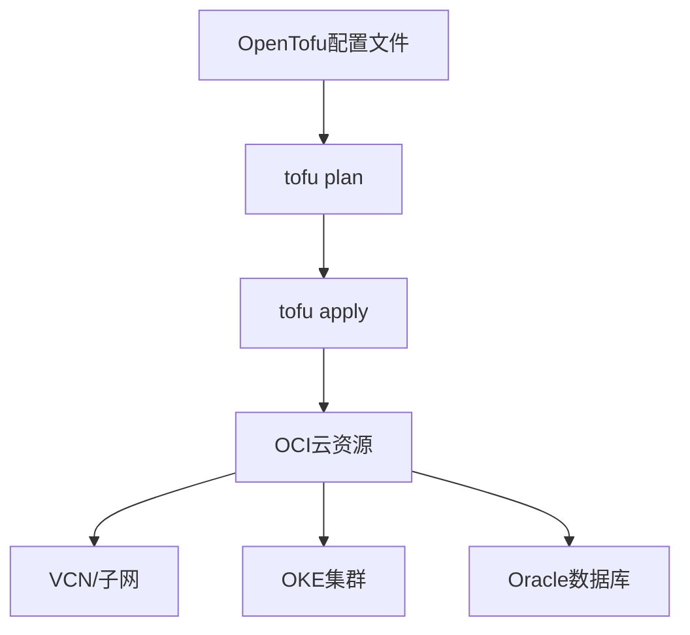

# OpenTofu在项目中扮演的角色

OpenTofu负责创建和维护OCI云基础设施，而不是编写业务逻辑。

## 核心要点

* OpenTofu是与Terraform HCL高度兼容的开源基础设施即代码工具
* 通过oracle/oci Provider调用OCI API创建资源
* 常用命令：tofu init、tofu plan、tofu apply
* OpenTofu负责基础设施，不负责Spring Boot业务代码

---

## 本章测验

本章共 5 道单项选择题。

### 第 1 题

OpenTofu主要负责项目中的哪一部分？

- A. Spring Boot业务逻辑
- B. 前端页面样式
- C. OCI云基础设施的创建与维护
- D. 数据库SQL查询优化

选择答案后查看结果

正确答案：C

答案解析：OpenTofu是基础设施即代码工具，负责创建VCN、OKE、数据库等云资源，不涉及业务代码。

### 第 2 题

OpenTofu与Terraform的关系是？

- A. 完全无关的两个产品
- B. OpenTofu是Terraform的付费插件
- C. OpenTofu只能用于AWS
- D. 与Terraform HCL配置高度兼容的开源工具

选择答案后查看结果

正确答案：D

答案解析：OpenTofu与Terraform的HCL配置高度兼容，很多Terraform配置可以较小改动迁移过去。

### 第 3 题

OpenTofu调用OCI API依赖什么组件？

- A. oracle/oci Provider
- B. Kubernetes API Server
- C. Spring Boot Actuator
- D. OCIR镜像仓库

选择答案后查看结果

正确答案：A

答案解析：OpenTofu通过oracle/oci Provider插件连接并调用OCI的API来创建资源。

### 第 4 题

以下哪一组是OpenTofu的典型执行命令？

- A. mvn install
- B. tofu init / tofu plan / tofu apply
- C. docker build
- D. kubectl apply

选择答案后查看结果

正确答案：B

答案解析：tofu init初始化、tofu plan查看变更计划、tofu apply执行变更，是OpenTofu的核心命令。

### 第 5 题

为什么OpenTofu不适合直接管理Spring Boot的版本升级？

- A. OpenTofu语法不支持字符串
- B. OpenTofu无法连接互联网
- C. OpenTofu定位于基础设施管理，频繁的应用版本变更不宜和底层网络绑在同一State中
- D. OpenTofu只支持只读操作

选择答案后查看结果

正确答案：C

答案解析：把频繁变化的应用版本和底层OCI网络绑在同一State中会让每次发布都牵动基础设施，因此更推荐职责分离。

<!-- QUIZ_DATA_START
{
  "chapter": "03",
  "questions": [
    {
      "id": 1,
      "question": "OpenTofu主要负责项目中的哪一部分？",
      "options": {
        "A": "Spring Boot业务逻辑",
        "B": "前端页面样式",
        "C": "OCI云基础设施的创建与维护",
        "D": "数据库SQL查询优化"
      },
      "answer": "C",
      "explanation": "OpenTofu是基础设施即代码工具，负责创建VCN、OKE、数据库等云资源，不涉及业务代码。"
    },
    {
      "id": 2,
      "question": "OpenTofu与Terraform的关系是？",
      "options": {
        "A": "完全无关的两个产品",
        "B": "OpenTofu是Terraform的付费插件",
        "C": "OpenTofu只能用于AWS",
        "D": "与Terraform HCL配置高度兼容的开源工具"
      },
      "answer": "D",
      "explanation": "OpenTofu与Terraform的HCL配置高度兼容，很多Terraform配置可以较小改动迁移过去。"
    },
    {
      "id": 3,
      "question": "OpenTofu调用OCI API依赖什么组件？",
      "options": {
        "A": "oracle/oci Provider",
        "B": "Kubernetes API Server",
        "C": "Spring Boot Actuator",
        "D": "OCIR镜像仓库"
      },
      "answer": "A",
      "explanation": "OpenTofu通过oracle/oci Provider插件连接并调用OCI的API来创建资源。"
    },
    {
      "id": 4,
      "question": "以下哪一组是OpenTofu的典型执行命令？",
      "options": {
        "A": "mvn install",
        "B": "tofu init / tofu plan / tofu apply",
        "C": "docker build",
        "D": "kubectl apply"
      },
      "answer": "B",
      "explanation": "tofu init初始化、tofu plan查看变更计划、tofu apply执行变更，是OpenTofu的核心命令。"
    },
    {
      "id": 5,
      "question": "为什么OpenTofu不适合直接管理Spring Boot的版本升级？",
      "options": {
        "A": "OpenTofu语法不支持字符串",
        "B": "OpenTofu无法连接互联网",
        "C": "OpenTofu定位于基础设施管理，频繁的应用版本变更不宜和底层网络绑在同一State中",
        "D": "OpenTofu只支持只读操作"
      },
      "answer": "C",
      "explanation": "把频繁变化的应用版本和底层OCI网络绑在同一State中会让每次发布都牵动基础设施，因此更推荐职责分离。"
    }
  ]
}
QUIZ_DATA_END -->
