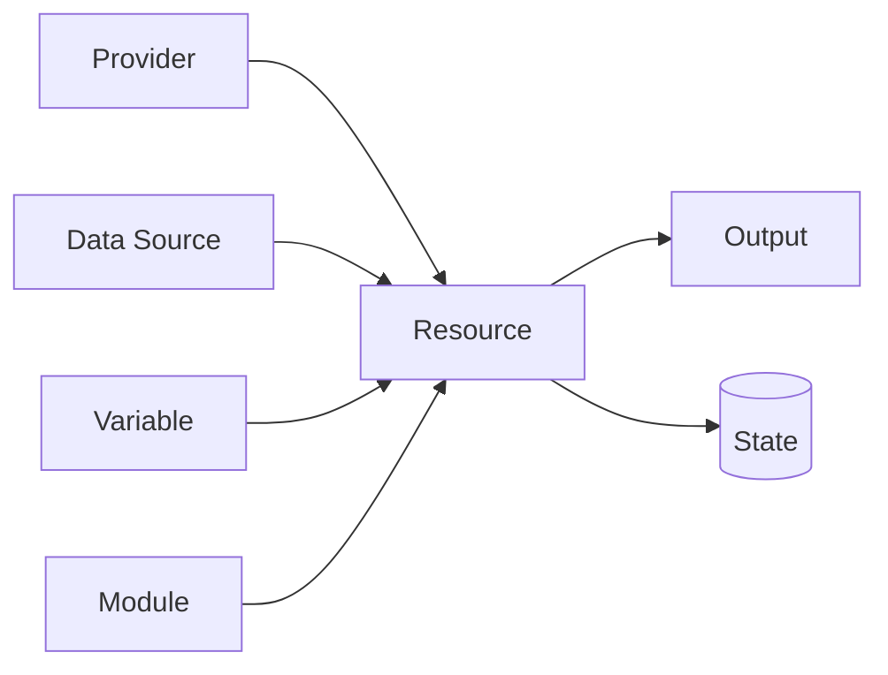

# OpenTofu核心概念

理解Provider、Resource、State等基本概念，是读懂任何OpenTofu配置的前提。

## 核心要点

* Provider连接云厂商API，Resource描述要创建的资源
* Data Source用于查询已存在的资源，Variable用于传参
* State记录代码与真实云资源之间的对应关系
* Module用于把网络、OKE、数据库等拆成可复用的组件

---

## 本章测验

本章共 5 道单项选择题。

### 第 1 题

Provider在OpenTofu中的作用是什么？

- A. 存储密码
- B. 生成Kubernetes YAML
- C. 编写业务逻辑
- D. 连接云厂商API

选择答案后查看结果

正确答案：D

答案解析：Provider是OpenTofu用来连接和调用具体云厂商（如OCI）API的插件。

### 第 2 题

Data Source通常用来做什么？

- A. 查询已经存在的资源
- B. 创建新资源
- C. 删除State文件
- D. 编译Java代码

选择答案后查看结果

正确答案：A

答案解析：Data Source用于读取已有的OCI资源信息，而不是创建新资源。

### 第 3 题

State文件的核心作用是什么？

- A. 存储Spring Boot的日志
- B. 记录配置代码与真实云资源之间的对应关系
- C. 编译Docker镜像
- D. 作为Kubernetes的ConfigMap

选择答案后查看结果

正确答案：B

答案解析：State记录了例如oci_core_vcn.monitoring_vcn对应哪个真实VCN的OCID等映射关系。

### 第 4 题

为什么要使用Module来拆分网络、OKE、数据库等配置？

- A. Module是语法强制要求的
- B. Module可以自动生成Java代码
- C. 为了让配置可以复用并且结构清晰
- D. Module能替代Kubernetes Service

选择答案后查看结果

正确答案：C

答案解析：通过Module拆分，可以让网络、OKE、数据库等配置独立、可复用、易维护。

### 第 5 题

Output在OpenTofu中通常用来输出什么？

- A. Java编译错误
- B. Kubernetes Pod日志
- C. SNMP Trap原始报文
- D. OCID、IP地址、数据库连接地址等信息

选择答案后查看结果

正确答案：D

答案解析：Output用于把创建出来的关键信息（如OCID、IP、数据库地址）暴露出去供后续使用。

<!-- QUIZ_DATA_START
{
  "chapter": "04",
  "questions": [
    {
      "id": 1,
      "question": "Provider在OpenTofu中的作用是什么？",
      "options": {
        "A": "存储密码",
        "B": "生成Kubernetes YAML",
        "C": "编写业务逻辑",
        "D": "连接云厂商API"
      },
      "answer": "D",
      "explanation": "Provider是OpenTofu用来连接和调用具体云厂商（如OCI）API的插件。"
    },
    {
      "id": 2,
      "question": "Data Source通常用来做什么？",
      "options": {
        "A": "查询已经存在的资源",
        "B": "创建新资源",
        "C": "删除State文件",
        "D": "编译Java代码"
      },
      "answer": "A",
      "explanation": "Data Source用于读取已有的OCI资源信息，而不是创建新资源。"
    },
    {
      "id": 3,
      "question": "State文件的核心作用是什么？",
      "options": {
        "A": "存储Spring Boot的日志",
        "B": "记录配置代码与真实云资源之间的对应关系",
        "C": "编译Docker镜像",
        "D": "作为Kubernetes的ConfigMap"
      },
      "answer": "B",
      "explanation": "State记录了例如oci_core_vcn.monitoring_vcn对应哪个真实VCN的OCID等映射关系。"
    },
    {
      "id": 4,
      "question": "为什么要使用Module来拆分网络、OKE、数据库等配置？",
      "options": {
        "A": "Module是语法强制要求的",
        "B": "Module可以自动生成Java代码",
        "C": "为了让配置可以复用并且结构清晰",
        "D": "Module能替代Kubernetes Service"
      },
      "answer": "C",
      "explanation": "通过Module拆分，可以让网络、OKE、数据库等配置独立、可复用、易维护。"
    },
    {
      "id": 5,
      "question": "Output在OpenTofu中通常用来输出什么？",
      "options": {
        "A": "Java编译错误",
        "B": "Kubernetes Pod日志",
        "C": "SNMP Trap原始报文",
        "D": "OCID、IP地址、数据库连接地址等信息"
      },
      "answer": "D",
      "explanation": "Output用于把创建出来的关键信息（如OCID、IP、数据库地址）暴露出去供后续使用。"
    }
  ]
}
QUIZ_DATA_END -->
