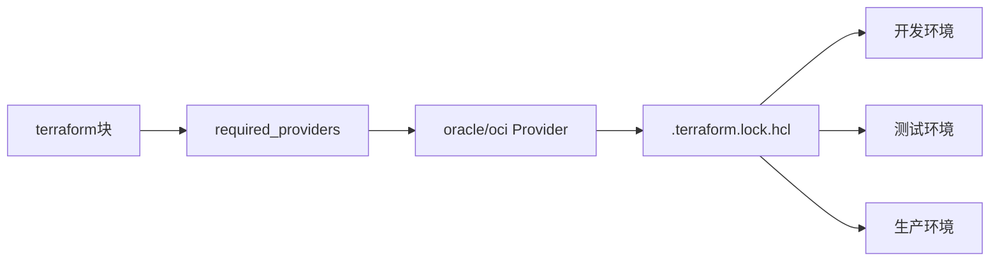

# OCI Provider配置与版本锁定

生产项目必须固定Provider版本，避免不同环境因自动升级产生差异。

## 核心要点

* required_providers中指定oracle/oci及版本范围
* 提交.terraform.lock.hcl以固定实际使用的Provider版本
* 本地开发常用API Key，CI/CD中推荐使用Instance Principal等资源身份
* 版本不固定可能导致开发、测试、生产结果不一致

---

## 本章测验

本章共 5 道单项选择题。

### 第 1 题

为什么生产项目要提交.terraform.lock.hcl文件？

- A. 为了固定Provider版本，避免不同环境自动升级导致不一致
- B. 为了让文件看起来更专业
- C. 该文件是必须手动编写的密码文件
- D. 该文件用于存储数据库密码

选择答案后查看结果

正确答案：A

答案解析：lock文件锁定了实际使用的Provider版本，避免各环境因版本差异产生不同的执行结果。

### 第 2 题

OpenTofu中声明使用的Provider及版本范围应该写在哪里？

- A. variables.tf
- B. required_providers块
- C. outputs.tf
- D. README.md

选择答案后查看结果

正确答案：B

答案解析：required_providers用于声明所使用的Provider来源和版本约束，例如oracle/oci。

### 第 3 题

在OCI Compute或OCI内部执行CI/CD时，更推荐使用哪种身份认证方式？

- A. 把私钥硬编码进配置文件
- B. 使用root账号API Key
- C. Instance Principal等资源身份
- D. 不需要任何身份认证

选择答案后查看结果

正确答案：C

答案解析：使用Instance Principal等资源身份可以避免把长期私钥直接写入配置，提高安全性。

### 第 4 题

本地开发时常见的OCI身份验证方式是什么？

- A. Kubernetes Secret
- B. SNMP Community
- C. Syslog Facility
- D. OCI配置文件和API Key

选择答案后查看结果

正确答案：D

答案解析：本地开发时通常使用OCI CLI配置文件结合API Key进行身份验证。

### 第 5 题

不固定Provider版本可能带来的风险是什么？

- A. 开发、测试、生产环境因Provider自动升级而产生不同结果
- B. 程序运行速度变慢
- C. 数据库连接数减少
- D. Kubernetes无法启动

选择答案后查看结果

正确答案：A

答案解析：Provider自动升级可能引入行为变化，如果各环境版本不一致，会导致部署结果出现差异。

<!-- QUIZ_DATA_START
{
  "chapter": "05",
  "questions": [
    {
      "id": 1,
      "question": "为什么生产项目要提交.terraform.lock.hcl文件？",
      "options": {
        "A": "为了固定Provider版本，避免不同环境自动升级导致不一致",
        "B": "为了让文件看起来更专业",
        "C": "该文件是必须手动编写的密码文件",
        "D": "该文件用于存储数据库密码"
      },
      "answer": "A",
      "explanation": "lock文件锁定了实际使用的Provider版本，避免各环境因版本差异产生不同的执行结果。"
    },
    {
      "id": 2,
      "question": "OpenTofu中声明使用的Provider及版本范围应该写在哪里？",
      "options": {
        "A": "variables.tf",
        "B": "required_providers块",
        "C": "outputs.tf",
        "D": "README.md"
      },
      "answer": "B",
      "explanation": "required_providers用于声明所使用的Provider来源和版本约束，例如oracle/oci。"
    },
    {
      "id": 3,
      "question": "在OCI Compute或OCI内部执行CI/CD时，更推荐使用哪种身份认证方式？",
      "options": {
        "A": "把私钥硬编码进配置文件",
        "B": "使用root账号API Key",
        "C": "Instance Principal等资源身份",
        "D": "不需要任何身份认证"
      },
      "answer": "C",
      "explanation": "使用Instance Principal等资源身份可以避免把长期私钥直接写入配置，提高安全性。"
    },
    {
      "id": 4,
      "question": "本地开发时常见的OCI身份验证方式是什么？",
      "options": {
        "A": "Kubernetes Secret",
        "B": "SNMP Community",
        "C": "Syslog Facility",
        "D": "OCI配置文件和API Key"
      },
      "answer": "D",
      "explanation": "本地开发时通常使用OCI CLI配置文件结合API Key进行身份验证。"
    },
    {
      "id": 5,
      "question": "不固定Provider版本可能带来的风险是什么？",
      "options": {
        "A": "开发、测试、生产环境因Provider自动升级而产生不同结果",
        "B": "程序运行速度变慢",
        "C": "数据库连接数减少",
        "D": "Kubernetes无法启动"
      },
      "answer": "A",
      "explanation": "Provider自动升级可能引入行为变化，如果各环境版本不一致，会导致部署结果出现差异。"
    }
  ]
}
QUIZ_DATA_END -->
