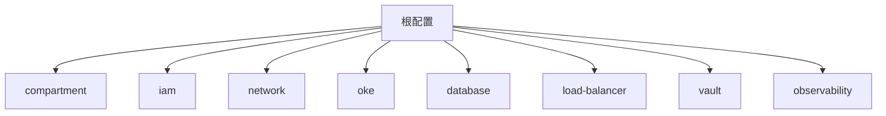

# OpenTofu模块化目录设计

把网络、IAM、OKE、数据库等拆分成独立模块，是管理复杂基础设施的关键。

## 核心要点

* 推荐模块划分：compartment、iam、network、oke、database、load-balancer、vault、observability
* 每个模块职责单一，便于独立维护和复用
* 模块之间通过Output/Variable传递依赖关系
* 结构清晰有助于团队协作和代码审查

---

## 本章测验

本章共 5 道单项选择题。

### 第 1 题

下列哪一项不属于推荐的OpenTofu模块划分？

- A. network
- B. spring-boot-controller
- C. oke
- D. database

选择答案后查看结果

正确答案：B

答案解析：Spring Boot业务代码不是OpenTofu模块，OpenTofu只管理基础设施相关模块。

### 第 2 题

模块化设计的主要好处是什么？

- A. 让所有代码写在一个文件里更简单
- B. 可以跳过版本控制
- C. 职责单一、便于复用和维护
- D. 不再需要State文件

选择答案后查看结果

正确答案：C

答案解析：拆分模块能让每部分职责清晰，方便复用到不同环境，也方便代码审查。

### 第 3 题

load-balancer模块通常负责创建哪类资源？

- A. Oracle数据库表结构
- B. Spring Boot Jar包
- C. SNMP OID定义
- D. 负载均衡器相关资源

选择答案后查看结果

正确答案：D

答案解析：load-balancer模块专门负责创建和管理负载均衡相关的OCI资源。

### 第 4 题

模块之间通常通过什么方式传递依赖信息？

- A. Output和Variable
- B. 直接读取对方的State文件内容并硬编码
- C. 通过Syslog传递
- D. 通过SNMP Trap传递

选择答案后查看结果

正确答案：A

答案解析：一个模块的Output可以作为另一个模块的Variable输入，实现模块间的信息传递。

### 第 5 题

observability模块最可能负责创建什么？

- A. Kubernetes Deployment的容器镜像
- B. 监控和日志相关的OCI资源
- C. Java的编译产物
- D. SNMP设备的固件

选择答案后查看结果

正确答案：B

答案解析：observability模块通常用于配置OCI Logging、Monitoring等可观测性相关资源。

<!-- QUIZ_DATA_START
{
  "chapter": "06",
  "questions": [
    {
      "id": 1,
      "question": "下列哪一项不属于推荐的OpenTofu模块划分？",
      "options": {
        "A": "network",
        "B": "spring-boot-controller",
        "C": "oke",
        "D": "database"
      },
      "answer": "B",
      "explanation": "Spring Boot业务代码不是OpenTofu模块，OpenTofu只管理基础设施相关模块。"
    },
    {
      "id": 2,
      "question": "模块化设计的主要好处是什么？",
      "options": {
        "A": "让所有代码写在一个文件里更简单",
        "B": "可以跳过版本控制",
        "C": "职责单一、便于复用和维护",
        "D": "不再需要State文件"
      },
      "answer": "C",
      "explanation": "拆分模块能让每部分职责清晰，方便复用到不同环境，也方便代码审查。"
    },
    {
      "id": 3,
      "question": "load-balancer模块通常负责创建哪类资源？",
      "options": {
        "A": "Oracle数据库表结构",
        "B": "Spring Boot Jar包",
        "C": "SNMP OID定义",
        "D": "负载均衡器相关资源"
      },
      "answer": "D",
      "explanation": "load-balancer模块专门负责创建和管理负载均衡相关的OCI资源。"
    },
    {
      "id": 4,
      "question": "模块之间通常通过什么方式传递依赖信息？",
      "options": {
        "A": "Output和Variable",
        "B": "直接读取对方的State文件内容并硬编码",
        "C": "通过Syslog传递",
        "D": "通过SNMP Trap传递"
      },
      "answer": "A",
      "explanation": "一个模块的Output可以作为另一个模块的Variable输入，实现模块间的信息传递。"
    },
    {
      "id": 5,
      "question": "observability模块最可能负责创建什么？",
      "options": {
        "A": "Kubernetes Deployment的容器镜像",
        "B": "监控和日志相关的OCI资源",
        "C": "Java的编译产物",
        "D": "SNMP设备的固件"
      },
      "answer": "B",
      "explanation": "observability模块通常用于配置OCI Logging、Monitoring等可观测性相关资源。"
    }
  ]
}
QUIZ_DATA_END -->
