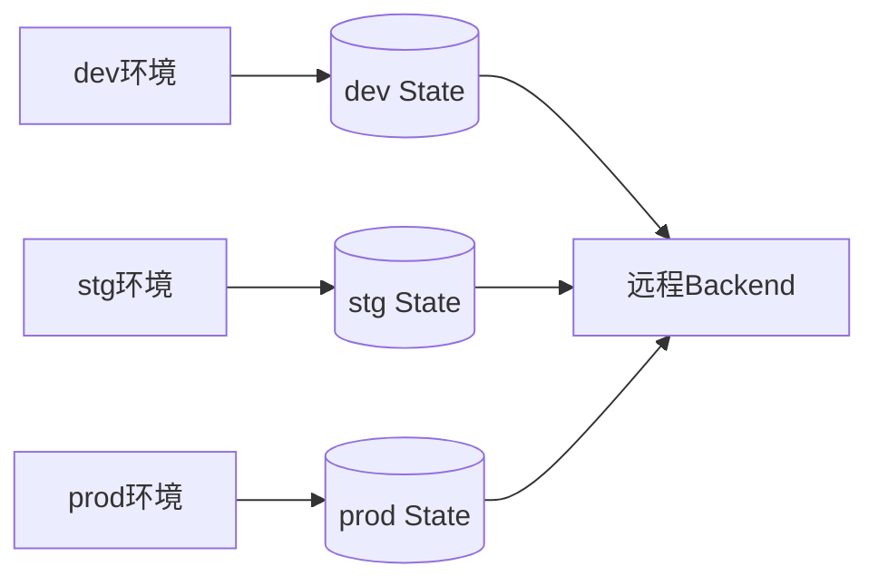

# State管理与多环境分离

State记录着云资源与代码的映射关系，必须妥善保存并按环境隔离。

## 核心要点

* State不应直接提交到公共代码仓库，可能包含敏感信息
* OpenTofu支持远程Backend、State Locking和加密
* 生产环境建议使用独立目录而非仅靠Workspace区分
* 环境目录示例：environments/dev、stg、prod，各自有独立backend.tf

---

## 本章测验

本章共 5 道单项选择题。

### 第 1 题

为什么State文件不应该直接提交到公共代码仓库？

- A. State文件体积太大无法上传
- B. GitHub不支持State格式
- C. State中可能包含数据库地址、密钥等敏感信息
- D. State文件是二进制无法查看

选择答案后查看结果

正确答案：C

答案解析：State可能记录数据库连接信息等敏感属性，直接提交到公共仓库存在泄露风险。

### 第 2 题

OpenTofu对State提供了哪些保护机制？

- A. 只能保存在本地磁盘
- B. 不支持任何加密
- C. 只能手动备份
- D. 远程Backend、State Locking和静态加密

选择答案后查看结果

正确答案：D

答案解析：OpenTofu支持远程Backend存储、State Locking防止并发冲突，以及对State和Plan文件进行加密。

### 第 3 题

对于复杂的生产部署，官方更建议采用哪种环境隔离方式？

- A. 独立的配置目录（如environments/prod）
- B. 仅依靠Workspace区分环境
- C. 把所有环境写在同一个State里
- D. 完全不做环境隔离

选择答案后查看结果

正确答案：A

答案解析：复杂部署通常需要独立权限、独立State和独立流水线，因此建议使用独立配置目录而非仅靠Workspace。

### 第 4 题

下面哪个目录结构更符合环境分离的推荐做法？

- A. 把dev/stg/prod配置全部写在同一个main.tf里
- B. environments/dev、environments/stg、environments/prod各自独立
- C. 只创建一个环境，所有人共用
- D. 把State文件放在Spring Boot的resources目录下

选择答案后查看结果

正确答案：B

答案解析：按环境分别建立独立目录，各自拥有main.tf、backend.tf和tfvars，是推荐的隔离方式。

### 第 5 题

State Locking的主要作用是什么？

- A. 加快tofu apply的执行速度
- B. 自动生成Kubernetes YAML
- C. 防止多人同时操作导致State并发冲突
- D. 替代IAM权限控制

选择答案后查看结果

正确答案：C

答案解析：State Locking可以避免多个人或流水线同时修改State而造成的冲突和损坏。

<!-- QUIZ_DATA_START
{
  "chapter": "07",
  "questions": [
    {
      "id": 1,
      "question": "为什么State文件不应该直接提交到公共代码仓库？",
      "options": {
        "A": "State文件体积太大无法上传",
        "B": "GitHub不支持State格式",
        "C": "State中可能包含数据库地址、密钥等敏感信息",
        "D": "State文件是二进制无法查看"
      },
      "answer": "C",
      "explanation": "State可能记录数据库连接信息等敏感属性，直接提交到公共仓库存在泄露风险。"
    },
    {
      "id": 2,
      "question": "OpenTofu对State提供了哪些保护机制？",
      "options": {
        "A": "只能保存在本地磁盘",
        "B": "不支持任何加密",
        "C": "只能手动备份",
        "D": "远程Backend、State Locking和静态加密"
      },
      "answer": "D",
      "explanation": "OpenTofu支持远程Backend存储、State Locking防止并发冲突，以及对State和Plan文件进行加密。"
    },
    {
      "id": 3,
      "question": "对于复杂的生产部署，官方更建议采用哪种环境隔离方式？",
      "options": {
        "A": "独立的配置目录（如environments/prod）",
        "B": "仅依靠Workspace区分环境",
        "C": "把所有环境写在同一个State里",
        "D": "完全不做环境隔离"
      },
      "answer": "A",
      "explanation": "复杂部署通常需要独立权限、独立State和独立流水线，因此建议使用独立配置目录而非仅靠Workspace。"
    },
    {
      "id": 4,
      "question": "下面哪个目录结构更符合环境分离的推荐做法？",
      "options": {
        "A": "把dev/stg/prod配置全部写在同一个main.tf里",
        "B": "environments/dev、environments/stg、environments/prod各自独立",
        "C": "只创建一个环境，所有人共用",
        "D": "把State文件放在Spring Boot的resources目录下"
      },
      "answer": "B",
      "explanation": "按环境分别建立独立目录，各自拥有main.tf、backend.tf和tfvars，是推荐的隔离方式。"
    },
    {
      "id": 5,
      "question": "State Locking的主要作用是什么？",
      "options": {
        "A": "加快tofu apply的执行速度",
        "B": "自动生成Kubernetes YAML",
        "C": "防止多人同时操作导致State并发冲突",
        "D": "替代IAM权限控制"
      },
      "answer": "C",
      "explanation": "State Locking可以避免多个人或流水线同时修改State而造成的冲突和损坏。"
    }
  ]
}
QUIZ_DATA_END -->
