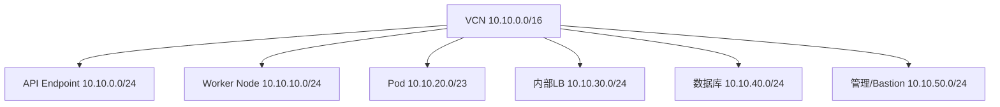

# OCI VCN与子网规划

合理的网络分段是整个平台安全和可维护性的基础。

## 核心要点

* 不同用途的资源应划分到不同子网，而不是共用一个大子网
* 示例划分：API Endpoint、Worker Node、Pod、内部LB、数据库、管理网段
* OKE创建前必须准备VCN、子网、路由等网络资源
* 分段清晰便于分别配置安全规则和路由

---

## 本章测验

本章共 5 道单项选择题。

### 第 1 题

为什么不建议把所有资源放在同一个子网里？

- A. OCI不允许创建超过1个子网
- B. 同一子网无法创建资源
- C. 子网数量会影响计费方式
- D. 分开子网便于分别设置和控制安全规则

选择答案后查看结果

正确答案：D

答案解析：如果所有资源共用一个子网，后续很难针对不同资源分别设置访问控制规则。

### 第 2 题

OKE集群创建之前必须提前准备哪些网络资源？

- A. VCN、子网、路由、NSG或安全列表等
- B. Spring Boot Jar包
- C. SNMP OID定义文件
- D. Oracle数据库表结构

选择答案后查看结果

正确答案：A

答案解析：OKE依赖预先创建好的VCN、子网、路由表和NSG/安全列表等网络资源。

### 第 3 题

下列哪个子网划分更符合职责分离的原则？

- A. Worker Node和数据库共用同一子网
- B. API Endpoint、Worker Node、Pod、内部LB、数据库分别使用独立子网
- C. 所有流量都走一个/16的大子网
- D. 只创建一个公有子网即可

选择答案后查看结果

正确答案：B

答案解析：按用途划分子网，可以分别针对不同资源设置合适的安全和路由策略。

### 第 4 题

示例中，Pod使用的子网范围通常比Worker Node子网大，原因最可能是？

- A. Pod子网不需要地址
- B. 这是随意设置，没有实际原因
- C. Pod数量通常远多于Worker Node数量，需要更大的地址空间
- D. Pod必须使用公网IP

选择答案后查看结果

正确答案：C

答案解析：一个Worker Node上可以运行多个Pod，因此Pod子网通常需要更大的地址空间来容纳更多IP。

### 第 5 题

管理/Bastion网段的主要作用是什么？

- A. 接收用户的HTTPS流量
- B. 用于存放Oracle数据库文件
- C. 作为SNMP Trap的接收地址
- D. 提供运维人员进行集群或资源管理的访问入口

选择答案后查看结果

正确答案：D

答案解析：管理/Bastion网段通常用于运维人员对内部资源进行管理性访问，而不是承载业务流量。

<!-- QUIZ_DATA_START
{
  "chapter": "08",
  "questions": [
    {
      "id": 1,
      "question": "为什么不建议把所有资源放在同一个子网里？",
      "options": {
        "A": "OCI不允许创建超过1个子网",
        "B": "同一子网无法创建资源",
        "C": "子网数量会影响计费方式",
        "D": "分开子网便于分别设置和控制安全规则"
      },
      "answer": "D",
      "explanation": "如果所有资源共用一个子网，后续很难针对不同资源分别设置访问控制规则。"
    },
    {
      "id": 2,
      "question": "OKE集群创建之前必须提前准备哪些网络资源？",
      "options": {
        "A": "VCN、子网、路由、NSG或安全列表等",
        "B": "Spring Boot Jar包",
        "C": "SNMP OID定义文件",
        "D": "Oracle数据库表结构"
      },
      "answer": "A",
      "explanation": "OKE依赖预先创建好的VCN、子网、路由表和NSG/安全列表等网络资源。"
    },
    {
      "id": 3,
      "question": "下列哪个子网划分更符合职责分离的原则？",
      "options": {
        "A": "Worker Node和数据库共用同一子网",
        "B": "API Endpoint、Worker Node、Pod、内部LB、数据库分别使用独立子网",
        "C": "所有流量都走一个/16的大子网",
        "D": "只创建一个公有子网即可"
      },
      "answer": "B",
      "explanation": "按用途划分子网，可以分别针对不同资源设置合适的安全和路由策略。"
    },
    {
      "id": 4,
      "question": "示例中，Pod使用的子网范围通常比Worker Node子网大，原因最可能是？",
      "options": {
        "A": "Pod子网不需要地址",
        "B": "这是随意设置，没有实际原因",
        "C": "Pod数量通常远多于Worker Node数量，需要更大的地址空间",
        "D": "Pod必须使用公网IP"
      },
      "answer": "C",
      "explanation": "一个Worker Node上可以运行多个Pod，因此Pod子网通常需要更大的地址空间来容纳更多IP。"
    },
    {
      "id": 5,
      "question": "管理/Bastion网段的主要作用是什么？",
      "options": {
        "A": "接收用户的HTTPS流量",
        "B": "用于存放Oracle数据库文件",
        "C": "作为SNMP Trap的接收地址",
        "D": "提供运维人员进行集群或资源管理的访问入口"
      },
      "answer": "D",
      "explanation": "管理/Bastion网段通常用于运维人员对内部资源进行管理性访问，而不是承载业务流量。"
    }
  ]
}
QUIZ_DATA_END -->
