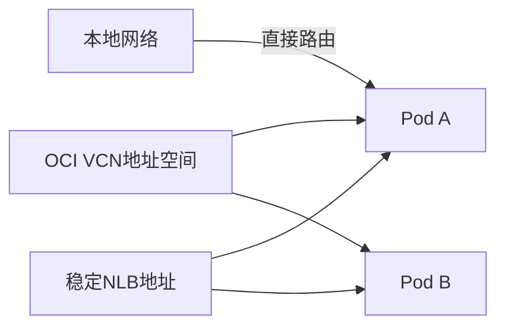

# OKE Pod网络模式：VCN-Native Networking

Pod使用什么样的网络模式，直接决定了企业设备能否直接访问Pod。

## 核心要点

* VCN-Native Pod Networking让Pod从VCN地址空间获得可路由IP
* 同VCN、对等VCN及连接的本地网络可以直接与Pod通信
* Pod重建后IP可能变化，不适合作为长期固定目标
* 设备发送Trap/Syslog应指向稳定的NLB地址，而非直接指向Pod IP

---

## 本章测验

本章共 5 道单项选择题。

### 第 1 题

VCN-Native Pod Networking的核心特点是什么？

- A. Pod使用与VCN完全隔离的独立地址空间
- B. Pod从VCN地址空间获得可路由IP
- C. Pod无法被外部网络访问
- D. Pod的IP永久不变

选择答案后查看结果

正确答案：B

答案解析：VCN-Native模式下，Pod直接使用VCN地址空间的IP，因此可以被同VCN、对等VCN或接入的本地网络直接路由访问。

### 第 2 题

为什么不建议让设备把Trap或Syslog直接发送到Pod IP？

- A. Pod不支持接收UDP流量
- B. Pod IP会自动加密无法解析
- C. Pod重建后IP可能变化，导致设备发送地址失效
- D. OCI禁止Pod接收外部流量

选择答案后查看结果

正确答案：C

答案解析：Pod的生命周期较短，重建后IP可能变化，如果设备直接配置Pod IP，Pod重建后设备就发不到消息了。

### 第 3 题

设备发送Trap/Syslog更推荐的目标地址是？

- A. 任意一个Worker Node的公网IP
- B. 随机选择的Pod IP
- C. Kubernetes API Server地址
- D. 稳定的NLB地址

选择答案后查看结果

正确答案：D

答案解析：NLB提供稳定不变的入口地址，即使后端Pod发生变化，设备的配置也不需要调整。

### 第 4 题

VCN-Native Networking相比某些覆盖网络（overlay）方案的一个优势是？

- A. Pod与本地网络之间的通信更直接，无需额外的地址转换
- B. 完全不需要任何路由配置
- C. Pod数量不受限制
- D. 不需要NSG或安全列表

选择答案后查看结果

正确答案：A

答案解析：由于Pod直接使用VCN地址空间，跨VCN对等连接或本地网络访问Pod时可以直接路由，减少了额外的封装和转换。

### 第 5 题

以下哪种说法准确描述了本章的建议？

- A. 设备应始终直接连接某个具体Pod的IP地址
- B. 入口流量应该指向能够抵抗Pod变化的稳定地址，如NLB
- C. Pod网络模式与设备接入无关
- D. NLB只能用于HTTP流量

选择答案后查看结果

正确答案：B

答案解析：本章强调应使用稳定的NLB地址作为入口，以应对Pod IP因重建而变化的问题。

<!-- QUIZ_DATA_START
{
  "chapter": "10",
  "questions": [
    {
      "id": 1,
      "question": "VCN-Native Pod Networking的核心特点是什么？",
      "options": {
        "A": "Pod使用与VCN完全隔离的独立地址空间",
        "B": "Pod从VCN地址空间获得可路由IP",
        "C": "Pod无法被外部网络访问",
        "D": "Pod的IP永久不变"
      },
      "answer": "B",
      "explanation": "VCN-Native模式下，Pod直接使用VCN地址空间的IP，因此可以被同VCN、对等VCN或接入的本地网络直接路由访问。"
    },
    {
      "id": 2,
      "question": "为什么不建议让设备把Trap或Syslog直接发送到Pod IP？",
      "options": {
        "A": "Pod不支持接收UDP流量",
        "B": "Pod IP会自动加密无法解析",
        "C": "Pod重建后IP可能变化，导致设备发送地址失效",
        "D": "OCI禁止Pod接收外部流量"
      },
      "answer": "C",
      "explanation": "Pod的生命周期较短，重建后IP可能变化，如果设备直接配置Pod IP，Pod重建后设备就发不到消息了。"
    },
    {
      "id": 3,
      "question": "设备发送Trap/Syslog更推荐的目标地址是？",
      "options": {
        "A": "任意一个Worker Node的公网IP",
        "B": "随机选择的Pod IP",
        "C": "Kubernetes API Server地址",
        "D": "稳定的NLB地址"
      },
      "answer": "D",
      "explanation": "NLB提供稳定不变的入口地址，即使后端Pod发生变化，设备的配置也不需要调整。"
    },
    {
      "id": 4,
      "question": "VCN-Native Networking相比某些覆盖网络（overlay）方案的一个优势是？",
      "options": {
        "A": "Pod与本地网络之间的通信更直接，无需额外的地址转换",
        "B": "完全不需要任何路由配置",
        "C": "Pod数量不受限制",
        "D": "不需要NSG或安全列表"
      },
      "answer": "A",
      "explanation": "由于Pod直接使用VCN地址空间，跨VCN对等连接或本地网络访问Pod时可以直接路由，减少了额外的封装和转换。"
    },
    {
      "id": 5,
      "question": "以下哪种说法准确描述了本章的建议？",
      "options": {
        "A": "设备应始终直接连接某个具体Pod的IP地址",
        "B": "入口流量应该指向能够抵抗Pod变化的稳定地址，如NLB",
        "C": "Pod网络模式与设备接入无关",
        "D": "NLB只能用于HTTP流量"
      },
      "answer": "B",
      "explanation": "本章强调应使用稳定的NLB地址作为入口，以应对Pod IP因重建而变化的问题。"
    }
  ]
}
QUIZ_DATA_END -->
