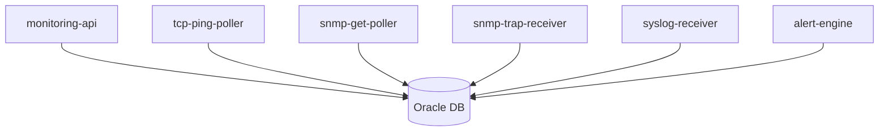

# OKE工作负载拆分原则

不要把所有功能塞进一个Spring Boot容器，拆分服务能避免重复采集等问题。

## 核心要点

* 推荐拆分为monitoring-api、多种Poller、Trap/Syslog接收器和alert-engine
* 统一放在一个容器里，HPA扩容时会导致重复轮询、重复告警等问题
* 拆分后各服务可以独立扩缩容，互不影响
* 数据库初始化用Job，定期清理用CronJob

---

## 本章测验

本章共 5 道单项选择题。

### 第 1 题

如果把Web API、Poller、Trap接收全部放进同一个容器，HPA扩容后可能出现什么问题？

- A. 系统会自动避免重复问题
- B. 容器会拒绝启动
- C. 同一设备可能被重复轮询、告警可能重复生成
- D. 数据库会自动去重不受影响

选择答案后查看结果

正确答案：C

答案解析：HPA扩容会增加Pod副本数，如果所有功能都在同一容器内，多个副本会各自执行相同的轮询和监听任务，导致重复。

### 第 2 题

下列哪一项适合使用Kubernetes的CronJob资源？

- A. monitoring-api的Web请求处理
- B. SNMP Trap的实时接收
- C. TCP Ping的即时探测
- D. 定期清理历史数据

选择答案后查看结果

正确答案：D

答案解析：定期清理历史数据是周期性任务，适合用CronJob实现，而不是常驻的Deployment。

### 第 3 题

数据库初始化任务更适合使用哪种Kubernetes资源？

- A. Job
- B. Deployment
- C. DaemonSet
- D. Service

选择答案后查看结果

正确答案：A

答案解析：数据库初始化是一次性任务，执行完成即可结束，适合用Job而不是长期运行的Deployment。

### 第 4 题

将Poller、Trap接收和Web API拆分成独立服务的主要好处是？

- A. 可以减少代码总量
- B. 可以让各服务独立扩缩容，互不影响
- C. 可以完全省略数据库
- D. 可以取消所有健康检查

选择答案后查看结果

正确答案：B

答案解析：拆分后，每个服务可以根据自身负载单独扩缩容，不会因为Web流量增加而误导Poller或Trap接收也跟着扩容。

### 第 5 题

alert-engine在整体架构中承担什么角色？

- A. 接收用户的HTTPS请求
- B. 负责创建OCI VCN
- C. 消费Poller和Trap/Syslog产生的标准化事件并进行告警判断
- D. 负责编译Docker镜像

选择答案后查看结果

正确答案：C

答案解析：alert-engine专门负责消费各来源产生的标准化事件，判断是否需要生成告警。

<!-- QUIZ_DATA_START
{
  "chapter": "11",
  "questions": [
    {
      "id": 1,
      "question": "如果把Web API、Poller、Trap接收全部放进同一个容器，HPA扩容后可能出现什么问题？",
      "options": {
        "A": "系统会自动避免重复问题",
        "B": "容器会拒绝启动",
        "C": "同一设备可能被重复轮询、告警可能重复生成",
        "D": "数据库会自动去重不受影响"
      },
      "answer": "C",
      "explanation": "HPA扩容会增加Pod副本数，如果所有功能都在同一容器内，多个副本会各自执行相同的轮询和监听任务，导致重复。"
    },
    {
      "id": 2,
      "question": "下列哪一项适合使用Kubernetes的CronJob资源？",
      "options": {
        "A": "monitoring-api的Web请求处理",
        "B": "SNMP Trap的实时接收",
        "C": "TCP Ping的即时探测",
        "D": "定期清理历史数据"
      },
      "answer": "D",
      "explanation": "定期清理历史数据是周期性任务，适合用CronJob实现，而不是常驻的Deployment。"
    },
    {
      "id": 3,
      "question": "数据库初始化任务更适合使用哪种Kubernetes资源？",
      "options": {
        "A": "Job",
        "B": "Deployment",
        "C": "DaemonSet",
        "D": "Service"
      },
      "answer": "A",
      "explanation": "数据库初始化是一次性任务，执行完成即可结束，适合用Job而不是长期运行的Deployment。"
    },
    {
      "id": 4,
      "question": "将Poller、Trap接收和Web API拆分成独立服务的主要好处是？",
      "options": {
        "A": "可以减少代码总量",
        "B": "可以让各服务独立扩缩容，互不影响",
        "C": "可以完全省略数据库",
        "D": "可以取消所有健康检查"
      },
      "answer": "B",
      "explanation": "拆分后，每个服务可以根据自身负载单独扩缩容，不会因为Web流量增加而误导Poller或Trap接收也跟着扩容。"
    },
    {
      "id": 5,
      "question": "alert-engine在整体架构中承担什么角色？",
      "options": {
        "A": "接收用户的HTTPS请求",
        "B": "负责创建OCI VCN",
        "C": "消费Poller和Trap/Syslog产生的标准化事件并进行告警判断",
        "D": "负责编译Docker镜像"
      },
      "answer": "C",
      "explanation": "alert-engine专门负责消费各来源产生的标准化事件，判断是否需要生成告警。"
    }
  ]
}
QUIZ_DATA_END -->
