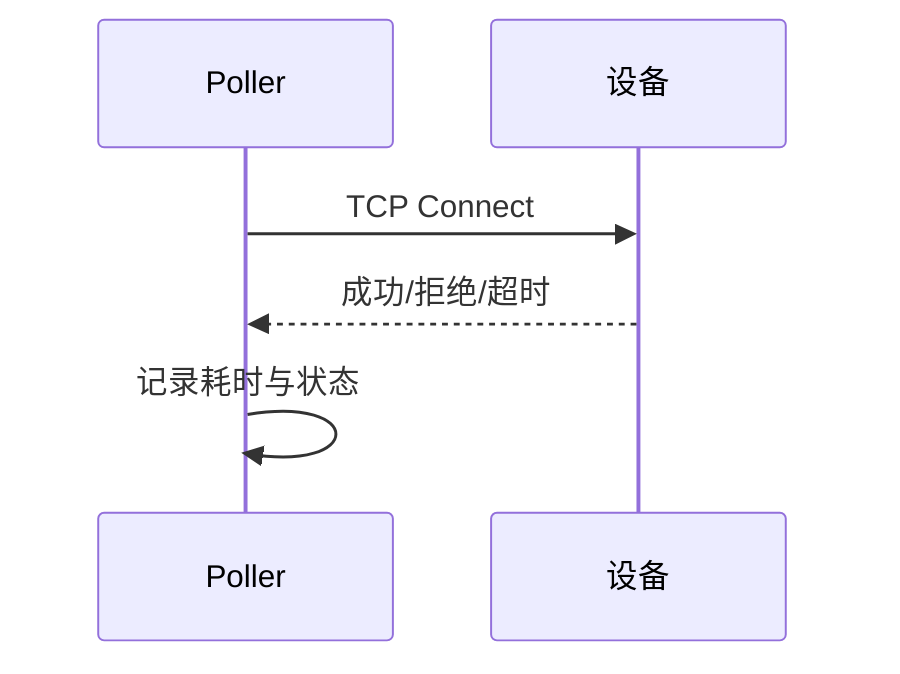

# TCP Ping监控原理与实现

TCP Ping不是ICMP Ping，而是通过尝试建立TCP连接来判断设备端口是否可达。

## 核心要点

* TCP Ping通过Socket连接指定IP和端口，判断成功、拒绝或超时
* 需要记录设备ID、IP、端口、耗时、失败类型等信息
* 必须设置连接超时并限制并发数，避免端口耗尽
* TCP Ping是出站流量，不需要负载均衡器

---

## 本章测验

本章共 5 道单项选择题。

### 第 1 题

TCP Ping与传统ICMP Ping的主要区别是什么？

- A. TCP Ping通过建立TCP连接判断端口可达性，而不是发送ICMP包
- B. 两者完全一样
- C. TCP Ping只能检测网页
- D. TCP Ping不需要指定端口

选择答案后查看结果

正确答案：A

答案解析：TCP Ping的原理是尝试对指定IP和端口发起TCP连接，根据连接结果判断可达性，而不是依赖ICMP协议。

### 第 2 题

实现TCP Ping时，为什么必须设置连接超时？

- A. 为了让程序运行得更慢
- B. 避免因设备无响应导致线程或连接长时间挂起
- C. 超时设置是Java语法强制要求的
- D. 为了绕过防火墙

选择答案后查看结果

正确答案：B

答案解析：如果不设置超时，遇到无响应的设备会导致连接长期挂起，占用资源甚至拖慢整体探测。

### 第 3 题

为什么需要限制TCP Ping的并发数？

- A. 限制并发可以让代码更短
- B. OCI禁止并发探测
- C. 并发太高会导致临时端口耗尽等资源问题
- D. 限制并发没有实际意义

选择答案后查看结果

正确答案：C

答案解析：如果同时发起过多连接，可能导致本地临时端口耗尽或者对目标设备造成压力，因此需要合理限制并发。

### 第 4 题

TCP Ping在网络架构上属于哪一类流量，是否需要负载均衡器？

- A. 入站流量，需要负载均衡器
- B. 既不是入站也不是出站
- C. 需要HTTP Load Balancer
- D. 出站流量，不需要负载均衡器

选择答案后查看结果

正确答案：D

答案解析：TCP Ping是平台主动向设备发起连接，属于出站流量，不需要经过负载均衡器。

### 第 5 题

每次TCP Ping通常需要记录哪些信息？

- A. 设备ID、IP、端口、耗时以及具体的失败类型（如超时、拒绝）
- B. 只需要记录成功或失败
- C. 只需要记录设备的品牌型号
- D. 不需要记录任何信息

选择答案后查看结果

正确答案：A

答案解析：为了后续分析和展示，需要完整记录探测的设备信息、耗时以及具体的成功/失败类型。

<!-- QUIZ_DATA_START
{
  "chapter": "13",
  "questions": [
    {
      "id": 1,
      "question": "TCP Ping与传统ICMP Ping的主要区别是什么？",
      "options": {
        "A": "TCP Ping通过建立TCP连接判断端口可达性，而不是发送ICMP包",
        "B": "两者完全一样",
        "C": "TCP Ping只能检测网页",
        "D": "TCP Ping不需要指定端口"
      },
      "answer": "A",
      "explanation": "TCP Ping的原理是尝试对指定IP和端口发起TCP连接，根据连接结果判断可达性，而不是依赖ICMP协议。"
    },
    {
      "id": 2,
      "question": "实现TCP Ping时，为什么必须设置连接超时？",
      "options": {
        "A": "为了让程序运行得更慢",
        "B": "避免因设备无响应导致线程或连接长时间挂起",
        "C": "超时设置是Java语法强制要求的",
        "D": "为了绕过防火墙"
      },
      "answer": "B",
      "explanation": "如果不设置超时，遇到无响应的设备会导致连接长期挂起，占用资源甚至拖慢整体探测。"
    },
    {
      "id": 3,
      "question": "为什么需要限制TCP Ping的并发数？",
      "options": {
        "A": "限制并发可以让代码更短",
        "B": "OCI禁止并发探测",
        "C": "并发太高会导致临时端口耗尽等资源问题",
        "D": "限制并发没有实际意义"
      },
      "answer": "C",
      "explanation": "如果同时发起过多连接，可能导致本地临时端口耗尽或者对目标设备造成压力，因此需要合理限制并发。"
    },
    {
      "id": 4,
      "question": "TCP Ping在网络架构上属于哪一类流量，是否需要负载均衡器？",
      "options": {
        "A": "入站流量，需要负载均衡器",
        "B": "既不是入站也不是出站",
        "C": "需要HTTP Load Balancer",
        "D": "出站流量，不需要负载均衡器"
      },
      "answer": "D",
      "explanation": "TCP Ping是平台主动向设备发起连接，属于出站流量，不需要经过负载均衡器。"
    },
    {
      "id": 5,
      "question": "每次TCP Ping通常需要记录哪些信息？",
      "options": {
        "A": "设备ID、IP、端口、耗时以及具体的失败类型（如超时、拒绝）",
        "B": "只需要记录成功或失败",
        "C": "只需要记录设备的品牌型号",
        "D": "不需要记录任何信息"
      },
      "answer": "A",
      "explanation": "为了后续分析和展示，需要完整记录探测的设备信息、耗时以及具体的成功/失败类型。"
    }
  ]
}
QUIZ_DATA_END -->
