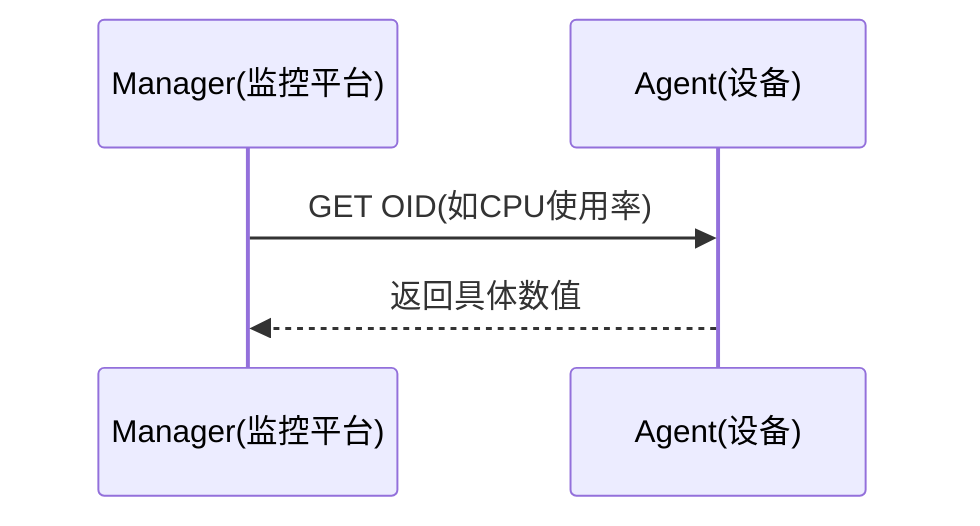

# SNMP GET原理与核心概念

SNMP GET是监控平台主动向设备查询具体指标的方式。

## 核心要点

* SNMP Manager是监控平台，SNMP Agent是网络设备
* OID是指标编号，MIB是OID的定义文件
* SNMPv2c依赖Community口令，安全性较弱
* 条件允许时应优先使用SNMPv3的身份认证与加密

---

## 本章测验

本章共 5 道单项选择题。

### 第 1 题

在SNMP架构中，谁扮演Manager的角色？

- A. 网络设备
- B. 监控平台
- C. Oracle数据库
- D. OCI Load Balancer

选择答案后查看结果

正确答案：B

答案解析：SNMP Manager指的是发起查询的监控平台一方，Agent则是被查询的网络设备。

### 第 2 题

OID在SNMP中代表什么？

- A. 设备的IP地址
- B. 数据库表名
- C. 指标的编号
- D. Kubernetes命名空间

选择答案后查看结果

正确答案：C

答案解析：OID（Object Identifier）是SNMP中用来唯一标识某个指标（如CPU使用率）的编号。

### 第 3 题

SNMPv2c主要依赖什么机制进行访问控制？

- A. OAuth2 Token
- B. TLS证书
- C. Kubernetes RBAC
- D. Community口令

选择答案后查看结果

正确答案：D

答案解析：SNMPv2c使用Community字符串作为简单的访问口令，安全性相对较弱。

### 第 4 题

相比SNMPv2c，SNMPv3提供了哪些增强能力？

- A. 用户身份认证和加密能力
- B. 更快的网络速度
- C. 自动生成MIB文件
- D. 免去OID编号

选择答案后查看结果

正确答案：A

答案解析：SNMPv3引入了基于用户的安全模型，支持身份认证和数据加密，比v2c的Community机制更安全。

### 第 5 题

MIB文件的作用是什么？

- A. 存储Oracle数据库连接池配置
- B. 定义OID所代表的具体含义
- C. 记录Kubernetes Pod的重启次数
- D. 生成Docker镜像

选择答案后查看结果

正确答案：B

答案解析：MIB（管理信息库）文件定义了各个OID所对应的具体指标含义，供SNMP客户端解析使用。

<!-- QUIZ_DATA_START
{
  "chapter": "14",
  "questions": [
    {
      "id": 1,
      "question": "在SNMP架构中，谁扮演Manager的角色？",
      "options": {
        "A": "网络设备",
        "B": "监控平台",
        "C": "Oracle数据库",
        "D": "OCI Load Balancer"
      },
      "answer": "B",
      "explanation": "SNMP Manager指的是发起查询的监控平台一方，Agent则是被查询的网络设备。"
    },
    {
      "id": 2,
      "question": "OID在SNMP中代表什么？",
      "options": {
        "A": "设备的IP地址",
        "B": "数据库表名",
        "C": "指标的编号",
        "D": "Kubernetes命名空间"
      },
      "answer": "C",
      "explanation": "OID（Object Identifier）是SNMP中用来唯一标识某个指标（如CPU使用率）的编号。"
    },
    {
      "id": 3,
      "question": "SNMPv2c主要依赖什么机制进行访问控制？",
      "options": {
        "A": "OAuth2 Token",
        "B": "TLS证书",
        "C": "Kubernetes RBAC",
        "D": "Community口令"
      },
      "answer": "D",
      "explanation": "SNMPv2c使用Community字符串作为简单的访问口令，安全性相对较弱。"
    },
    {
      "id": 4,
      "question": "相比SNMPv2c，SNMPv3提供了哪些增强能力？",
      "options": {
        "A": "用户身份认证和加密能力",
        "B": "更快的网络速度",
        "C": "自动生成MIB文件",
        "D": "免去OID编号"
      },
      "answer": "A",
      "explanation": "SNMPv3引入了基于用户的安全模型，支持身份认证和数据加密，比v2c的Community机制更安全。"
    },
    {
      "id": 5,
      "question": "MIB文件的作用是什么？",
      "options": {
        "A": "存储Oracle数据库连接池配置",
        "B": "定义OID所代表的具体含义",
        "C": "记录Kubernetes Pod的重启次数",
        "D": "生成Docker镜像"
      },
      "answer": "B",
      "explanation": "MIB（管理信息库）文件定义了各个OID所对应的具体指标含义，供SNMP客户端解析使用。"
    }
  ]
}
QUIZ_DATA_END -->
