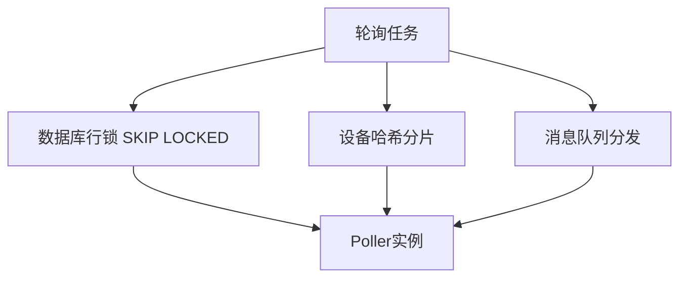

# SNMP GET轮询的并发与去重策略

多个Poller副本同时运行时，必须解决重复轮询同一设备的问题。

## 核心要点

* 方案一：数据库行锁 FOR UPDATE SKIP LOCKED 抢占任务
* 方案二：按设备ID哈希取模分片
* 方案三：使用消息队列分发任务给多个Consumer
* 正式系统中数据库锁或消息队列通常比单纯@Scheduled更可靠

---

## 本章测验

本章共 5 道单项选择题。

### 第 1 题

使用SQL的FOR UPDATE SKIP LOCKED的目的是什么？

- A. 让所有Poller都能抢到同一个任务
- B. 永久锁定表，禁止任何查询
- C. 一个Poller抢到任务后，其他Poller自动跳过，避免重复轮询
- D. 提高SNMP查询速度

选择答案后查看结果

正确答案：C

答案解析：SKIP LOCKED允许多个Poller并发抢占任务，已被锁定的行会被跳过，从而避免重复处理同一任务。

### 第 2 题

按hash(device_id) % pod_count分片的目的是什么？

- A. 随机分配任务，允许重复处理
- B. 让所有设备都由同一个Poller处理
- C. 取消并发轮询
- D. 让每台设备固定由某个Poller处理，避免重复轮询

选择答案后查看结果

正确答案：D

答案解析：通过对设备ID取模，可以让每个设备稳定地分配给固定的Poller实例，从而避免多个实例同时轮询同一设备。

### 第 3 题

消息队列方案在SNMP GET轮询中的作用是什么？

- A. 将轮询任务从Scheduler分发给多个Poller Consumer，避免重复消费
- B. 存储设备的固件版本
- C. 替代Oracle数据库存储指标
- D. 生成Kubernetes YAML

选择答案后查看结果

正确答案：A

答案解析：消息队列可以把任务集中分发，各Consumer各自消费不同任务，天然避免了重复处理。

### 第 4 题

为什么单纯使用@Scheduled定时任务在多副本场景下不够可靠？

- A. @Scheduled语法本身有错误
- B. 多个副本各自独立触发定时任务，容易导致同一设备被多次重复轮询
- C. @Scheduled无法在Spring Boot中使用
- D. @Scheduled只能执行一次

选择答案后查看结果

正确答案：B

答案解析：如果每个Pod副本都各自独立地按计划触发轮询，而没有协调机制，就会造成同一设备被多个副本同时轮询的问题。

### 第 5 题

以下哪种做法最不适合用来解决多Poller重复轮询问题？

- A. 数据库行锁抢占任务
- B. 设备哈希分片
- C. 让所有Poller各自独立无协调地轮询全部设备
- D. 消息队列分发任务

选择答案后查看结果

正确答案：C

答案解析：没有任何协调机制、各自独立轮询全部设备，必然会导致大量重复轮询，是应当避免的做法。

<!-- QUIZ_DATA_START
{
  "chapter": "15",
  "questions": [
    {
      "id": 1,
      "question": "使用SQL的FOR UPDATE SKIP LOCKED的目的是什么？",
      "options": {
        "A": "让所有Poller都能抢到同一个任务",
        "B": "永久锁定表，禁止任何查询",
        "C": "一个Poller抢到任务后，其他Poller自动跳过，避免重复轮询",
        "D": "提高SNMP查询速度"
      },
      "answer": "C",
      "explanation": "SKIP LOCKED允许多个Poller并发抢占任务，已被锁定的行会被跳过，从而避免重复处理同一任务。"
    },
    {
      "id": 2,
      "question": "按hash(device_id) % pod_count分片的目的是什么？",
      "options": {
        "A": "随机分配任务，允许重复处理",
        "B": "让所有设备都由同一个Poller处理",
        "C": "取消并发轮询",
        "D": "让每台设备固定由某个Poller处理，避免重复轮询"
      },
      "answer": "D",
      "explanation": "通过对设备ID取模，可以让每个设备稳定地分配给固定的Poller实例，从而避免多个实例同时轮询同一设备。"
    },
    {
      "id": 3,
      "question": "消息队列方案在SNMP GET轮询中的作用是什么？",
      "options": {
        "A": "将轮询任务从Scheduler分发给多个Poller Consumer，避免重复消费",
        "B": "存储设备的固件版本",
        "C": "替代Oracle数据库存储指标",
        "D": "生成Kubernetes YAML"
      },
      "answer": "A",
      "explanation": "消息队列可以把任务集中分发，各Consumer各自消费不同任务，天然避免了重复处理。"
    },
    {
      "id": 4,
      "question": "为什么单纯使用@Scheduled定时任务在多副本场景下不够可靠？",
      "options": {
        "A": "@Scheduled语法本身有错误",
        "B": "多个副本各自独立触发定时任务，容易导致同一设备被多次重复轮询",
        "C": "@Scheduled无法在Spring Boot中使用",
        "D": "@Scheduled只能执行一次"
      },
      "answer": "B",
      "explanation": "如果每个Pod副本都各自独立地按计划触发轮询，而没有协调机制，就会造成同一设备被多个副本同时轮询的问题。"
    },
    {
      "id": 5,
      "question": "以下哪种做法最不适合用来解决多Poller重复轮询问题？",
      "options": {
        "A": "数据库行锁抢占任务",
        "B": "设备哈希分片",
        "C": "让所有Poller各自独立无协调地轮询全部设备",
        "D": "消息队列分发任务"
      },
      "answer": "C",
      "explanation": "没有任何协调机制、各自独立轮询全部设备，必然会导致大量重复轮询，是应当避免的做法。"
    }
  ]
}
QUIZ_DATA_END -->
