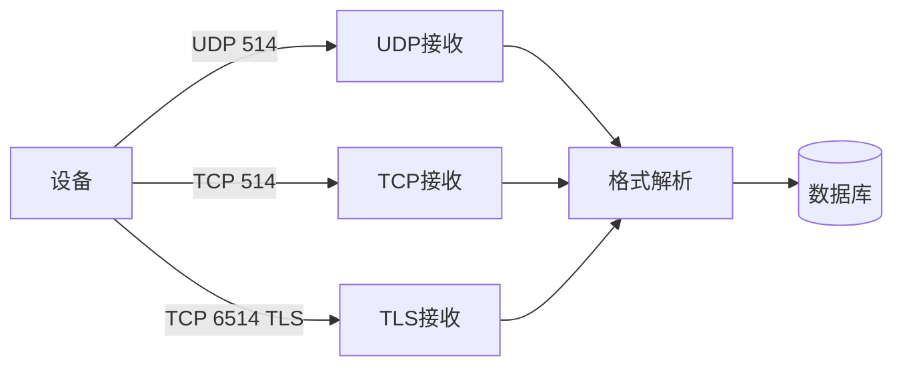

# Syslog接收设计

Syslog用于设备主动发送日志，需要兼容多种协议版本和传输方式。

## 核心要点

* 需要兼容RFC 5424新格式和RFC 3164传统格式
* 常用端口：UDP 514、TCP 514、TCP 6514（TLS）
* 生产安全环境优先TLS 6514，内部可靠环境用TCP 514，兼容旧设备用UDP 514
* 需要处理每秒日志量、单条日志长度限制、背压等问题

---

## 本章测验

本章共 5 道单项选择题。

### 第 1 题

Syslog over TLS通常使用的端口是？

- A. TCP 6514
- B. UDP 514
- C. TCP 514
- D. UDP 162

选择答案后查看结果

正确答案：A

答案解析：Syslog over TLS的标准端口是TCP 6514，而UDP 514和TCP 514分别对应传统的UDP和可靠TCP传输。

### 第 2 题

在生产安全环境中，本章建议优先使用哪种Syslog传输方式？

- A. UDP 514
- B. TLS 6514
- C. TCP 514
- D. 都一样，没有优先级

选择答案后查看结果

正确答案：B

答案解析：生产安全环境优先使用TLS 6514以获得加密传输，内部可靠环境可用TCP 514，兼容旧设备时才考虑UDP 514。

### 第 3 题

Syslog接收端需要兼容哪两类主要的消息格式？

- A. 只需要兼容JSON格式
- B. 只需要兼容XML格式
- C. RFC 5424格式和传统RFC 3164风格
- D. 只需要兼容二进制格式

选择答案后查看结果

正确答案：C

答案解析：现实环境中既有遵循RFC 5424的新设备，也有沿用传统RFC 3164风格的老旧设备，接收端需要都能处理。

### 第 4 题

为什么Syslog接收端需要考虑背压处理？

- A. 因为Syslog消息永远不会超过一条
- B. 因为TCP协议不支持背压
- C. 背压只在SNMP场景中出现
- D. 因为设备可能每秒发送数百甚至数千条日志，处理跟不上会造成积压或丢失

选择答案后查看结果

正确答案：D

答案解析：高频率的日志流入如果没有背压机制，可能导致内存暴涨或消息丢失，因此需要专门设计应对策略。

### 第 5 题

以下哪项不是Syslog接收端需要关心的内容？

- A. Oracle Database的表分区策略优化细节
- B. Facility和Severity字段
- C. 厂商私有格式解析
- D. 单条日志最大长度

选择答案后查看结果

正确答案：A

答案解析：数据库分区策略属于数据库设计范畴，虽然相关，但不是Syslog接收端本身需要处理的解析和传输问题。

<!-- QUIZ_DATA_START
{
  "chapter": "17",
  "questions": [
    {
      "id": 1,
      "question": "Syslog over TLS通常使用的端口是？",
      "options": {
        "A": "TCP 6514",
        "B": "UDP 514",
        "C": "TCP 514",
        "D": "UDP 162"
      },
      "answer": "A",
      "explanation": "Syslog over TLS的标准端口是TCP 6514，而UDP 514和TCP 514分别对应传统的UDP和可靠TCP传输。"
    },
    {
      "id": 2,
      "question": "在生产安全环境中，本章建议优先使用哪种Syslog传输方式？",
      "options": {
        "A": "UDP 514",
        "B": "TLS 6514",
        "C": "TCP 514",
        "D": "都一样，没有优先级"
      },
      "answer": "B",
      "explanation": "生产安全环境优先使用TLS 6514以获得加密传输，内部可靠环境可用TCP 514，兼容旧设备时才考虑UDP 514。"
    },
    {
      "id": 3,
      "question": "Syslog接收端需要兼容哪两类主要的消息格式？",
      "options": {
        "A": "只需要兼容JSON格式",
        "B": "只需要兼容XML格式",
        "C": "RFC 5424格式和传统RFC 3164风格",
        "D": "只需要兼容二进制格式"
      },
      "answer": "C",
      "explanation": "现实环境中既有遵循RFC 5424的新设备，也有沿用传统RFC 3164风格的老旧设备，接收端需要都能处理。"
    },
    {
      "id": 4,
      "question": "为什么Syslog接收端需要考虑背压处理？",
      "options": {
        "A": "因为Syslog消息永远不会超过一条",
        "B": "因为TCP协议不支持背压",
        "C": "背压只在SNMP场景中出现",
        "D": "因为设备可能每秒发送数百甚至数千条日志，处理跟不上会造成积压或丢失"
      },
      "answer": "D",
      "explanation": "高频率的日志流入如果没有背压机制，可能导致内存暴涨或消息丢失，因此需要专门设计应对策略。"
    },
    {
      "id": 5,
      "question": "以下哪项不是Syslog接收端需要关心的内容？",
      "options": {
        "A": "Oracle Database的表分区策略优化细节",
        "B": "Facility和Severity字段",
        "C": "厂商私有格式解析",
        "D": "单条日志最大长度"
      },
      "answer": "A",
      "explanation": "数据库分区策略属于数据库设计范畴，虽然相关，但不是Syslog接收端本身需要处理的解析和传输问题。"
    }
  ]
}
QUIZ_DATA_END -->
