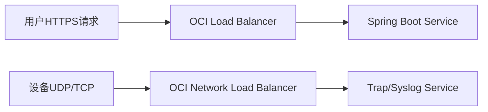

# 负载均衡分类：HTTP LB与NLB

不同协议类型的流量需要匹配不同类型的负载均衡器。

## 核心要点

* OCI Load Balancer适合HTTP/HTTPS流量、TLS终止、域名和路径路由
* OCI NLB适合TCP/UDP流量，支持保留源地址
* OCI Native Ingress Controller可根据Ingress资源自动创建Load Balancer
* Trap和Syslog必须走NLB而不是HTTP LB

---

## 本章测验

本章共 5 道单项选择题。

### 第 1 题

OCI Load Balancer最适合处理哪类流量？

- A. 原始UDP流量
- B. HTTP/HTTPS流量
- C. SNMP Trap
- D. Syslog原始报文

选择答案后查看结果

正确答案：B

答案解析：OCI Load Balancer是面向HTTP/HTTPS的七层负载均衡器，适合处理Web类流量、TLS终止和路径路由。

### 第 2 题

OCI Native Ingress Controller的作用是什么？

- A. 替代Oracle数据库
- B. 接收SNMP Trap
- C. 根据Kubernetes Ingress资源自动创建并配置OCI Load Balancer
- D. 管理OpenTofu State

选择答案后查看结果

正确答案：C

答案解析：OCI Native Ingress Controller可以根据集群中的Ingress资源，自动创建和维护对应的OCI Load Balancer及路由规则。

### 第 3 题

为什么SNMP Trap和Syslog不能使用HTTP Load Balancer？

- A. 因为HTTP LB不支持任何加密
- B. 因为HTTP LB只能转发GET请求
- C. 因为Trap和Syslog不需要负载均衡
- D. 因为它们是TCP/UDP协议，而HTTP LB是面向HTTP/HTTPS设计的七层负载均衡

选择答案后查看结果

正确答案：D

答案解析：Trap和Syslog基于TCP/UDP协议，属于四层流量，需要NLB这种支持TCP/UDP的负载均衡器来处理。

### 第 4 题

路径路由（如/api、/admin）这类功能通常由哪种负载均衡器提供？

- A. OCI Load Balancer
- B. OCI Network Load Balancer
- C. 两者都不支持
- D. 只有Kubernetes Service能做

选择答案后查看结果

正确答案：A

答案解析：路径路由是HTTP层面的功能，属于OCI Load Balancer（七层负载均衡）的能力范畴。

### 第 5 题

OCI NLB相较HTTP LB的一个关键特性是什么？

- A. 只能处理HTTPS流量
- B. 可以保留源地址信息，适合非HTTP协议
- C. 不支持任何UDP协议
- D. 无法与Kubernetes Service集成

选择答案后查看结果

正确答案：B

答案解析：NLB支持TCP和UDP，并且可以保留源地址和目标地址信息，适合SNMP Trap、Syslog等非HTTP协议场景。

<!-- QUIZ_DATA_START
{
  "chapter": "18",
  "questions": [
    {
      "id": 1,
      "question": "OCI Load Balancer最适合处理哪类流量？",
      "options": {
        "A": "原始UDP流量",
        "B": "HTTP/HTTPS流量",
        "C": "SNMP Trap",
        "D": "Syslog原始报文"
      },
      "answer": "B",
      "explanation": "OCI Load Balancer是面向HTTP/HTTPS的七层负载均衡器，适合处理Web类流量、TLS终止和路径路由。"
    },
    {
      "id": 2,
      "question": "OCI Native Ingress Controller的作用是什么？",
      "options": {
        "A": "替代Oracle数据库",
        "B": "接收SNMP Trap",
        "C": "根据Kubernetes Ingress资源自动创建并配置OCI Load Balancer",
        "D": "管理OpenTofu State"
      },
      "answer": "C",
      "explanation": "OCI Native Ingress Controller可以根据集群中的Ingress资源，自动创建和维护对应的OCI Load Balancer及路由规则。"
    },
    {
      "id": 3,
      "question": "为什么SNMP Trap和Syslog不能使用HTTP Load Balancer？",
      "options": {
        "A": "因为HTTP LB不支持任何加密",
        "B": "因为HTTP LB只能转发GET请求",
        "C": "因为Trap和Syslog不需要负载均衡",
        "D": "因为它们是TCP/UDP协议，而HTTP LB是面向HTTP/HTTPS设计的七层负载均衡"
      },
      "answer": "D",
      "explanation": "Trap和Syslog基于TCP/UDP协议，属于四层流量，需要NLB这种支持TCP/UDP的负载均衡器来处理。"
    },
    {
      "id": 4,
      "question": "路径路由（如/api、/admin）这类功能通常由哪种负载均衡器提供？",
      "options": {
        "A": "OCI Load Balancer",
        "B": "OCI Network Load Balancer",
        "C": "两者都不支持",
        "D": "只有Kubernetes Service能做"
      },
      "answer": "A",
      "explanation": "路径路由是HTTP层面的功能，属于OCI Load Balancer（七层负载均衡）的能力范畴。"
    },
    {
      "id": 5,
      "question": "OCI NLB相较HTTP LB的一个关键特性是什么？",
      "options": {
        "A": "只能处理HTTPS流量",
        "B": "可以保留源地址信息，适合非HTTP协议",
        "C": "不支持任何UDP协议",
        "D": "无法与Kubernetes Service集成"
      },
      "answer": "B",
      "explanation": "NLB支持TCP和UDP，并且可以保留源地址和目标地址信息，适合SNMP Trap、Syslog等非HTTP协议场景。"
    }
  ]
}
QUIZ_DATA_END -->
