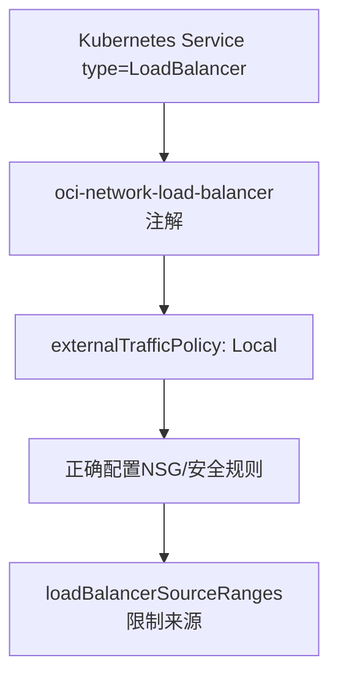

# NLB详细配置：保留源IP与安全规则

配置NLB时必须正确设置来源保留和安全规则，否则会丢失关键信息或暴露风险。

## 核心要点

* 通过注解is-preserve-source保留来源IP
* 结合externalTrafficPolicy: Local保留源地址
* NLB与后端节点的NSG安全规则不一定自动创建，需要手动配置
* 应使用loadBalancerSourceRanges限制允许访问的来源网段

---

## 本章测验

本章共 5 道单项选择题。

### 第 1 题

要让NLB保留客户端源IP，通常需要结合哪个Kubernetes Service字段？

- A. type: ClusterIP
- B. sessionAffinity: None
- C. externalTrafficPolicy: Local
- D. publishNotReadyAddresses: true

选择答案后查看结果

正确答案：C

答案解析：设置externalTrafficPolicy为Local，配合NLB的保留源地址注解，可以让后端应用看到真实的客户端源IP。

### 第 2 题

关于NLB与后端节点之间的安全规则，本章提到的注意事项是什么？

- A. OCI会自动创建所有必需的安全规则
- B. NLB不需要任何安全规则
- C. 安全规则只影响HTTP LB，不影响NLB
- D. 所需的安全规则默认情况下不一定自动创建，需要手动确认配置

选择答案后查看结果

正确答案：D

答案解析：OCI文档特别说明NLB所需的安全规则不一定会自动创建，需要手动检查并配置NSG或安全列表。

### 第 3 题

loadBalancerSourceRanges字段的作用是什么？

- A. 限制允许访问该负载均衡器的来源IP网段
- B. 指定后端Pod的资源限制
- C. 设置数据库连接字符串
- D. 配置容器镜像拉取策略

选择答案后查看结果

正确答案：A

答案解析：loadBalancerSourceRanges可以限制只有特定网段（如企业内网）才能访问该负载均衡器，避免对互联网开放。

### 第 4 题

为什么不应该在没有必要的情况下对互联网开放UDP 162、UDP/TCP 514等端口？

- A. 这些端口在互联网上完全用不了
- B. 这些端口对外开放会带来不必要的安全风险
- C. OCI技术上禁止开放这些端口
- D. 开放这些端口会导致Kubernetes崩溃

选择答案后查看结果

正确答案：B

答案解析：这些端口是设备监控专用的协议端口，若无限制地对互联网开放，容易成为攻击面，因此应严格限制来源。

### 第 5 题

容器内部监听端口和NLB对外端口是否需要保持一致？

- A. 必须完全一致，否则无法工作
- B. 容器必须直接绑定162等低位端口
- C. 可以不同，例如容器监听1162，NLB对外仍提供UDP 162
- D. NLB不支持端口映射

选择答案后查看结果

正确答案：C

答案解析：非root容器通常不建议绑定低于1024的端口，可以让容器监听如1162，NLB对外仍然提供162端口，通过端口映射实现。

<!-- QUIZ_DATA_START
{
  "chapter": "19",
  "questions": [
    {
      "id": 1,
      "question": "要让NLB保留客户端源IP，通常需要结合哪个Kubernetes Service字段？",
      "options": {
        "A": "type: ClusterIP",
        "B": "sessionAffinity: None",
        "C": "externalTrafficPolicy: Local",
        "D": "publishNotReadyAddresses: true"
      },
      "answer": "C",
      "explanation": "设置externalTrafficPolicy为Local，配合NLB的保留源地址注解，可以让后端应用看到真实的客户端源IP。"
    },
    {
      "id": 2,
      "question": "关于NLB与后端节点之间的安全规则，本章提到的注意事项是什么？",
      "options": {
        "A": "OCI会自动创建所有必需的安全规则",
        "B": "NLB不需要任何安全规则",
        "C": "安全规则只影响HTTP LB，不影响NLB",
        "D": "所需的安全规则默认情况下不一定自动创建，需要手动确认配置"
      },
      "answer": "D",
      "explanation": "OCI文档特别说明NLB所需的安全规则不一定会自动创建，需要手动检查并配置NSG或安全列表。"
    },
    {
      "id": 3,
      "question": "loadBalancerSourceRanges字段的作用是什么？",
      "options": {
        "A": "限制允许访问该负载均衡器的来源IP网段",
        "B": "指定后端Pod的资源限制",
        "C": "设置数据库连接字符串",
        "D": "配置容器镜像拉取策略"
      },
      "answer": "A",
      "explanation": "loadBalancerSourceRanges可以限制只有特定网段（如企业内网）才能访问该负载均衡器，避免对互联网开放。"
    },
    {
      "id": 4,
      "question": "为什么不应该在没有必要的情况下对互联网开放UDP 162、UDP/TCP 514等端口？",
      "options": {
        "A": "这些端口在互联网上完全用不了",
        "B": "这些端口对外开放会带来不必要的安全风险",
        "C": "OCI技术上禁止开放这些端口",
        "D": "开放这些端口会导致Kubernetes崩溃"
      },
      "answer": "B",
      "explanation": "这些端口是设备监控专用的协议端口，若无限制地对互联网开放，容易成为攻击面，因此应严格限制来源。"
    },
    {
      "id": 5,
      "question": "容器内部监听端口和NLB对外端口是否需要保持一致？",
      "options": {
        "A": "必须完全一致，否则无法工作",
        "B": "容器必须直接绑定162等低位端口",
        "C": "可以不同，例如容器监听1162，NLB对外仍提供UDP 162",
        "D": "NLB不支持端口映射"
      },
      "answer": "C",
      "explanation": "非root容器通常不建议绑定低于1024的端口，可以让容器监听如1162，NLB对外仍然提供162端口，通过端口映射实现。"
    }
  ]
}
QUIZ_DATA_END -->
