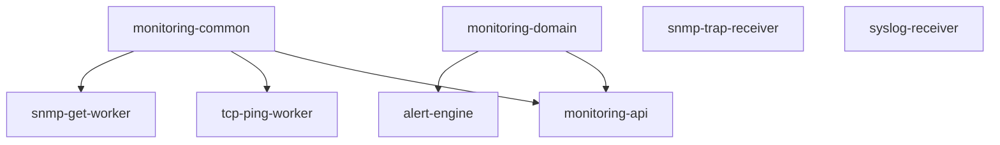

# Spring Boot多服务模块设计

把系统拆分为多个Spring Boot服务模块，各自承担明确职责。

## 核心要点

* monitoring-api负责用户登录、设备管理、告警查询等对外服务
* tcp-ping-worker和snmp-get-worker分别负责两种出站探测
* snmp-trap-receiver和syslog-receiver专注接收入站消息
* alert-engine负责统一处理标准化事件并生成告警

---

## 本章测验

本章共 5 道单项选择题。

### 第 1 题

monitoring-api模块主要负责什么功能？

- A. 接收SNMP Trap原始报文
- B. 执行TCP Connect探测
- C. 解析Syslog日志
- D. 用户登录、设备管理、告警查询等REST API

选择答案后查看结果

正确答案：D

答案解析：monitoring-api是面向用户和外部系统的服务，负责登录、设备与策略管理、告警查询等功能。

### 第 2 题

tcp-ping-worker采用了怎样的告警判断策略，而不是每次失败立即告警？

- A. 连续多次失败（如连续三次）才产生告警，恢复时产生恢复事件
- B. 第一次失败就立即产生告警
- C. 永远不产生告警
- D. 只有用户手动点击才产生告警

选择答案后查看结果

正确答案：A

答案解析：为了避免偶发抖动造成误报，通常设计为记录失败次数，连续多次失败才真正触发告警，恢复后再产生恢复事件。

### 第 3 题

snmp-get-worker将哪两个层面分开处理？

- A. 登录层和数据库层
- B. 采集层与告警层分开：采集层记录设备说了什么，规则层判断数值是否异常
- C. 前端层和后端层
- D. 网络层和存储层

选择答案后查看结果

正确答案：B

答案解析：设计上把“设备返回的原始数值”和“该数值是否超出阈值”分离开，分别对应采集层和规则/告警层。

### 第 4 题

为什么要把标准化后的事件统一成一致的JSON结构（如包含deviceId、sourceType等字段）？

- A. 因为JSON是唯一支持的数据格式
- B. 为了减少数据库表的数量
- C. 为了让不同来源（Trap、Syslog、TCP Ping等）的事件都能进入同一个告警模型统一处理
- D. 因为Spring Boot强制要求这种格式

选择答案后查看结果

正确答案：C

答案解析：统一的标准化事件结构，让不同协议来源产生的信息都可以用同一套告警引擎和规则去处理，简化了整体设计。

### 第 5 题

alert-engine在整体设计中的定位是什么？

- A. 只负责渲染前端页面
- B. 只负责数据库表结构设计
- C. 只负责创建OCI VCN
- D. 统一消费各来源产生的标准化事件，进行告警规则判断

选择答案后查看结果

正确答案：D

答案解析：alert-engine是消费标准化事件并统一进行告警判断和生成的核心模块。

<!-- QUIZ_DATA_START
{
  "chapter": "20",
  "questions": [
    {
      "id": 1,
      "question": "monitoring-api模块主要负责什么功能？",
      "options": {
        "A": "接收SNMP Trap原始报文",
        "B": "执行TCP Connect探测",
        "C": "解析Syslog日志",
        "D": "用户登录、设备管理、告警查询等REST API"
      },
      "answer": "D",
      "explanation": "monitoring-api是面向用户和外部系统的服务，负责登录、设备与策略管理、告警查询等功能。"
    },
    {
      "id": 2,
      "question": "tcp-ping-worker采用了怎样的告警判断策略，而不是每次失败立即告警？",
      "options": {
        "A": "连续多次失败（如连续三次）才产生告警，恢复时产生恢复事件",
        "B": "第一次失败就立即产生告警",
        "C": "永远不产生告警",
        "D": "只有用户手动点击才产生告警"
      },
      "answer": "A",
      "explanation": "为了避免偶发抖动造成误报，通常设计为记录失败次数，连续多次失败才真正触发告警，恢复后再产生恢复事件。"
    },
    {
      "id": 3,
      "question": "snmp-get-worker将哪两个层面分开处理？",
      "options": {
        "A": "登录层和数据库层",
        "B": "采集层与告警层分开：采集层记录设备说了什么，规则层判断数值是否异常",
        "C": "前端层和后端层",
        "D": "网络层和存储层"
      },
      "answer": "B",
      "explanation": "设计上把“设备返回的原始数值”和“该数值是否超出阈值”分离开，分别对应采集层和规则/告警层。"
    },
    {
      "id": 4,
      "question": "为什么要把标准化后的事件统一成一致的JSON结构（如包含deviceId、sourceType等字段）？",
      "options": {
        "A": "因为JSON是唯一支持的数据格式",
        "B": "为了减少数据库表的数量",
        "C": "为了让不同来源（Trap、Syslog、TCP Ping等）的事件都能进入同一个告警模型统一处理",
        "D": "因为Spring Boot强制要求这种格式"
      },
      "answer": "C",
      "explanation": "统一的标准化事件结构，让不同协议来源产生的信息都可以用同一套告警引擎和规则去处理，简化了整体设计。"
    },
    {
      "id": 5,
      "question": "alert-engine在整体设计中的定位是什么？",
      "options": {
        "A": "只负责渲染前端页面",
        "B": "只负责数据库表结构设计",
        "C": "只负责创建OCI VCN",
        "D": "统一消费各来源产生的标准化事件，进行告警规则判断"
      },
      "answer": "D",
      "explanation": "alert-engine是消费标准化事件并统一进行告警判断和生成的核心模块。"
    }
  ]
}
QUIZ_DATA_END -->
