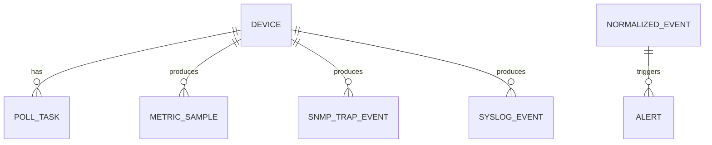

# Oracle Database表结构设计

良好的表结构设计决定了系统在海量指标数据下依然能高效查询。

## 核心要点

* 核心表包括DEVICE、POLL_TASK、METRIC_SAMPLE、SNMP_TRAP_EVENT、SYSLOG_EVENT等
* 事件数据增长很快，需要按日期分区并合理设置索引
* 查询METRIC_SAMPLE常按DEVICE_ID、METRIC_CODE、COLLECTED_AT组合过滤
* 需要制定冷热数据分离、归档和自动清理策略

---

## 本章测验

本章共 5 道单项选择题。

### 第 1 题

为什么METRIC_SAMPLE等事件数据表建议按日期分区？

- A. 因为数据增长很快，分区有助于查询性能和数据管理
- B. 因为分区可以让表名更好看
- C. 因为Oracle不支持不分区的表
- D. 分区是Spring Boot的强制要求

选择答案后查看结果

正确答案：A

答案解析：监控数据（如指标采集、Syslog事件）增长速度快，按日期分区有助于提升查询效率，也便于归档和清理旧数据。

### 第 2 题

查询METRIC_SAMPLE时，索引应该重点围绕哪些字段设计？

- A. 只围绕主键ID
- B. DEVICE_ID、METRIC_CODE、COLLECTED_AT等常用过滤字段
- C. 只围绕表的创建时间
- D. 不需要任何索引

选择答案后查看结果

正确答案：B

答案解析：常见查询是按设备、指标类型和时间范围过滤，因此索引应围绕这些高频查询字段设计。

### 第 3 题

为什么不建议每条指标都开启独立事务写入？

- A. Oracle不支持事务
- B. 事务与指标数据无关
- C. 海量高频写入下，每条都开事务会带来较大的性能开销
- D. 独立事务会导致数据丢失

选择答案后查看结果

正确答案：C

答案解析：面对每5分钟数千设备乘以多个OID的采集量，逐条开事务会造成显著的性能压力，因此建议批量写入。

### 第 4 题

下列哪一项不属于本章提到的核心数据表？

- A. DEVICE
- B. SNMP_TRAP_EVENT
- C. ALERT
- D. SPRING_SECURITY_SESSION

选择答案后查看结果

正确答案：D

答案解析：SPRING_SECURITY_SESSION不是本章描述的监控平台核心表，本章列出的核心表包括DEVICE、POLL_TASK、METRIC_SAMPLE、各类事件表和ALERT等。

### 第 5 题

冷热数据分离的主要目的是什么？

- A. 将访问频率低的历史数据与常用的近期数据分开管理，优化存储和查询性能
- B. 让所有数据永久保存在同一张热表中
- C. 取消所有历史数据
- D. 让数据库变得更难维护

选择答案后查看结果

正确答案：A

答案解析：冷热分离可以把不常访问的历史数据迁移或归档，减轻热数据表的压力，从而提升整体查询性能。

<!-- QUIZ_DATA_START
{
  "chapter": "21",
  "questions": [
    {
      "id": 1,
      "question": "为什么METRIC_SAMPLE等事件数据表建议按日期分区？",
      "options": {
        "A": "因为数据增长很快，分区有助于查询性能和数据管理",
        "B": "因为分区可以让表名更好看",
        "C": "因为Oracle不支持不分区的表",
        "D": "分区是Spring Boot的强制要求"
      },
      "answer": "A",
      "explanation": "监控数据（如指标采集、Syslog事件）增长速度快，按日期分区有助于提升查询效率，也便于归档和清理旧数据。"
    },
    {
      "id": 2,
      "question": "查询METRIC_SAMPLE时，索引应该重点围绕哪些字段设计？",
      "options": {
        "A": "只围绕主键ID",
        "B": "DEVICE_ID、METRIC_CODE、COLLECTED_AT等常用过滤字段",
        "C": "只围绕表的创建时间",
        "D": "不需要任何索引"
      },
      "answer": "B",
      "explanation": "常见查询是按设备、指标类型和时间范围过滤，因此索引应围绕这些高频查询字段设计。"
    },
    {
      "id": 3,
      "question": "为什么不建议每条指标都开启独立事务写入？",
      "options": {
        "A": "Oracle不支持事务",
        "B": "事务与指标数据无关",
        "C": "海量高频写入下，每条都开事务会带来较大的性能开销",
        "D": "独立事务会导致数据丢失"
      },
      "answer": "C",
      "explanation": "面对每5分钟数千设备乘以多个OID的采集量，逐条开事务会造成显著的性能压力，因此建议批量写入。"
    },
    {
      "id": 4,
      "question": "下列哪一项不属于本章提到的核心数据表？",
      "options": {
        "A": "DEVICE",
        "B": "SNMP_TRAP_EVENT",
        "C": "ALERT",
        "D": "SPRING_SECURITY_SESSION"
      },
      "answer": "D",
      "explanation": "SPRING_SECURITY_SESSION不是本章描述的监控平台核心表，本章列出的核心表包括DEVICE、POLL_TASK、METRIC_SAMPLE、各类事件表和ALERT等。"
    },
    {
      "id": 5,
      "question": "冷热数据分离的主要目的是什么？",
      "options": {
        "A": "将访问频率低的历史数据与常用的近期数据分开管理，优化存储和查询性能",
        "B": "让所有数据永久保存在同一张热表中",
        "C": "取消所有历史数据",
        "D": "让数据库变得更难维护"
      },
      "answer": "A",
      "explanation": "冷热分离可以把不常访问的历史数据迁移或归档，减轻热数据表的压力，从而提升整体查询性能。"
    }
  ]
}
QUIZ_DATA_END -->
