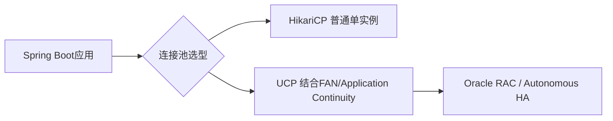

# 数据库连接池：HikariCP与UCP

连接池的选型会影响系统在数据库故障切换时的表现。

## 核心要点

* Spring Boot JDBC/JPA默认通常自带HikariCP
* 普通单实例数据库场景，HikariCP通常可以满足需求
* Oracle RAC或Autonomous Database高可用场景，可以考虑UCP结合FAN和Application Continuity
* UCP能改善计划维护或部分故障时的连接排空、恢复和事务重放能力

---

## 本章测验

本章共 5 道单项选择题。

### 第 1 题

Spring Boot项目中默认常见的连接池是什么？

- A. UCP
- B. HikariCP
- C. C3P0
- D. DBCP

选择答案后查看结果

正确答案：B

答案解析：Spring Boot的JDBC/JPA Starter通常默认引入HikariCP作为连接池实现。

### 第 2 题

对于普通单实例数据库场景，本章的建议是什么？

- A. 必须使用UCP，否则无法连接
- B. 不需要任何连接池
- C. HikariCP通常可以满足需求
- D. 必须手写JDBC连接管理

选择答案后查看结果

正确答案：C

答案解析：对普通单实例场景，HikariCP作为轻量高性能的连接池已经足够满足大多数需求。

### 第 3 题

UCP结合FAN和Application Continuity的优势主要体现在什么场景？

- A. 普通开发环境的调试场景
- B. 前端页面渲染场景
- C. SNMP Trap接收场景
- D. Oracle RAC或Autonomous Database在计划维护或部分故障时的连接排空与恢复

选择答案后查看结果

正确答案：D

答案解析：UCP配合FAN（快速应用通知）和Application Continuity，能在数据库端计划维护或部分故障时提供更好的连接恢复和事务重放能力。

### 第 4 题

选择连接池的一个基本原则是什么？

- A. 普通单实例可以用HikariCP，Oracle RAC/Autonomous HA场景优先评估UCP
- B. 任何场景都必须使用UCP
- C. 连接池的选择与数据库类型无关
- D. 应始终使用最新发布的连接池，无需考虑场景

选择答案后查看结果

正确答案：A

答案解析：本章给出的原则是根据数据库部署形态选择合适的连接池：普通场景用HikariCP，高可用RAC/Autonomous场景优先评估UCP。

### 第 5 题

Application Continuity的主要价值是什么？

- A. 自动生成SQL语句
- B. 在数据库故障切换时改善事务重放和连接恢复的体验
- C. 替代Kubernetes的Service发现
- D. 加密Kubernetes Secret

选择答案后查看结果

正确答案：B

答案解析：Application Continuity旨在数据库发生故障或维护切换时，让应用尽可能无感知地继续，通过事务重放等机制改善体验。

<!-- QUIZ_DATA_START
{
  "chapter": "22",
  "questions": [
    {
      "id": 1,
      "question": "Spring Boot项目中默认常见的连接池是什么？",
      "options": {
        "A": "UCP",
        "B": "HikariCP",
        "C": "C3P0",
        "D": "DBCP"
      },
      "answer": "B",
      "explanation": "Spring Boot的JDBC/JPA Starter通常默认引入HikariCP作为连接池实现。"
    },
    {
      "id": 2,
      "question": "对于普通单实例数据库场景，本章的建议是什么？",
      "options": {
        "A": "必须使用UCP，否则无法连接",
        "B": "不需要任何连接池",
        "C": "HikariCP通常可以满足需求",
        "D": "必须手写JDBC连接管理"
      },
      "answer": "C",
      "explanation": "对普通单实例场景，HikariCP作为轻量高性能的连接池已经足够满足大多数需求。"
    },
    {
      "id": 3,
      "question": "UCP结合FAN和Application Continuity的优势主要体现在什么场景？",
      "options": {
        "A": "普通开发环境的调试场景",
        "B": "前端页面渲染场景",
        "C": "SNMP Trap接收场景",
        "D": "Oracle RAC或Autonomous Database在计划维护或部分故障时的连接排空与恢复"
      },
      "answer": "D",
      "explanation": "UCP配合FAN（快速应用通知）和Application Continuity，能在数据库端计划维护或部分故障时提供更好的连接恢复和事务重放能力。"
    },
    {
      "id": 4,
      "question": "选择连接池的一个基本原则是什么？",
      "options": {
        "A": "普通单实例可以用HikariCP，Oracle RAC/Autonomous HA场景优先评估UCP",
        "B": "任何场景都必须使用UCP",
        "C": "连接池的选择与数据库类型无关",
        "D": "应始终使用最新发布的连接池，无需考虑场景"
      },
      "answer": "A",
      "explanation": "本章给出的原则是根据数据库部署形态选择合适的连接池：普通场景用HikariCP，高可用RAC/Autonomous场景优先评估UCP。"
    },
    {
      "id": 5,
      "question": "Application Continuity的主要价值是什么？",
      "options": {
        "A": "自动生成SQL语句",
        "B": "在数据库故障切换时改善事务重放和连接恢复的体验",
        "C": "替代Kubernetes的Service发现",
        "D": "加密Kubernetes Secret"
      },
      "answer": "B",
      "explanation": "Application Continuity旨在数据库发生故障或维护切换时，让应用尽可能无感知地继续，通过事务重放等机制改善体验。"
    }
  ]
}
QUIZ_DATA_END -->
