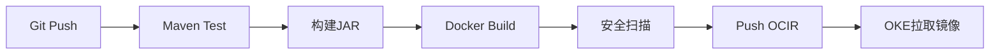

# 容器镜像与OCIR

Spring Boot服务需要打包成容器镜像，并通过OCIR供OKE拉取。

## 核心要点

* OCIR是OCI管理的容器镜像仓库，支持Docker镜像和OCI兼容制品
* 私有镜像仓库需要配置IAM权限和镜像拉取认证
* 推荐使用非root用户运行容器
* 完整流程包括测试、构建、扫描、推送到OCIR、再由OKE拉取

---

## 本章测验

本章共 5 道单项选择题。

### 第 1 题

OCIR的全称和作用是什么？

- A. OCI Compute Instance Repository，计算实例仓库
- B. OCI Cluster Isolation Rule，集群隔离规则
- C. OCI Container Registry，OCI管理的容器镜像仓库
- D. OCI Cache Instance Router，缓存路由

选择答案后查看结果

正确答案：C

答案解析：OCIR即OCI Container Registry，是OCI提供的托管容器镜像仓库，支持Docker镜像和OCI兼容制品。

### 第 2 题

为什么Dockerfile中建议使用非root用户运行容器？

- A. 非root用户可以让镜像体积更小
- B. root用户在容器中被禁止使用
- C. 非root用户运行速度更快
- D. 出于安全考虑，减少容器内进程的权限

选择答案后查看结果

正确答案：D

答案解析：使用非root用户运行容器进程，是常见的安全加固实践，可以减少容器被攻破后对宿主环境的潜在影响。

### 第 3 题

私有镜像仓库通常需要配置什么，OKE才能成功拉取镜像？

- A. IAM权限和镜像拉取认证
- B. Oracle数据库连接字符串
- C. SNMP Community
- D. Syslog Facility编号

选择答案后查看结果

正确答案：A

答案解析：从私有OCIR仓库拉取镜像，需要正确配置IAM策略和相应的镜像拉取凭证（如Secret）。

### 第 4 题

典型的CI/CD流程顺序是怎样的？

- A. Push OCIR → Git Push → Maven Test
- B. Git Push → Maven Test → 构建JAR → Docker Build → 安全扫描 → Push OCIR → OKE拉取
- C. OKE拉取 → Docker Build → Git Push
- D. 安全扫描 → Git Push → OKE拉取

选择答案后查看结果

正确答案：B

答案解析：正常顺序是先提交代码触发测试和构建，然后构建镜像、扫描、推送到仓库，最后由OKE从仓库拉取部署。

### 第 5 题

为什么要在Push OCIR之前进行安全扫描？

- A. 安全扫描可以加快镜像构建速度
- B. 安全扫描是Docker语法强制要求的步骤
- C. 尽早发现镜像中的已知漏洞，避免带风险的镜像进入生产
- D. 安全扫描可以替代单元测试

选择答案后查看结果

正确答案：C

答案解析：在推送到镜像仓库前进行安全扫描，可以及早发现基础镜像或依赖中的已知漏洞，降低生产环境风险。

<!-- QUIZ_DATA_START
{
  "chapter": "23",
  "questions": [
    {
      "id": 1,
      "question": "OCIR的全称和作用是什么？",
      "options": {
        "A": "OCI Compute Instance Repository，计算实例仓库",
        "B": "OCI Cluster Isolation Rule，集群隔离规则",
        "C": "OCI Container Registry，OCI管理的容器镜像仓库",
        "D": "OCI Cache Instance Router，缓存路由"
      },
      "answer": "C",
      "explanation": "OCIR即OCI Container Registry，是OCI提供的托管容器镜像仓库，支持Docker镜像和OCI兼容制品。"
    },
    {
      "id": 2,
      "question": "为什么Dockerfile中建议使用非root用户运行容器？",
      "options": {
        "A": "非root用户可以让镜像体积更小",
        "B": "root用户在容器中被禁止使用",
        "C": "非root用户运行速度更快",
        "D": "出于安全考虑，减少容器内进程的权限"
      },
      "answer": "D",
      "explanation": "使用非root用户运行容器进程，是常见的安全加固实践，可以减少容器被攻破后对宿主环境的潜在影响。"
    },
    {
      "id": 3,
      "question": "私有镜像仓库通常需要配置什么，OKE才能成功拉取镜像？",
      "options": {
        "A": "IAM权限和镜像拉取认证",
        "B": "Oracle数据库连接字符串",
        "C": "SNMP Community",
        "D": "Syslog Facility编号"
      },
      "answer": "A",
      "explanation": "从私有OCIR仓库拉取镜像，需要正确配置IAM策略和相应的镜像拉取凭证（如Secret）。"
    },
    {
      "id": 4,
      "question": "典型的CI/CD流程顺序是怎样的？",
      "options": {
        "A": "Push OCIR → Git Push → Maven Test",
        "B": "Git Push → Maven Test → 构建JAR → Docker Build → 安全扫描 → Push OCIR → OKE拉取",
        "C": "OKE拉取 → Docker Build → Git Push",
        "D": "安全扫描 → Git Push → OKE拉取"
      },
      "answer": "B",
      "explanation": "正常顺序是先提交代码触发测试和构建，然后构建镜像、扫描、推送到仓库，最后由OKE从仓库拉取部署。"
    },
    {
      "id": 5,
      "question": "为什么要在Push OCIR之前进行安全扫描？",
      "options": {
        "A": "安全扫描可以加快镜像构建速度",
        "B": "安全扫描是Docker语法强制要求的步骤",
        "C": "尽早发现镜像中的已知漏洞，避免带风险的镜像进入生产",
        "D": "安全扫描可以替代单元测试"
      },
      "answer": "C",
      "explanation": "在推送到镜像仓库前进行安全扫描，可以及早发现基础镜像或依赖中的已知漏洞，降低生产环境风险。"
    }
  ]
}
QUIZ_DATA_END -->
