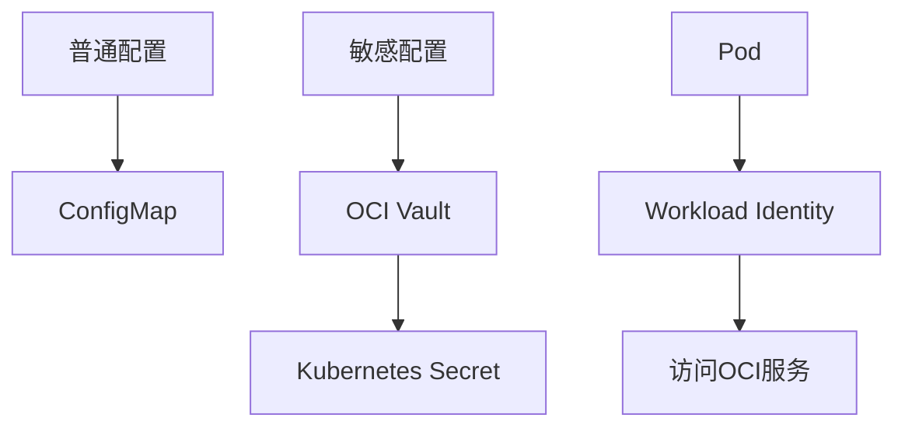

# 密钥与配置管理：Vault、Secret与Workload Identity

密码、密钥这类敏感信息绝不能直接写进代码仓库。

## 核心要点

* 数据库密码、SNMP口令、TLS私钥等绝不能直接写入Git
* 普通配置放ConfigMap，敏感配置放OCI Vault/Kubernetes Secret
* OCI Vault用于管理加密密钥和Secret
* 推荐使用OKE Workload Identity，避免在Pod中保存长期API Key

---

## 本章测验

本章共 5 道单项选择题。

### 第 1 题

下列哪种配置绝对不应该直接写入Git仓库？

- A. 应用的服务名称
- B. 日志级别设置
- C. 服务端口号
- D. Oracle数据库密码

选择答案后查看结果

正确答案：D

答案解析：数据库密码属于高度敏感信息，绝不能明文写入代码仓库，应该通过Vault或Secret管理。

### 第 2 题

普通、非敏感的配置项一般推荐使用什么Kubernetes资源管理？

- A. ConfigMap
- B. Secret
- C. PersistentVolume
- D. NetworkPolicy

选择答案后查看结果

正确答案：A

答案解析：ConfigMap适合存放非敏感的普通配置，敏感信息则应放在Secret或Vault中。

### 第 3 题

OKE Workload Identity的主要目的是什么？

- A. 让Pod可以直接访问互联网所有资源
- B. 通过集群、Namespace、ServiceAccount组合识别工作负载并授予细粒度权限，避免长期API Key
- C. 替代Oracle数据库连接池
- D. 用于接收SNMP Trap

选择答案后查看结果

正确答案：B

答案解析：Workload Identity通过身份组合而非静态密钥来授权Pod访问OCI服务，减少长期凭证泄露的风险。

### 第 4 题

OCI Vault的主要功能是什么？

- A. 编译Java代码
- B. 接收Syslog报文
- C. 管理加密密钥和Secret
- D. 创建OKE Node Pool

选择答案后查看结果

正确答案：C

答案解析：OCI Vault专门用于集中管理加密密钥和敏感的Secret信息。

### 第 5 题

为什么推荐使用Workload Identity而不是在Pod里保存长期API Key？

- A. Workload Identity运行速度比API Key快十倍
- B. API Key在Kubernetes中无法使用
- C. 这只是个人偏好，没有安全考量
- D. 长期API Key更容易泄露，且难以精细化控制权限范围

选择答案后查看结果

正确答案：D

答案解析：长期保存的静态API Key一旦泄露风险较大且难以快速轮换，Workload Identity可以基于身份动态授权，安全性更高。

<!-- QUIZ_DATA_START
{
  "chapter": "24",
  "questions": [
    {
      "id": 1,
      "question": "下列哪种配置绝对不应该直接写入Git仓库？",
      "options": {
        "A": "应用的服务名称",
        "B": "日志级别设置",
        "C": "服务端口号",
        "D": "Oracle数据库密码"
      },
      "answer": "D",
      "explanation": "数据库密码属于高度敏感信息，绝不能明文写入代码仓库，应该通过Vault或Secret管理。"
    },
    {
      "id": 2,
      "question": "普通、非敏感的配置项一般推荐使用什么Kubernetes资源管理？",
      "options": {
        "A": "ConfigMap",
        "B": "Secret",
        "C": "PersistentVolume",
        "D": "NetworkPolicy"
      },
      "answer": "A",
      "explanation": "ConfigMap适合存放非敏感的普通配置，敏感信息则应放在Secret或Vault中。"
    },
    {
      "id": 3,
      "question": "OKE Workload Identity的主要目的是什么？",
      "options": {
        "A": "让Pod可以直接访问互联网所有资源",
        "B": "通过集群、Namespace、ServiceAccount组合识别工作负载并授予细粒度权限，避免长期API Key",
        "C": "替代Oracle数据库连接池",
        "D": "用于接收SNMP Trap"
      },
      "answer": "B",
      "explanation": "Workload Identity通过身份组合而非静态密钥来授权Pod访问OCI服务，减少长期凭证泄露的风险。"
    },
    {
      "id": 4,
      "question": "OCI Vault的主要功能是什么？",
      "options": {
        "A": "编译Java代码",
        "B": "接收Syslog报文",
        "C": "管理加密密钥和Secret",
        "D": "创建OKE Node Pool"
      },
      "answer": "C",
      "explanation": "OCI Vault专门用于集中管理加密密钥和敏感的Secret信息。"
    },
    {
      "id": 5,
      "question": "为什么推荐使用Workload Identity而不是在Pod里保存长期API Key？",
      "options": {
        "A": "Workload Identity运行速度比API Key快十倍",
        "B": "API Key在Kubernetes中无法使用",
        "C": "这只是个人偏好，没有安全考量",
        "D": "长期API Key更容易泄露，且难以精细化控制权限范围"
      },
      "answer": "D",
      "explanation": "长期保存的静态API Key一旦泄露风险较大且难以快速轮换，Workload Identity可以基于身份动态授权，安全性更高。"
    }
  ]
}
QUIZ_DATA_END -->
