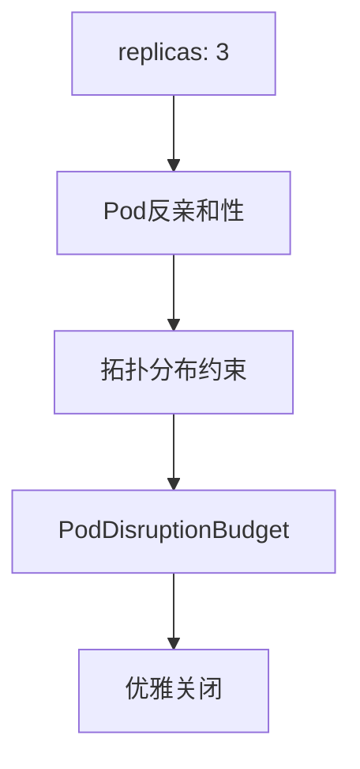

# Kubernetes高可用配置

通过副本数、反亲和性、PDB等配置，保证服务在节点故障或升级时依然可用。

## 核心要点

* 重要服务至少配置3个副本
* 使用Pod Anti-Affinity和拓扑分布约束避免副本集中在同一节点
* PodDisruptionBudget保证维护期间最少可用副本数
* Spring Boot配置优雅关闭，滚动更新时先完成现有请求再关闭旧Pod

---

## 本章测验

本章共 5 道单项选择题。

### 第 1 题

PodDisruptionBudget（PDB）的主要作用是什么？

- A. 在节点维护等场景下保证服务的最少可用副本数
- B. 限制Pod的CPU使用率
- C. 自动扩容Pod数量
- D. 管理容器镜像版本

选择答案后查看结果

正确答案：A

答案解析：PDB用于在计划性中断（如节点维护）期间限制同时不可用的Pod数量，从而保证最少可用副本。

### 第 2 题

Pod Anti-Affinity的作用是什么？

- A. 让所有副本都调度到同一节点，方便管理
- B. 避免同一服务的多个副本集中调度到同一节点，提高容错能力
- C. 禁止Pod被重新调度
- D. 自动清理历史数据

选择答案后查看结果

正确答案：B

答案解析：通过反亲和性规则，可以让同一服务的副本尽量分散到不同节点，避免单节点故障影响所有副本。

### 第 3 题

Spring Boot中graceful shutdown的作用是什么？

- A. 让应用立即强制退出，不等待任何请求完成
- B. 自动重启数据库
- C. 在关闭前给正在处理的请求一定时间完成，再真正退出
- D. 跳过所有健康检查

选择答案后查看结果

正确答案：C

答案解析：优雅关闭允许应用在收到终止信号后，等待正在处理的请求完成，避免请求被强行中断。

### 第 4 题

滚动更新时正确的流程顺序是什么？

- A. 旧Pod关闭 → 新Pod启动 → readinessProbe成功
- B. 同时关闭所有旧Pod和启动所有新Pod
- C. 直接删除旧Pod，不等待新Pod启动
- D. 新Pod启动 → startupProbe成功 → readinessProbe成功 → 开始转发流量 → 旧Pod进入NotReady并完成剩余请求后关闭

选择答案后查看结果

正确答案：D

答案解析：正确的滚动更新顺序是先确保新Pod通过启动和就绪检查，负载均衡开始转发流量后，再逐步下线旧Pod。

### 第 5 题

重要服务的副本数建议至少设置为多少？

- A. 3
- B. 1
- C. 2
- D. 没有具体建议

选择答案后查看结果

正确答案：A

答案解析：本章建议重要服务至少配置3个副本，以提高容错和可用性。

<!-- QUIZ_DATA_START
{
  "chapter": "25",
  "questions": [
    {
      "id": 1,
      "question": "PodDisruptionBudget（PDB）的主要作用是什么？",
      "options": {
        "A": "在节点维护等场景下保证服务的最少可用副本数",
        "B": "限制Pod的CPU使用率",
        "C": "自动扩容Pod数量",
        "D": "管理容器镜像版本"
      },
      "answer": "A",
      "explanation": "PDB用于在计划性中断（如节点维护）期间限制同时不可用的Pod数量，从而保证最少可用副本。"
    },
    {
      "id": 2,
      "question": "Pod Anti-Affinity的作用是什么？",
      "options": {
        "A": "让所有副本都调度到同一节点，方便管理",
        "B": "避免同一服务的多个副本集中调度到同一节点，提高容错能力",
        "C": "禁止Pod被重新调度",
        "D": "自动清理历史数据"
      },
      "answer": "B",
      "explanation": "通过反亲和性规则，可以让同一服务的副本尽量分散到不同节点，避免单节点故障影响所有副本。"
    },
    {
      "id": 3,
      "question": "Spring Boot中graceful shutdown的作用是什么？",
      "options": {
        "A": "让应用立即强制退出，不等待任何请求完成",
        "B": "自动重启数据库",
        "C": "在关闭前给正在处理的请求一定时间完成，再真正退出",
        "D": "跳过所有健康检查"
      },
      "answer": "C",
      "explanation": "优雅关闭允许应用在收到终止信号后，等待正在处理的请求完成，避免请求被强行中断。"
    },
    {
      "id": 4,
      "question": "滚动更新时正确的流程顺序是什么？",
      "options": {
        "A": "旧Pod关闭 → 新Pod启动 → readinessProbe成功",
        "B": "同时关闭所有旧Pod和启动所有新Pod",
        "C": "直接删除旧Pod，不等待新Pod启动",
        "D": "新Pod启动 → startupProbe成功 → readinessProbe成功 → 开始转发流量 → 旧Pod进入NotReady并完成剩余请求后关闭"
      },
      "answer": "D",
      "explanation": "正确的滚动更新顺序是先确保新Pod通过启动和就绪检查，负载均衡开始转发流量后，再逐步下线旧Pod。"
    },
    {
      "id": 5,
      "question": "重要服务的副本数建议至少设置为多少？",
      "options": {
        "A": "3",
        "B": "1",
        "C": "2",
        "D": "没有具体建议"
      },
      "answer": "A",
      "explanation": "本章建议重要服务至少配置3个副本，以提高容错和可用性。"
    }
  ]
}
QUIZ_DATA_END -->
