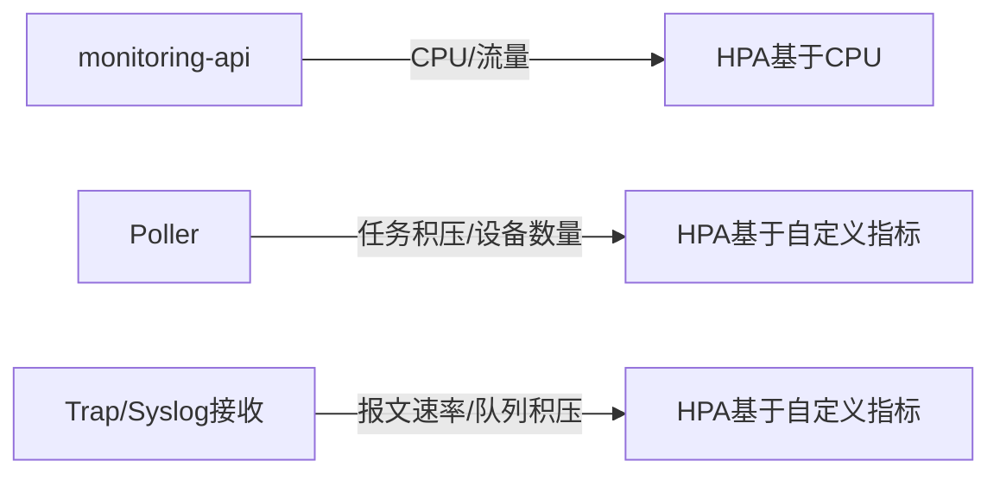

# HPA自动扩缩容策略

不同类型的服务应该根据不同指标来决定是否扩容，而不是一律看CPU。

## 核心要点

* monitoring-api和alert-engine等无状态服务适合基于CPU的HPA
* Poller更适合根据待处理任务数、设备数量或队列长度扩容
* Trap/Syslog接收器适合根据每秒报文数量、队列积压或处理延迟扩容
* 需要正确配置资源请求、Probe和扩容行为，避免误判

---

## 本章测验

本章共 5 道单项选择题。

### 第 1 题

哪些服务比较适合仅仅基于CPU使用率来做HPA？

- A. snmp-trap-receiver
- B. monitoring-api、alert-engine等无状态服务
- C. tcp-ping-poller
- D. syslog-receiver

选择答案后查看结果

正确答案：B

答案解析：像monitoring-api这类无状态Web服务，CPU使用率和请求量通常有较强的相关性，比较适合基于CPU的HPA。

### 第 2 题

Poller类服务更适合依据什么指标来扩缩容？

- A. 仅仅依据CPU使用率
- B. 仅仅依据内存使用率
- C. 待处理任务数、设备数量或队列长度等自定义指标
- D. 不需要任何扩缩容策略

选择答案后查看结果

正确答案：C

答案解析：Poller的负载主要取决于需要轮询的设备数量和任务积压，而不是单纯的CPU占用，因此更适合基于任务量的自定义指标。

### 第 3 题

Trap/Syslog接收器扩容更适合参考哪些指标？

- A. 数据库表的行数
- B. OpenTofu的State文件大小
- C. Git提交次数
- D. 每秒报文数量、队列积压、处理延迟等

选择答案后查看结果

正确答案：D

答案解析：接收器的负载体现在报文流量和队列积压情况上，因此扩容应参考这些与实际接收压力相关的指标。

### 第 4 题

为什么正确配置资源请求和Probe对HPA很重要？

- A. 应用启动期和Readiness状态会影响HPA的指标计算，配置不当会导致误判
- B. 资源请求和Probe与HPA完全无关
- C. 资源请求只影响计费，不影响扩缩容
- D. Probe只是用于调试目的

选择答案后查看结果

正确答案：A

答案解析：如果Probe配置不当，Pod可能被错误地计入或排除在指标计算之外，从而导致HPA做出错误的扩缩容决策。

### 第 5 题

以下哪种做法最不合适？

- A. 为无状态API服务基于CPU设置HPA
- B. 为所有服务不加区分地统一使用CPU作为唯一扩缩容依据
- C. 为Poller基于设备数量或任务积压设置自定义指标HPA
- D. 为Trap接收器基于报文速率设置扩缩容策略

选择答案后查看结果

正确答案：B

答案解析：不同服务的负载特征不同，统一只用CPU作为扩缩容依据会导致像Poller这样的服务扩缩容不准确。

<!-- QUIZ_DATA_START
{
  "chapter": "26",
  "questions": [
    {
      "id": 1,
      "question": "哪些服务比较适合仅仅基于CPU使用率来做HPA？",
      "options": {
        "A": "snmp-trap-receiver",
        "B": "monitoring-api、alert-engine等无状态服务",
        "C": "tcp-ping-poller",
        "D": "syslog-receiver"
      },
      "answer": "B",
      "explanation": "像monitoring-api这类无状态Web服务，CPU使用率和请求量通常有较强的相关性，比较适合基于CPU的HPA。"
    },
    {
      "id": 2,
      "question": "Poller类服务更适合依据什么指标来扩缩容？",
      "options": {
        "A": "仅仅依据CPU使用率",
        "B": "仅仅依据内存使用率",
        "C": "待处理任务数、设备数量或队列长度等自定义指标",
        "D": "不需要任何扩缩容策略"
      },
      "answer": "C",
      "explanation": "Poller的负载主要取决于需要轮询的设备数量和任务积压，而不是单纯的CPU占用，因此更适合基于任务量的自定义指标。"
    },
    {
      "id": 3,
      "question": "Trap/Syslog接收器扩容更适合参考哪些指标？",
      "options": {
        "A": "数据库表的行数",
        "B": "OpenTofu的State文件大小",
        "C": "Git提交次数",
        "D": "每秒报文数量、队列积压、处理延迟等"
      },
      "answer": "D",
      "explanation": "接收器的负载体现在报文流量和队列积压情况上，因此扩容应参考这些与实际接收压力相关的指标。"
    },
    {
      "id": 4,
      "question": "为什么正确配置资源请求和Probe对HPA很重要？",
      "options": {
        "A": "应用启动期和Readiness状态会影响HPA的指标计算，配置不当会导致误判",
        "B": "资源请求和Probe与HPA完全无关",
        "C": "资源请求只影响计费，不影响扩缩容",
        "D": "Probe只是用于调试目的"
      },
      "answer": "A",
      "explanation": "如果Probe配置不当，Pod可能被错误地计入或排除在指标计算之外，从而导致HPA做出错误的扩缩容决策。"
    },
    {
      "id": 5,
      "question": "以下哪种做法最不合适？",
      "options": {
        "A": "为无状态API服务基于CPU设置HPA",
        "B": "为所有服务不加区分地统一使用CPU作为唯一扩缩容依据",
        "C": "为Poller基于设备数量或任务积压设置自定义指标HPA",
        "D": "为Trap接收器基于报文速率设置扩缩容策略"
      },
      "answer": "B",
      "explanation": "不同服务的负载特征不同，统一只用CPU作为扩缩容依据会导致像Poller这样的服务扩缩容不准确。"
    }
  ]
}
QUIZ_DATA_END -->
