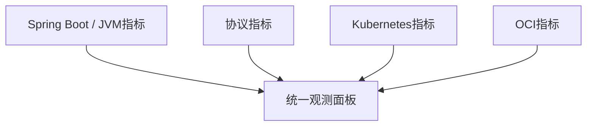

# 系统自监控：四层指标体系

监控平台不仅要监控别人，也必须监控自己，才能及时发现自身的问题。

## 核心要点

* Spring Boot指标：JVM Heap、GC、线程、HTTP延迟、数据库连接池等
* 协议指标：tcp_ping_total、snmp_trap_received_total、syslog_dropped_total等
* Kubernetes指标：Pod重启、Pending Pod、OOMKilled、Node NotReady等
* OCI指标：负载均衡器健康状态、NLB流量、数据库CPU与存储空间等

---

## 本章测验

本章共 5 道单项选择题。

### 第 1 题

下列哪一项属于Spring Boot/JVM层面的自监控指标？

- A. snmp_trap_received_total
- B. OKE控制面日志
- C. JVM Heap和GC情况
- D. NLB流量

选择答案后查看结果

正确答案：C

答案解析：JVM Heap和GC属于应用层JVM运行状态指标，是Spring Boot自监控的重要组成部分。

### 第 2 题

syslog_dropped_total这个指标最可能反映什么问题？

- A. 数据库表的分区数量
- B. OpenTofu的Provider版本
- C. Kubernetes节点的CPU型号
- D. Syslog接收端因处理不及时而丢弃的报文数量

选择答案后查看结果

正确答案：D

答案解析：该指标名称表明它统计的是被丢弃的Syslog报文数量，通常反映接收端处理能力是否跟得上流量。

### 第 3 题

Pod Restart、OOMKilled、Node NotReady属于哪一层的自监控指标？

- A. Kubernetes层指标
- B. OCI层指标
- C. SNMP协议指标
- D. 数据库层指标

选择答案后查看结果

正确答案：A

答案解析：这些是Kubernetes集群和工作负载运行状态相关的指标，属于Kubernetes层自监控范畴。

### 第 4 题

负载均衡器健康状态和数据库CPU使用率属于哪一层的自监控指标？

- A. Spring Boot应用层
- B. OCI基础设施层
- C. SNMP协议层
- D. Syslog解析层

选择答案后查看结果

正确答案：B

答案解析：负载均衡器健康状态、数据库CPU与存储空间属于底层OCI基础设施的监控范畴。

### 第 5 题

为什么监控平台需要建立自监控体系，而不只是监控外部设备？

- A. 自监控没有实际意义，只是形式主义
- B. 自监控可以完全替代对外部设备的监控
- C. 如果监控平台自身出问题却没被发现，会导致对外部设备的监控失效而不自知
- D. 自监控只是为了满足审计要求，没有技术价值

选择答案后查看结果

正确答案：C

答案解析：如果监控平台本身故障（如队列积压、Pod重启）却没有被感知，会导致外部设备的异常也无法被及时发现，因此自监控同样至关重要。

<!-- QUIZ_DATA_START
{
  "chapter": "27",
  "questions": [
    {
      "id": 1,
      "question": "下列哪一项属于Spring Boot/JVM层面的自监控指标？",
      "options": {
        "A": "snmp_trap_received_total",
        "B": "OKE控制面日志",
        "C": "JVM Heap和GC情况",
        "D": "NLB流量"
      },
      "answer": "C",
      "explanation": "JVM Heap和GC属于应用层JVM运行状态指标，是Spring Boot自监控的重要组成部分。"
    },
    {
      "id": 2,
      "question": "syslog_dropped_total这个指标最可能反映什么问题？",
      "options": {
        "A": "数据库表的分区数量",
        "B": "OpenTofu的Provider版本",
        "C": "Kubernetes节点的CPU型号",
        "D": "Syslog接收端因处理不及时而丢弃的报文数量"
      },
      "answer": "D",
      "explanation": "该指标名称表明它统计的是被丢弃的Syslog报文数量，通常反映接收端处理能力是否跟得上流量。"
    },
    {
      "id": 3,
      "question": "Pod Restart、OOMKilled、Node NotReady属于哪一层的自监控指标？",
      "options": {
        "A": "Kubernetes层指标",
        "B": "OCI层指标",
        "C": "SNMP协议指标",
        "D": "数据库层指标"
      },
      "answer": "A",
      "explanation": "这些是Kubernetes集群和工作负载运行状态相关的指标，属于Kubernetes层自监控范畴。"
    },
    {
      "id": 4,
      "question": "负载均衡器健康状态和数据库CPU使用率属于哪一层的自监控指标？",
      "options": {
        "A": "Spring Boot应用层",
        "B": "OCI基础设施层",
        "C": "SNMP协议层",
        "D": "Syslog解析层"
      },
      "answer": "B",
      "explanation": "负载均衡器健康状态、数据库CPU与存储空间属于底层OCI基础设施的监控范畴。"
    },
    {
      "id": 5,
      "question": "为什么监控平台需要建立自监控体系，而不只是监控外部设备？",
      "options": {
        "A": "自监控没有实际意义，只是形式主义",
        "B": "自监控可以完全替代对外部设备的监控",
        "C": "如果监控平台自身出问题却没被发现，会导致对外部设备的监控失效而不自知",
        "D": "自监控只是为了满足审计要求，没有技术价值"
      },
      "answer": "C",
      "explanation": "如果监控平台本身故障（如队列积压、Pod重启）却没有被感知，会导致外部设备的异常也无法被及时发现，因此自监控同样至关重要。"
    }
  ]
}
QUIZ_DATA_END -->
