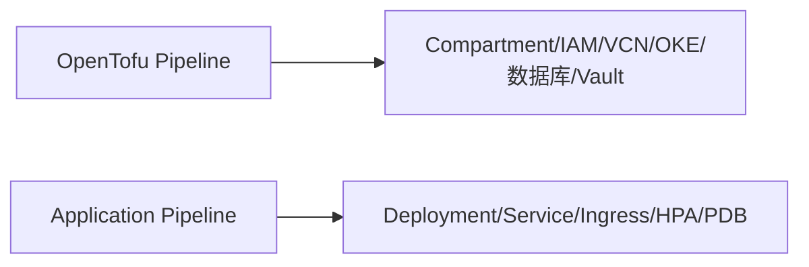

# OpenTofu与Kubernetes职责边界

明确基础设施代码和应用部署配置的边界，能避免升级应用时牵动整个云网络。

## 核心要点

* OpenTofu负责Compartment、IAM、VCN、OKE、数据库、Vault等基础设施
* Kubernetes/Helm负责Deployment、Service、Ingress、HPA、PDB等应用层资源
* 虽然OpenTofu也能通过Kubernetes/Helm Provider创建应用资源，但不建议与OCI网络绑在同一State中
* 更稳妥的做法是分离出独立的基础设施流水线和应用流水线

---

## 本章测验

本章共 5 道单项选择题。

### 第 1 题

下列哪一项通常由OpenTofu而不是Kubernetes/Helm管理？

- A. Deployment
- B. Ingress
- C. HPA
- D. OKE Cluster本身

选择答案后查看结果

正确答案：D

答案解析：OKE Cluster属于基础设施层面的资源，通常由OpenTofu创建和维护，而Deployment、Ingress、HPA属于应用层，通常由Kubernetes/Helm管理。

### 第 2 题

为什么不建议把频繁变化的应用版本和底层OCI网络绑在同一个OpenTofu State中？

- A. 会导致每次发布应用都可能牵动基础设施变更
- B. 技术上完全不可行
- C. State文件大小有严格上限
- D. Kubernetes不支持OpenTofu管理的资源

选择答案后查看结果

正确答案：A

答案解析：如果应用版本和基础设施绑定在同一State，每次简单的应用升级都可能触发对底层网络等基础设施的重新评估，风险和复杂度都会增加。

### 第 3 题

更稳妥的流水线设计是怎样的？

- A. 只用一条流水线同时管理基础设施和应用
- B. 基础设施流水线负责OpenTofu资源，应用流水线负责Spring Boot和Helm部署
- C. 完全不使用流水线，手动操作
- D. 让Kubernetes管理所有OCI资源，抛弃OpenTofu

选择答案后查看结果

正确答案：B

答案解析：将基础设施和应用部署拆分为两条独立流水线，可以让应用升级不必每次牵动底层网络等基础设施的变更流程。

### 第 4 题

ConfigMap、Secret的引用关系通常由谁管理？

- A. 完全由OpenTofu管理
- B. 由SNMP协议管理
- C. 由Kubernetes/Helm管理，其中的密钥值可能来自OCI Vault
- D. 不需要任何管理

选择答案后查看结果

正确答案：C

答案解析：ConfigMap和Secret本身属于Kubernetes资源，由Helm/Kubernetes管理，但其中的敏感值可能来源于OCI Vault。

### 第 5 题

以下说法哪一项是准确的？

- A. OpenTofu完全无法创建Kubernetes资源
- B. Kubernetes可以直接管理OCI Compartment和IAM策略而无需OpenTofu
- C. 应用层和基础设施层没有明确边界，可以随意混用
- D. OpenTofu可以通过Kubernetes/Helm Provider创建应用资源，但通常不建议与OCI基础设施绑在同一State

选择答案后查看结果

正确答案：D

答案解析：技术上OpenTofu具备通过Provider创建Kubernetes资源的能力，但从维护角度更推荐职责分离，避免耦合过深。

<!-- QUIZ_DATA_START
{
  "chapter": "28",
  "questions": [
    {
      "id": 1,
      "question": "下列哪一项通常由OpenTofu而不是Kubernetes/Helm管理？",
      "options": {
        "A": "Deployment",
        "B": "Ingress",
        "C": "HPA",
        "D": "OKE Cluster本身"
      },
      "answer": "D",
      "explanation": "OKE Cluster属于基础设施层面的资源，通常由OpenTofu创建和维护，而Deployment、Ingress、HPA属于应用层，通常由Kubernetes/Helm管理。"
    },
    {
      "id": 2,
      "question": "为什么不建议把频繁变化的应用版本和底层OCI网络绑在同一个OpenTofu State中？",
      "options": {
        "A": "会导致每次发布应用都可能牵动基础设施变更",
        "B": "技术上完全不可行",
        "C": "State文件大小有严格上限",
        "D": "Kubernetes不支持OpenTofu管理的资源"
      },
      "answer": "A",
      "explanation": "如果应用版本和基础设施绑定在同一State，每次简单的应用升级都可能触发对底层网络等基础设施的重新评估，风险和复杂度都会增加。"
    },
    {
      "id": 3,
      "question": "更稳妥的流水线设计是怎样的？",
      "options": {
        "A": "只用一条流水线同时管理基础设施和应用",
        "B": "基础设施流水线负责OpenTofu资源，应用流水线负责Spring Boot和Helm部署",
        "C": "完全不使用流水线，手动操作",
        "D": "让Kubernetes管理所有OCI资源，抛弃OpenTofu"
      },
      "answer": "B",
      "explanation": "将基础设施和应用部署拆分为两条独立流水线，可以让应用升级不必每次牵动底层网络等基础设施的变更流程。"
    },
    {
      "id": 4,
      "question": "ConfigMap、Secret的引用关系通常由谁管理？",
      "options": {
        "A": "完全由OpenTofu管理",
        "B": "由SNMP协议管理",
        "C": "由Kubernetes/Helm管理，其中的密钥值可能来自OCI Vault",
        "D": "不需要任何管理"
      },
      "answer": "C",
      "explanation": "ConfigMap和Secret本身属于Kubernetes资源，由Helm/Kubernetes管理，但其中的敏感值可能来源于OCI Vault。"
    },
    {
      "id": 5,
      "question": "以下说法哪一项是准确的？",
      "options": {
        "A": "OpenTofu完全无法创建Kubernetes资源",
        "B": "Kubernetes可以直接管理OCI Compartment和IAM策略而无需OpenTofu",
        "C": "应用层和基础设施层没有明确边界，可以随意混用",
        "D": "OpenTofu可以通过Kubernetes/Helm Provider创建应用资源，但通常不建议与OCI基础设施绑在同一State"
      },
      "answer": "D",
      "explanation": "技术上OpenTofu具备通过Provider创建Kubernetes资源的能力，但从维护角度更推荐职责分离，避免耦合过深。"
    }
  ]
}
QUIZ_DATA_END -->
