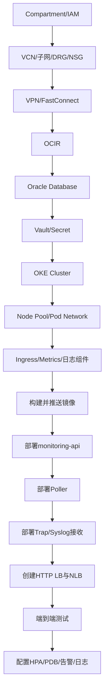

# 完整部署顺序

按照正确的先后顺序部署，可以避免因依赖关系缺失导致的失败。

## 核心要点

* 先创建Compartment和IAM，再创建网络和混合云接入
* 数据库、Vault要在OKE应用部署之前准备好
* 先部署monitoring-api和Poller，再部署Trap/Syslog接收
* 最后创建负载均衡器并进行端到端测试，配置HPA/PDB/告警

---

## 本章测验

本章共 5 道单项选择题。

### 第 1 题

按照推荐顺序，以下哪一项应该最先创建？

- A. Compartment和IAM
- B. OKE Cluster
- C. monitoring-api的Deployment
- D. HTTP Load Balancer

选择答案后查看结果

正确答案：A

答案解析：Compartment和IAM是整个OCI资源体系的基础，应该最先创建，后续资源都依赖于此。

### 第 2 题

Oracle Database应该在什么阶段准备好？

- A. 在整个项目结束之后
- B. 在部署monitoring-api等应用之前
- C. 在创建HTTP Load Balancer之后才需要
- D. 数据库不需要提前准备

选择答案后查看结果

正确答案：B

答案解析：应用（如monitoring-api）在启动时通常需要连接数据库，因此数据库应在应用部署之前准备就绪。

### 第 3 题

推荐的部署顺序中，Trap/Syslog接收器与monitoring-api相比，应该？

- A. 两者顺序没有先后要求，完全随意
- B. 必须先部署Trap/Syslog接收，再部署monitoring-api
- C. 先部署monitoring-api和Poller，再部署Trap/Syslog接收
- D. 两者必须同时部署，不能分开

选择答案后查看结果

正确答案：C

答案解析：根据推荐的部署顺序，monitoring-api和Poller在前，Trap和Syslog接收器随后部署。

### 第 4 题

端到端通信测试应该安排在什么阶段？

- A. 在创建Compartment之前
- B. 端到端测试不需要
- C. 在部署HPA之前，负载均衡器创建之前
- D. 在创建负载均衡器（HTTP LB与NLB）之后

选择答案后查看结果

正确答案：D

答案解析：端到端测试需要验证从设备到平台的完整链路，因此应该安排在负载均衡器等入口组件创建完成之后。

### 第 5 题

HPA、PDB、告警和日志配置在整体顺序中处于什么位置？

- A. 在端到端测试之后作为最后阶段
- B. 最先配置，早于任何基础设施创建
- C. 这些配置不需要在部署顺序中体现
- D. 必须在OKE Cluster创建之前完成

选择答案后查看结果

正确答案：A

答案解析：根据推荐顺序，HPA、PDB、告警和日志的配置是整个部署流程的最后一步，在端到端测试完成之后进行细化配置。

<!-- QUIZ_DATA_START
{
  "chapter": "29",
  "questions": [
    {
      "id": 1,
      "question": "按照推荐顺序，以下哪一项应该最先创建？",
      "options": {
        "A": "Compartment和IAM",
        "B": "OKE Cluster",
        "C": "monitoring-api的Deployment",
        "D": "HTTP Load Balancer"
      },
      "answer": "A",
      "explanation": "Compartment和IAM是整个OCI资源体系的基础，应该最先创建，后续资源都依赖于此。"
    },
    {
      "id": 2,
      "question": "Oracle Database应该在什么阶段准备好？",
      "options": {
        "A": "在整个项目结束之后",
        "B": "在部署monitoring-api等应用之前",
        "C": "在创建HTTP Load Balancer之后才需要",
        "D": "数据库不需要提前准备"
      },
      "answer": "B",
      "explanation": "应用（如monitoring-api）在启动时通常需要连接数据库，因此数据库应在应用部署之前准备就绪。"
    },
    {
      "id": 3,
      "question": "推荐的部署顺序中，Trap/Syslog接收器与monitoring-api相比，应该？",
      "options": {
        "A": "两者顺序没有先后要求，完全随意",
        "B": "必须先部署Trap/Syslog接收，再部署monitoring-api",
        "C": "先部署monitoring-api和Poller，再部署Trap/Syslog接收",
        "D": "两者必须同时部署，不能分开"
      },
      "answer": "C",
      "explanation": "根据推荐的部署顺序，monitoring-api和Poller在前，Trap和Syslog接收器随后部署。"
    },
    {
      "id": 4,
      "question": "端到端通信测试应该安排在什么阶段？",
      "options": {
        "A": "在创建Compartment之前",
        "B": "端到端测试不需要",
        "C": "在部署HPA之前，负载均衡器创建之前",
        "D": "在创建负载均衡器（HTTP LB与NLB）之后"
      },
      "answer": "D",
      "explanation": "端到端测试需要验证从设备到平台的完整链路，因此应该安排在负载均衡器等入口组件创建完成之后。"
    },
    {
      "id": 5,
      "question": "HPA、PDB、告警和日志配置在整体顺序中处于什么位置？",
      "options": {
        "A": "在端到端测试之后作为最后阶段",
        "B": "最先配置，早于任何基础设施创建",
        "C": "这些配置不需要在部署顺序中体现",
        "D": "必须在OKE Cluster创建之前完成"
      },
      "answer": "A",
      "explanation": "根据推荐顺序，HPA、PDB、告警和日志的配置是整个部署流程的最后一步，在端到端测试完成之后进行细化配置。"
    }
  ]
}
QUIZ_DATA_END -->
