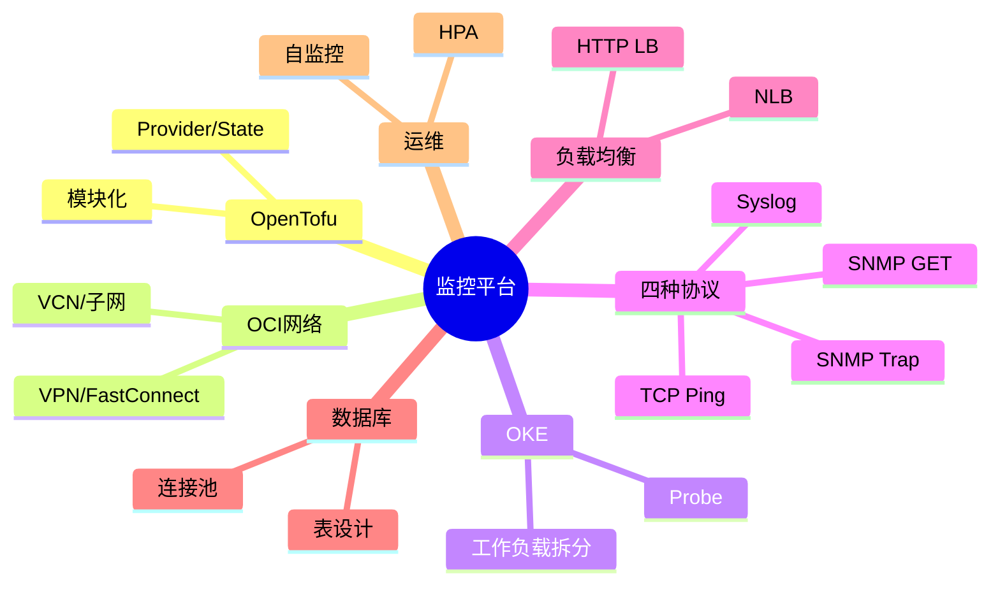

# 课程总结与延伸思考

回顾整套监控平台的核心设计原则，并思考可以继续深入的方向。

## 核心要点

* Web流量用OCI Load Balancer，TCP/UDP协议流量用OCI NLB
* TCP Ping和SNMP GET是出站任务，不需要负载均衡器
* SNMP Trap和Syslog必须保留来源IP并防止突发流量压垮数据库
* Poller水平扩容需要任务分片或抢占机制，避免重复采集
* OpenTofu管基础设施，Helm/Kubernetes管应用，避免绑在同一State中

---

## 本章测验

本章共 5 道单项选择题。

### 第 1 题

下列哪一项最准确地概括了本课程反复强调的负载均衡选型原则？

- A. 所有流量都应该走同一种负载均衡器
- B. Web流量走OCI Load Balancer，TCP/UDP协议流量走OCI NLB
- C. TCP Ping和SNMP GET必须经过NLB
- D. SNMP Trap应该直接暴露给互联网

选择答案后查看结果

正确答案：B

答案解析：课程反复强调应根据协议类型选择负载均衡器：HTTP流量用OCI LB，TCP/UDP流量用NLB。

### 第 2 题

为什么Poller在水平扩容时需要任务分片或抢占机制？

- A. 为了让代码更复杂
- B. 因为Kubernetes不支持多副本部署
- C. 避免多个副本重复轮询同一台设备
- D. 这与水平扩容完全无关

选择答案后查看结果

正确答案：C

答案解析：没有分片或抢占机制的多副本Poller会导致同一设备被多次重复轮询，因此需要通过数据库锁、哈希分片或消息队列来协调。

### 第 3 题

OpenTofu和Kubernetes/Helm的职责边界，课程给出的建议是什么？

- A. 两者应该完全合并成一个State统一管理
- B. 只使用OpenTofu，完全不用Helm
- C. 只使用Kubernetes，完全不用OpenTofu
- D. OpenTofu管理基础设施，Helm/Kubernetes管理应用，避免绑在同一State中

选择答案后查看结果

正确答案：D

答案解析：课程建议将基础设施和应用部署的职责分离，避免应用频繁变更牵动底层基础设施State。

### 第 4 题

SNMP Trap和Syslog接收设计中反复强调的两个关键点是什么？

- A. 必须保留来源IP、必须防止突发流量压垮数据库（如异步处理）
- B. 必须使用HTTP协议、必须暴露给公网
- C. 必须使用ICMP协议、必须同步写入数据库
- D. 必须禁用UDP、必须使用TLS 1.0

选择答案后查看结果

正确答案：A

答案解析：课程多次强调Trap/Syslog接收需要保留来源IP以便追溯，并通过异步队列等方式应对突发流量，避免压垮数据库。

### 第 5 题

综合来看，这套项目最核心的技术涉及面是？

- A. 仅仅是前端页面开发
- B. IaC、OCI网络、OKE、容器、网络协议、Java并发、Spring Boot、Oracle数据库、负载均衡、安全、监控和CI/CD的综合体
- C. 仅仅是Oracle数据库调优
- D. 仅仅是SNMP协议的实现细节

选择答案后查看结果

正确答案：B

答案解析：整个课程覆盖了从基础设施代码到网络、容器编排、多种通信协议、后端服务设计、数据库、负载均衡、安全和可观测性的完整技术栈。

<!-- QUIZ_DATA_START
{
  "chapter": "30",
  "questions": [
    {
      "id": 1,
      "question": "下列哪一项最准确地概括了本课程反复强调的负载均衡选型原则？",
      "options": {
        "A": "所有流量都应该走同一种负载均衡器",
        "B": "Web流量走OCI Load Balancer，TCP/UDP协议流量走OCI NLB",
        "C": "TCP Ping和SNMP GET必须经过NLB",
        "D": "SNMP Trap应该直接暴露给互联网"
      },
      "answer": "B",
      "explanation": "课程反复强调应根据协议类型选择负载均衡器：HTTP流量用OCI LB，TCP/UDP流量用NLB。"
    },
    {
      "id": 2,
      "question": "为什么Poller在水平扩容时需要任务分片或抢占机制？",
      "options": {
        "A": "为了让代码更复杂",
        "B": "因为Kubernetes不支持多副本部署",
        "C": "避免多个副本重复轮询同一台设备",
        "D": "这与水平扩容完全无关"
      },
      "answer": "C",
      "explanation": "没有分片或抢占机制的多副本Poller会导致同一设备被多次重复轮询，因此需要通过数据库锁、哈希分片或消息队列来协调。"
    },
    {
      "id": 3,
      "question": "OpenTofu和Kubernetes/Helm的职责边界，课程给出的建议是什么？",
      "options": {
        "A": "两者应该完全合并成一个State统一管理",
        "B": "只使用OpenTofu，完全不用Helm",
        "C": "只使用Kubernetes，完全不用OpenTofu",
        "D": "OpenTofu管理基础设施，Helm/Kubernetes管理应用，避免绑在同一State中"
      },
      "answer": "D",
      "explanation": "课程建议将基础设施和应用部署的职责分离，避免应用频繁变更牵动底层基础设施State。"
    },
    {
      "id": 4,
      "question": "SNMP Trap和Syslog接收设计中反复强调的两个关键点是什么？",
      "options": {
        "A": "必须保留来源IP、必须防止突发流量压垮数据库（如异步处理）",
        "B": "必须使用HTTP协议、必须暴露给公网",
        "C": "必须使用ICMP协议、必须同步写入数据库",
        "D": "必须禁用UDP、必须使用TLS 1.0"
      },
      "answer": "A",
      "explanation": "课程多次强调Trap/Syslog接收需要保留来源IP以便追溯，并通过异步队列等方式应对突发流量，避免压垮数据库。"
    },
    {
      "id": 5,
      "question": "综合来看，这套项目最核心的技术涉及面是？",
      "options": {
        "A": "仅仅是前端页面开发",
        "B": "IaC、OCI网络、OKE、容器、网络协议、Java并发、Spring Boot、Oracle数据库、负载均衡、安全、监控和CI/CD的综合体",
        "C": "仅仅是Oracle数据库调优",
        "D": "仅仅是SNMP协议的实现细节"
      },
      "answer": "B",
      "explanation": "整个课程覆盖了从基础设施代码到网络、容器编排、多种通信协议、后端服务设计、数据库、负载均衡、安全和可观测性的完整技术栈。"
    }
  ]
}
QUIZ_DATA_END -->
