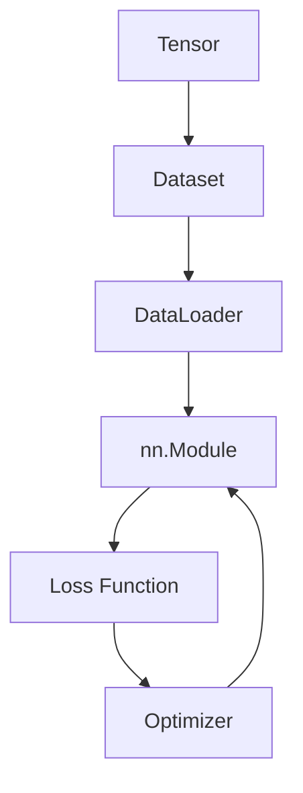

# PyTorch 六大核心组件总览

学习 PyTorch，先记住六个核心概念，它们串联起整个训练流程。

## 核心要点

* Tensor：保存数据、参数和梯度的多维数组
* Dataset：定义单条训练数据如何读取
* DataLoader：批量加载、打乱、多进程读取数据
* nn.Module：定义模型结构（层与前向计算）
* Loss Function：衡量预测结果有多差
* Optimizer：根据梯度更新模型参数

| 组件 | 作用 |
|---|---|
| Tensor | 保存数据、参数和梯度 |
| Dataset | 定义单条训练数据如何读取 |
| DataLoader | 批量加载、打乱、多进程读取数据 |
| nn.Module | 定义模型结构 |
| Loss | 衡量预测结果有多差 |
| Optimizer | 根据梯度更新模型参数 |

后面每一章都会逐个展开这六个组件的具体用法。

---

## 本章测验

### 第 1 题

在 PyTorch 的六个核心组件中，负责“批量加载、打乱、多进程读取数据”的是哪一个？

- A. Tensor
- B. Dataset
- C. DataLoader
- D. Optimizer

选择答案后查看结果

正确答案：C

答案解析：DataLoader 在 Dataset 之上负责分批、打乱顺序和多进程读取，Dataset 本身只定义单条数据如何读取。

### 第 2 题

下列哪一项是 Tensor 的主要作用？

- A. 定义模型结构
- B. 保存数据、参数和梯度
- C. 衡量预测结果的好坏
- D. 更新模型参数

选择答案后查看结果

正确答案：B

答案解析：Tensor 是 PyTorch 中支持自动求导和 GPU 加速的多维数组，用来保存输入数据、模型参数以及计算得到的梯度。

### 第 3 题

Dataset 和 DataLoader 的关系是什么？

- A. 两者完全相同，可以互相替代
- B. Dataset 定义单条数据如何读取，DataLoader 在其基础上做批量加载
- C. DataLoader 定义单条数据，Dataset 做批量加载
- D. 两者互不相关

选择答案后查看结果

正确答案：B

答案解析：Dataset 负责描述“一条数据怎么取”，DataLoader 则包装 Dataset，实现批量、打乱和多进程加载。

### 第 4 题

如果模型训练时 Loss 一直很大且不下降，最不可能是下面哪个组件配置错误导致的？

- A. Loss Function 选错了任务类型
- B. Optimizer 没有正确更新参数
- C. Tensor 的 shape 与模型输入不匹配
- D. Tensor 的变量命名风格

选择答案后查看结果

正确答案：D

答案解析：变量命名风格只是代码可读性问题，不会影响训练效果；而损失函数类型、优化器是否正确更新参数、Tensor 形状是否匹配都会直接影响训练结果。

### 第 5 题

在这六个组件的流程图中，Optimizer 更新的对象是什么？

- A. Dataset 中的原始数据
- B. nn.Module 中的模型参数
- C. Loss Function 的计算公式
- D. DataLoader 的批次大小

选择答案后查看结果

正确答案：B

答案解析：Optimizer 根据反向传播得到的梯度，去更新 nn.Module 中定义的可训练参数，而不是修改数据、损失公式或批次大小本身。

<!-- QUIZ_DATA_START
{
  "chapter": "02",
  "questions": [
    {"id": 1, "question": "在 PyTorch 的六个核心组件中，负责“批量加载、打乱、多进程读取数据”的是哪一个？", "options": {"A": "Tensor", "B": "Dataset", "C": "DataLoader", "D": "Optimizer"}, "answer": "C", "explanation": "DataLoader 在 Dataset 之上负责分批、打乱顺序和多进程读取，Dataset 本身只定义单条数据如何读取。"},
    {"id": 2, "question": "下列哪一项是 Tensor 的主要作用？", "options": {"A": "定义模型结构", "B": "保存数据、参数和梯度", "C": "衡量预测结果的好坏", "D": "更新模型参数"}, "answer": "B", "explanation": "Tensor 是 PyTorch 中支持自动求导和 GPU 加速的多维数组，用来保存输入数据、模型参数以及计算得到的梯度。"},
    {"id": 3, "question": "Dataset 和 DataLoader 的关系是什么？", "options": {"A": "两者完全相同，可以互相替代", "B": "Dataset 定义单条数据如何读取，DataLoader 在其基础上做批量加载", "C": "DataLoader 定义单条数据，Dataset 做批量加载", "D": "两者互不相关"}, "answer": "B", "explanation": "Dataset 负责描述“一条数据怎么取”，DataLoader 则包装 Dataset，实现批量、打乱和多进程加载。"},
    {"id": 4, "question": "如果模型训练时 Loss 一直很大且不下降，最不可能是下面哪个组件配置错误导致的？", "options": {"A": "Loss Function 选错了任务类型", "B": "Optimizer 没有正确更新参数", "C": "Tensor 的 shape 与模型输入不匹配", "D": "Tensor 的变量命名风格"}, "answer": "D", "explanation": "变量命名风格只是代码可读性问题，不会影响训练效果；而损失函数类型、优化器是否正确更新参数、Tensor 形状是否匹配都会直接影响训练结果。"},
    {"id": 5, "question": "在这六个组件的流程图中，Optimizer 更新的对象是什么？", "options": {"A": "Dataset 中的原始数据", "B": "nn.Module 中的模型参数", "C": "Loss Function 的计算公式", "D": "DataLoader 的批次大小"}, "answer": "B", "explanation": "Optimizer 根据反向传播得到的梯度，去更新 nn.Module 中定义的可训练参数，而不是修改数据、损失公式或批次大小本身。"}
  ]
}
QUIZ_DATA_END -->
