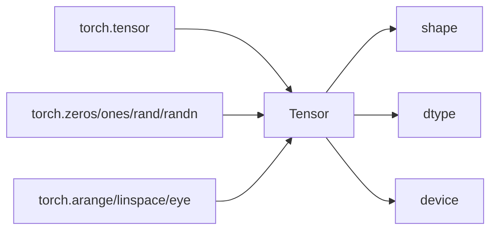

# Tensor 基础：创建方法与三大属性

Tensor 是支持 GPU 和自动求导的多维数组，是 PyTorch 一切计算的基础。



## 核心要点

* `torch.tensor([...])` 从 Python 数据创建 Tensor
* `torch.zeros`、`torch.ones`、`torch.rand`、`torch.randn` 快速生成常用 Tensor
* `rand` 是 [0,1) 均匀分布，`randn` 是标准正态分布
* Tensor 三大属性：`shape`（形状）、`dtype`（数据类型）、`device`（所在设备）
* 训练中大部分报错都源于这三者不匹配：shape 不匹配、dtype 不匹配、device 不匹配

## 代码示例

```python
import torch

scalar = torch.tensor(5.0)
vector = torch.tensor([1.0, 2.0, 3.0])
matrix = torch.tensor([[1.0, 2.0], [3.0, 4.0]])

x = torch.randn(3, 4)
print(x.shape, x.dtype, x.device)
```

排查错误时，优先打印 `x.shape, x.dtype, x.device`。

---

## 本章测验

### 第 1 题

`torch.randn(3, 4)` 生成的随机数服从什么分布？

- A. [0,1) 均匀分布
- B. 标准正态分布
- C. 泊松分布
- D. 指数分布

<details>
<summary>选择答案后查看结果</summary>

正确答案：B

答案解析：`torch.rand` 生成 [0,1) 均匀分布，`torch.randn` 生成标准正态分布，两者容易混淆但作用不同。

</details>

### 第 2 题

Tensor 的三大重要属性是什么？

- A. shape、dtype、device
- B. name、value、size
- C. loss、grad、data
- D. batch、epoch、iteration

<details>
<summary>选择答案后查看结果</summary>

正确答案：A

答案解析：shape（形状）、dtype（数据类型）、device（所在设备）是排查 Tensor 相关错误时最先要检查的三个属性。

</details>

### 第 3 题

训练中出现 “Expected all tensors to be on the same device” 报错，最可能是哪个属性不匹配？

- A. shape
- B. dtype
- C. device
- D. requires_grad

<details>
<summary>选择答案后查看结果</summary>

正确答案：C

答案解析：这个错误说明参与运算的 Tensor 分布在不同设备（比如一个在 CPU、一个在 GPU），需要统一 device。

</details>

### 第 4 题

下面哪种写法可以创建一个形状为 [2,2] 的 Tensor？

- A. `torch.tensor([1.0, 2.0, 3.0])`
- B. `torch.tensor([[1.0, 2.0], [3.0, 4.0]])`
- C. `torch.tensor(5.0)`
- D. `torch.arange(0, 4)`

<details>
<summary>选择答案后查看结果</summary>

正确答案：B

答案解析：两层嵌套列表 `[[1.0, 2.0], [3.0, 4.0]]` 对应一个 2 行 2 列的矩阵，形状为 [2, 2]；其余选项分别是向量或标量。

</details>

### 第 5 题

排查模型训练报错时，文中建议优先打印的是什么？

- A. 模型的全部参数值
- B. `x.shape, x.dtype, x.device`
- C. 损失函数的公式
- D. 优化器的学习率

<details>
<summary>选择答案后查看结果</summary>

正确答案：B

答案解析：训练中的常见问题本质上分为 shape 不匹配、dtype 不匹配、device 不匹配三类，因此优先打印这三个属性最有效率。

</details>

<!-- QUIZ_DATA_START
{
  "chapter": "03",
  "questions": [
    {"id": 1, "question": "torch.randn(3, 4) 生成的随机数服从什么分布？", "options": {"A": "[0,1) 均匀分布", "B": "标准正态分布", "C": "泊松分布", "D": "指数分布"}, "answer": "B", "explanation": "torch.rand 生成 [0,1) 均匀分布，torch.randn 生成标准正态分布，两者容易混淆但作用不同。"},
    {"id": 2, "question": "Tensor 的三大重要属性是什么？", "options": {"A": "shape、dtype、device", "B": "name、value、size", "C": "loss、grad、data", "D": "batch、epoch、iteration"}, "answer": "A", "explanation": "shape（形状）、dtype（数据类型）、device（所在设备）是排查 Tensor 相关错误时最先要检查的三个属性。"},
    {"id": 3, "question": "训练中出现 “Expected all tensors to be on the same device” 报错，最可能是哪个属性不匹配？", "options": {"A": "shape", "B": "dtype", "C": "device", "D": "requires_grad"}, "answer": "C", "explanation": "这个错误说明参与运算的 Tensor 分布在不同设备（比如一个在 CPU、一个在 GPU），需要统一 device。"},
    {"id": 4, "question": "下面哪种写法可以创建一个形状为 [2,2] 的 Tensor？", "options": {"A": "torch.tensor([1.0, 2.0, 3.0])", "B": "torch.tensor([[1.0, 2.0], [3.0, 4.0]])", "C": "torch.tensor(5.0)", "D": "torch.arange(0, 4)"}, "answer": "B", "explanation": "两层嵌套列表对应一个 2 行 2 列的矩阵，形状为 [2, 2]；其余选项分别是向量或标量。"},
    {"id": 5, "question": "排查模型训练报错时，文中建议优先打印的是什么？", "options": {"A": "模型的全部参数值", "B": "x.shape, x.dtype, x.device", "C": "损失函数的公式", "D": "优化器的学习率"}, "answer": "B", "explanation": "训练中的常见问题本质上分为 shape 不匹配、dtype 不匹配、device 不匹配三类，因此优先打印这三个属性最有效率。"}
  ]
}
QUIZ_DATA_END -->
