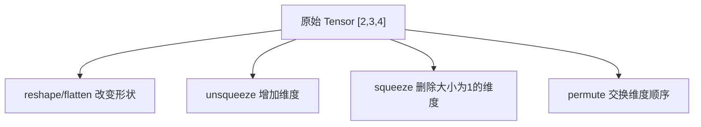

# Tensor 维度变换：reshape、squeeze、permute

处理图像、文本等数据时，经常需要调整 Tensor 的维度形状。



## 核心要点

* `reshape` / `flatten`：改变形状但不改变元素总数
* `unsqueeze(dim)`：在指定位置插入一个大小为 1 的新维度
* `squeeze()`：删除所有大小为 1 的维度
* `permute(...)`：重新排列已有维度的顺序（不增删维度数量）
* 图像常用 `[N, C, H, W]`，NLP 常用 `[batch_size, sequence_length, hidden_size]`

## 代码示例

```python
x = torch.randn(2, 3, 4)
y = x.reshape(2, 12)          # [2, 12]
z = x.flatten(start_dim=1)    # [2, 12]

v = torch.tensor([1, 2, 3])
print(v.unsqueeze(0).shape)   # [1, 3]
print(v.unsqueeze(1).shape)   # [3, 1]

w = torch.randn(1, 3, 1, 4)
print(w.squeeze().shape)      # [3, 4]

p = torch.randn(32, 10, 128)
print(p.permute(0, 2, 1).shape)  # [32, 128, 10]
```

---

## 本章测验

### 第 1 题

`torch.randn(2, 3, 4).reshape(2, 12)` 之后，元素总数会发生变化吗？

- A. 会变多
- B. 会变少
- C. 不会变化，只是形状重新排列
- D. 变成随机数量

<details>
<summary>选择答案后查看结果</summary>

正确答案：C

答案解析：reshape 只是改变 Tensor 的形状描述，元素总数保持不变，2*3*4=24 与 2*12=24 是一致的。

</details>

### 第 2 题

`torch.tensor([1, 2, 3]).unsqueeze(0)` 得到的形状是什么？

- A. [3]
- B. [1, 3]
- C. [3, 1]
- D. [1, 1, 3]

<details>
<summary>选择答案后查看结果</summary>

正确答案：B

答案解析：unsqueeze(0) 在第 0 维插入一个大小为 1 的新维度，原本形状 [3] 变成 [1, 3]。

</details>

### 第 3 题

`torch.randn(1, 3, 1, 4).squeeze()` 得到的形状是什么？

- A. [1, 3, 1, 4]
- B. [3, 4]
- C. [1, 3, 4]
- D. [3, 1, 4]

<details>
<summary>选择答案后查看结果</summary>

正确答案：B

答案解析：squeeze() 会删除所有大小为 1 的维度，[1,3,1,4] 中第 0 维和第 2 维大小为 1，删除后剩下 [3, 4]。

</details>

### 第 4 题

在图像任务中排查模型报错，发现输入形状是 [128, 28, 28, 1] 而模型期望 [128, 1, 28, 28]，应该使用哪个操作调整？

- A. squeeze
- B. unsqueeze
- C. permute
- D. flatten

<details>
<summary>选择答案后查看结果</summary>

正确答案：C

答案解析：这属于维度顺序不对而不是维度数量不对，squeeze/unsqueeze 用于增删维度，permute 才是用于重新排列已有维度顺序的操作。

</details>

### 第 5 题

NLP 任务中常见的输入形状 `[batch_size, sequence_length, hidden_size]`，其中 `sequence_length` 通常表示什么？

- A. 批次大小
- B. 序列长度，例如一句话包含多少个 token
- C. 隐藏层维度
- D. 模型的层数

<details>
<summary>选择答案后查看结果</summary>

正确答案：B

答案解析：sequence_length 表示序列（如一句话）中 token 的数量，batch_size 是批次样本数，hidden_size 是每个 token 的特征维度。

</details>

<!-- QUIZ_DATA_START
{
  "chapter": "04",
  "questions": [
    {"id": 1, "question": "torch.randn(2, 3, 4).reshape(2, 12) 之后，元素总数会发生变化吗？", "options": {"A": "会变多", "B": "会变少", "C": "不会变化，只是形状重新排列", "D": "变成随机数量"}, "answer": "C", "explanation": "reshape 只是改变 Tensor 的形状描述，元素总数保持不变，2*3*4=24 与 2*12=24 是一致的。"},
    {"id": 2, "question": "torch.tensor([1, 2, 3]).unsqueeze(0) 得到的形状是什么？", "options": {"A": "[3]", "B": "[1, 3]", "C": "[3, 1]", "D": "[1, 1, 3]"}, "answer": "B", "explanation": "unsqueeze(0) 在第 0 维插入一个大小为 1 的新维度，原本形状 [3] 变成 [1, 3]。"},
    {"id": 3, "question": "torch.randn(1, 3, 1, 4).squeeze() 得到的形状是什么？", "options": {"A": "[1, 3, 1, 4]", "B": "[3, 4]", "C": "[1, 3, 4]", "D": "[3, 1, 4]"}, "answer": "B", "explanation": "squeeze() 会删除所有大小为 1 的维度，[1,3,1,4] 中第 0 维和第 2 维大小为 1，删除后剩下 [3, 4]。"},
    {"id": 4, "question": "在图像任务中排查模型报错，发现输入形状是 [128, 28, 28, 1] 而模型期望 [128, 1, 28, 28]，应该使用哪个操作调整？", "options": {"A": "squeeze", "B": "unsqueeze", "C": "permute", "D": "flatten"}, "answer": "C", "explanation": "这属于维度顺序不对而不是维度数量不对，squeeze/unsqueeze 用于增删维度，permute 才是用于重新排列已有维度顺序的操作。"},
    {"id": 5, "question": "NLP 任务中常见的输入形状 [batch_size, sequence_length, hidden_size]，其中 sequence_length 通常表示什么？", "options": {"A": "批次大小", "B": "序列长度，例如一句话包含多少个 token", "C": "隐藏层维度", "D": "模型的层数"}, "answer": "B", "explanation": "sequence_length 表示序列（如一句话）中 token 的数量，batch_size 是批次样本数，hidden_size 是每个 token 的特征维度。"}
  ]
}
QUIZ_DATA_END -->
