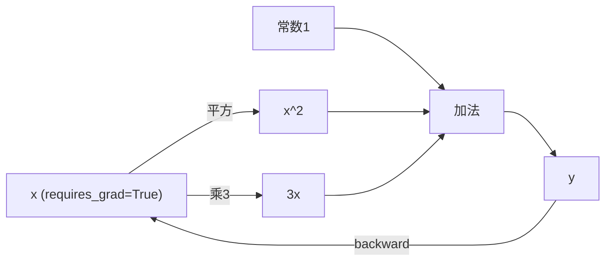

# Autograd：自动微分与计算图

Autograd 是 PyTorch 最核心的机制之一，负责自动计算梯度。



## 核心要点

* 设置 `requires_grad=True` 后，Autograd 会记录相关运算，自动建立动态计算图
* 调用 `y.backward()` 会从结果开始，按链式法则反向计算梯度
* 梯度默认是累加的，所以每轮训练前必须清空梯度
* `torch.no_grad()` / `torch.inference_mode()`：推理阶段不需要梯度，可减少内存和计算开销
* `detach()`：得到一个共享数据但脱离计算图的新 Tensor

## 代码示例

```python
x = torch.tensor(2.0, requires_grad=True)
y = x ** 2 + 3 * x + 1
y.backward()
print(x.grad)  # tensor(7.)  因为 dy/dx = 2x+3 = 7
```

数学上：y = x² + 3x + 1，dy/dx = 2x + 3，代入 x=2 得到 7，与代码结果一致。

---

## 本章测验

### 第 1 题

要让 PyTorch 自动跟踪某个 Tensor 的运算以便求梯度，需要设置什么？

- A. `dtype=torch.float64`
- B. `requires_grad=True`
- C. `device="cuda"`
- D. `shape=(1,)`

<details>
<summary>选择答案后查看结果</summary>

正确答案：B

答案解析：只有设置 requires_grad=True 的 Tensor，PyTorch 才会记录它参与的运算，构建计算图用于后续反向传播。

</details>

### 第 2 题

对于 y = x² + 3x + 1，当 x = 2 时，dy/dx 的值是多少？

- A. 4
- B. 5
- C. 7
- D. 8

<details>
<summary>选择答案后查看结果</summary>

正确答案：C

答案解析：dy/dx = 2x + 3，代入 x=2 得到 2*2+3=7，这与代码中 x.grad 输出的 tensor(7.) 一致。

</details>

### 第 3 题

如果不调用 `optimizer.zero_grad()`（或手动清空梯度），连续两次 backward 会发生什么？

- A. 第二次的梯度会覆盖第一次
- B. 梯度会累加，导致数值偏大
- C. 程序会报错并终止
- D. 第二次的梯度自动被忽略

<details>
<summary>选择答案后查看结果</summary>

正确答案：B

答案解析：PyTorch 默认梯度是累加的，不清空的话，多次 backward 后梯度值会不断叠加，导致更新方向和幅度都不正确。

</details>

### 第 4 题

模型验证或推理阶段，为什么推荐使用 `torch.no_grad()` 或 `torch.inference_mode()`？

- A. 可以让模型输出更准确
- B. 可以避免构建计算图，节省内存和计算开销
- C. 可以自动清空模型参数
- D. 可以提高模型的训练速度

<details>
<summary>选择答案后查看结果</summary>

正确答案：B

答案解析：推理阶段不需要反向传播，因此不需要构建计算图，用 no_grad/inference_mode 包裹可以节省内存和计算，但不会改变预测准确度本身。

</details>

### 第 5 题

`detach()` 的作用是什么？

- A. 直接删除这个 Tensor
- B. 得到一个与原 Tensor 共享数据、但脱离当前计算图的新 Tensor
- C. 把 Tensor 从 GPU 移动到 CPU
- D. 清空这个 Tensor 已有的梯度

<details>
<summary>选择答案后查看结果</summary>

正确答案：B

答案解析：detach() 返回的新 Tensor 与原 Tensor 共享底层数据，但不再参与梯度计算，常用于保存中间特征、转 NumPy 或阻止梯度继续向前传播。

</details>

<!-- QUIZ_DATA_START
{
  "chapter": "05",
  "questions": [
    {"id": 1, "question": "要让 PyTorch 自动跟踪某个 Tensor 的运算以便求梯度，需要设置什么？", "options": {"A": "dtype=torch.float64", "B": "requires_grad=True", "C": "device=\"cuda\"", "D": "shape=(1,)"}, "answer": "B", "explanation": "只有设置 requires_grad=True 的 Tensor，PyTorch 才会记录它参与的运算，构建计算图用于后续反向传播。"},
    {"id": 2, "question": "对于 y = x² + 3x + 1，当 x = 2 时，dy/dx 的值是多少？", "options": {"A": "4", "B": "5", "C": "7", "D": "8"}, "answer": "C", "explanation": "dy/dx = 2x + 3，代入 x=2 得到 2*2+3=7，这与代码中 x.grad 输出的 tensor(7.) 一致。"},
    {"id": 3, "question": "如果不调用 optimizer.zero_grad()（或手动清空梯度），连续两次 backward 会发生什么？", "options": {"A": "第二次的梯度会覆盖第一次", "B": "梯度会累加，导致数值偏大", "C": "程序会报错并终止", "D": "第二次的梯度自动被忽略"}, "answer": "B", "explanation": "PyTorch 默认梯度是累加的，不清空的话，多次 backward 后梯度值会不断叠加，导致更新方向和幅度都不正确。"},
    {"id": 4, "question": "模型验证或推理阶段，为什么推荐使用 torch.no_grad() 或 torch.inference_mode()？", "options": {"A": "可以让模型输出更准确", "B": "可以避免构建计算图，节省内存和计算开销", "C": "可以自动清空模型参数", "D": "可以提高模型的训练速度"}, "answer": "B", "explanation": "推理阶段不需要反向传播，因此不需要构建计算图，用 no_grad/inference_mode 包裹可以节省内存和计算，但不会改变预测准确度本身。"},
    {"id": 5, "question": "detach() 的作用是什么？", "options": {"A": "直接删除这个 Tensor", "B": "得到一个与原 Tensor 共享数据、但脱离当前计算图的新 Tensor", "C": "把 Tensor 从 GPU 移动到 CPU", "D": "清空这个 Tensor 已有的梯度"}, "answer": "B", "explanation": "detach() 返回的新 Tensor 与原 Tensor 共享底层数据，但不再参与梯度计算，常用于保存中间特征、转 NumPy 或阻止梯度继续向前传播。"}
  ]
}
QUIZ_DATA_END -->
