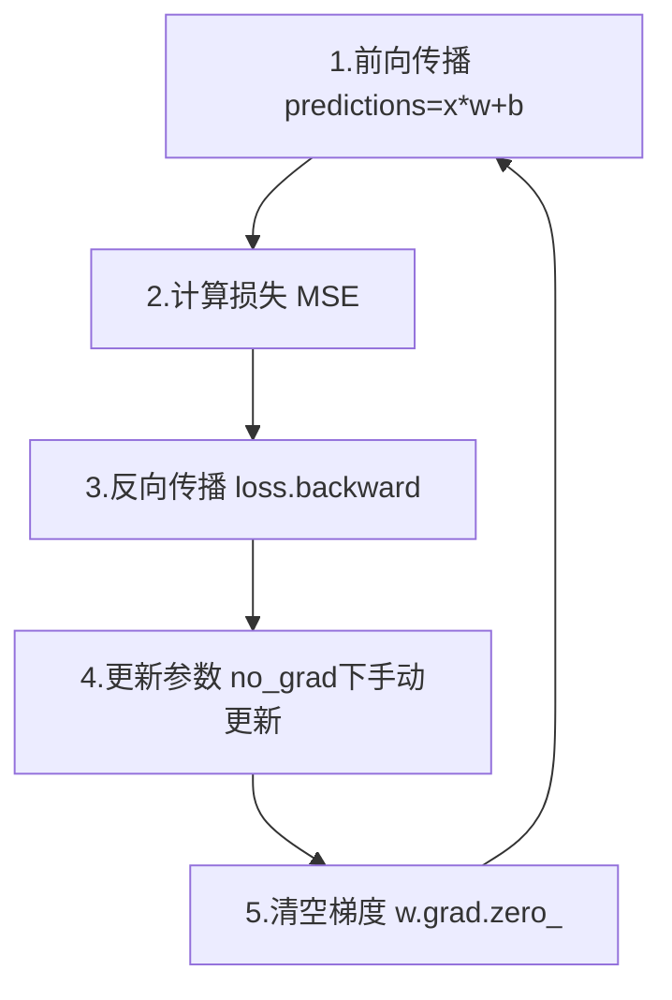

# 手写线性回归：训练五步曲实战

不依赖 nn.Linear，手动实现完整的训练循环，把前几章的知识串联起来。



## 核心要点

* 数据：`y = 3x + 2 + 噪声`，模型要学出接近 w≈3、b≈2 的参数
* w、b 都设置 `requires_grad=True`，才能被 Autograd 跟踪
* 参数更新必须放在 `with torch.no_grad()` 中，避免这一步本身被记录进计算图
* 每轮结束后要手动清空梯度：`w.grad.zero_()`、`b.grad.zero_()`
* 这五步是所有神经网络训练循环的雏形，复杂模型只是把这五步做了扩展

## 代码示例

```python
w = torch.randn(1, requires_grad=True)
b = torch.zeros(1, requires_grad=True)
learning_rate = 0.01

for epoch in range(1000):
    predictions = x * w + b
    loss = ((predictions - y) ** 2).mean()
    loss.backward()

    with torch.no_grad():
        w -= learning_rate * w.grad
        b -= learning_rate * b.grad

    w.grad.zero_()
    b.grad.zero_()
```

---

## 本章测验

### 第 1 题

这个线性回归例子中，数据是按照什么规律生成的？

- A. y = x + 1 + 噪声
- B. y = 3x + 2 + 噪声
- C. y = 2x + 3 + 噪声
- D. y = x² + 噪声

<details>
<summary>选择答案后查看结果</summary>

正确答案：B

答案解析：代码中构造数据的公式是 `y = 3 * x + 2 + noise`，因此训练目标是让模型学出接近 w≈3、b≈2 的参数。

</details>

### 第 2 题

为什么参数更新那一步要放在 `with torch.no_grad()` 里？

- A. 因为更新参数不需要用到梯度
- B. 避免参数更新这个操作本身被记录进计算图
- C. 因为 no_grad 可以让训练变得更快
- D. 因为不这样写程序会报语法错误

<details>
<summary>选择答案后查看结果</summary>

正确答案：B

答案解析：如果不用 no_grad 包裹，`w -= learning_rate * w.grad` 这个减法操作会被 Autograd 记录，破坏计算图的正确性，因此必须显式声明这一步不需要跟踪梯度。

</details>

### 第 3 题

代码结尾为什么要调用 `w.grad.zero_()` 和 `b.grad.zero_()`？

- A. 为了让模型输出更准确
- B. 因为梯度默认会累加，不清空下一轮就会出错
- C. 因为这样可以加快训练速度
- D. 这一步不是必须的，可以省略

<details>
<summary>选择答案后查看结果</summary>

正确答案：B

答案解析：PyTorch 的梯度是累加的，如果不清空，下一轮 backward 计算出的梯度会叠加在上一轮的梯度之上，导致更新方向和幅度错误。

</details>

### 第 4 题

在这个例子中，`w` 和 `b` 为什么都要设置 `requires_grad=True`？

- A. 这样可以让它们的初始值更接近真实值
- B. 只有设置了 requires_grad=True，Autograd 才会跟踪它们参与的运算并计算梯度
- C. 这样可以让训练速度更快
- D. 这个设置只是可选的代码风格，不影响结果

<details>
<summary>选择答案后查看结果</summary>

正确答案：B

答案解析：w、b 是需要通过反向传播学习的参数，必须设置 requires_grad=True，Autograd 才会记录它们参与的计算并在 backward 时算出梯度。

</details>

### 第 5 题

训练 1000 轮后，w 和 b 大概会收敛到什么值？

- A. w≈0，b≈0
- B. w≈1，b≈1
- C. w≈3，b≈2
- D. 完全无法预测，每次都不同

<details>
<summary>选择答案后查看结果</summary>

正确答案：C

答案解析：因为训练数据是按 y=3x+2+噪声 生成的，经过足够多轮训练，参数会逐渐逼近生成数据时使用的真实参数 w≈3、b≈2。

</details>

<!-- QUIZ_DATA_START
{
  "chapter": "06",
  "questions": [
    {"id": 1, "question": "这个线性回归例子中，数据是按照什么规律生成的？", "options": {"A": "y = x + 1 + 噪声", "B": "y = 3x + 2 + 噪声", "C": "y = 2x + 3 + 噪声", "D": "y = x² + 噪声"}, "answer": "B", "explanation": "代码中构造数据的公式是 y = 3 * x + 2 + noise，因此训练目标是让模型学出接近 w≈3、b≈2 的参数。"},
    {"id": 2, "question": "为什么参数更新那一步要放在 with torch.no_grad() 里？", "options": {"A": "因为更新参数不需要用到梯度", "B": "避免参数更新这个操作本身被记录进计算图", "C": "因为 no_grad 可以让训练变得更快", "D": "因为不这样写程序会报语法错误"}, "answer": "B", "explanation": "如果不用 no_grad 包裹，w -= learning_rate * w.grad 这个减法操作会被 Autograd 记录，破坏计算图的正确性，因此必须显式声明这一步不需要跟踪梯度。"},
    {"id": 3, "question": "代码结尾为什么要调用 w.grad.zero_() 和 b.grad.zero_()？", "options": {"A": "为了让模型输出更准确", "B": "因为梯度默认会累加，不清空下一轮就会出错", "C": "因为这样可以加快训练速度", "D": "这一步不是必须的，可以省略"}, "answer": "B", "explanation": "PyTorch 的梯度是累加的，如果不清空，下一轮 backward 计算出的梯度会叠加在上一轮的梯度之上，导致更新方向和幅度错误。"},
    {"id": 4, "question": "在这个例子中，w 和 b 为什么都要设置 requires_grad=True？", "options": {"A": "这样可以让它们的初始值更接近真实值", "B": "只有设置了 requires_grad=True，Autograd 才会跟踪它们参与的运算并计算梯度", "C": "这样可以让训练速度更快", "D": "这个设置只是可选的代码风格，不影响结果"}, "answer": "B", "explanation": "w、b 是需要通过反向传播学习的参数，必须设置 requires_grad=True，Autograd 才会记录它们参与的计算并在 backward 时算出梯度。"},
    {"id": 5, "question": "训练 1000 轮后，w 和 b 大概会收敛到什么值？", "options": {"A": "w≈0，b≈0", "B": "w≈1，b≈1", "C": "w≈3，b≈2", "D": "完全无法预测，每次都不同"}, "answer": "C", "explanation": "因为训练数据是按 y=3x+2+噪声 生成的，经过足够多轮训练，参数会逐渐逼近生成数据时使用的真实参数 w≈3、b≈2。"}
  ]
}
QUIZ_DATA_END -->
