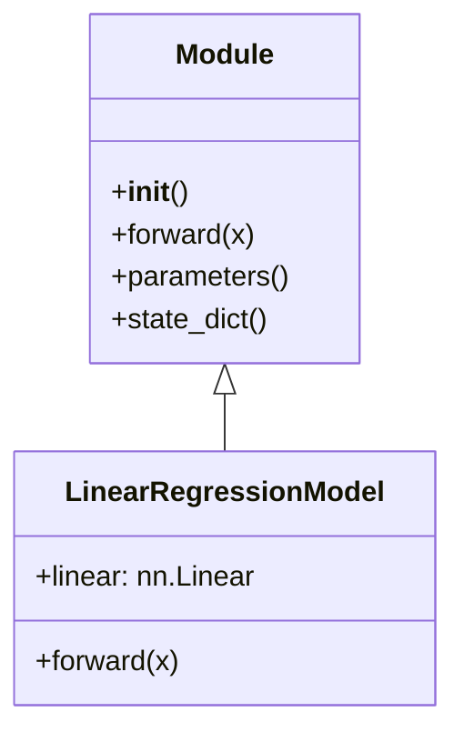

# 用 nn.Module 构建模型

正式项目通常继承 `torch.nn.Module`，而不是像上一章那样手动管理每个参数。



## 核心要点

* 自定义模型需要继承 `nn.Module`，并在 `__init__` 中调用 `super().__init__()`
* `forward(self, x)` 定义数据如何从输入流向输出，调用 `model(x)` 时会自动执行
* `nn.Linear(in_features, out_features)` 内部自动管理 `weight` 和 `bias` 两个参数
* `model.parameters()` 返回所有可训练参数，交给优化器统一管理
* `model.state_dict()` 返回参数名到参数值的字典，用于保存和加载模型

## 代码示例

```python
from torch import nn

class LinearRegressionModel(nn.Module):
    def __init__(self) -> None:
        super().__init__()
        self.linear = nn.Linear(in_features=1, out_features=1)

    def forward(self, x: torch.Tensor) -> torch.Tensor:
        return self.linear(x)

model = LinearRegressionModel()
print(model)
print(model.state_dict())
```

`nn.Linear(1, 1)` 等价于公式 y = xWᵀ + b，只是不再需要我们手动写 `x*w+b`。

---

## 本章测验

### 第 1 题

自定义一个 PyTorch 模型类，通常需要继承哪个类？

- A. `torch.Tensor`
- B. `torch.nn.Module`
- C. `torch.optim.Optimizer`
- D. `torch.utils.data.Dataset`

<details>
<summary>选择答案后查看结果</summary>

正确答案：B

答案解析：自定义模型结构需要继承 nn.Module，它提供了参数管理、forward 调用等基础能力，而 Dataset 和 Optimizer 是完全不同用途的类。

</details>

### 第 2 题

在自定义模型的 `__init__` 方法中，为什么第一行通常要写 `super().__init__()`？

- A. 这是可有可无的装饰性代码
- B. 让 nn.Module 完成自身的初始化，否则参数管理等功能会出错
- C. 这样可以让模型跑得更快
- D. 这是为了兼容旧版本 PyTorch

<details>
<summary>选择答案后查看结果</summary>

正确答案：B

答案解析：nn.Module 内部维护了参数、子模块等重要状态，必须先调用父类的 __init__ 完成这些初始化，否则后续注册的层无法被正确追踪。

</details>

### 第 3 题

`forward` 方法的作用是什么？

- A. 定义模型训练结束后如何保存
- B. 定义数据如何从输入一步步计算到输出
- C. 定义损失函数的计算公式
- D. 定义优化器如何更新参数

<details>
<summary>选择答案后查看结果</summary>

正确答案：B

答案解析：forward 描述了输入数据经过哪些层、按什么顺序计算得到最终输出，当我们调用 model(x) 时，PyTorch 会自动执行这个方法。

</details>

### 第 4 题

`nn.Linear(in_features=1, out_features=1)` 内部自动管理的两个参数是什么？

- A. loss 和 grad
- B. weight 和 bias
- C. optimizer 和 scheduler
- D. shape 和 dtype

<details>
<summary>选择答案后查看结果</summary>

正确答案：B

答案解析：nn.Linear 内部自动创建并管理 weight（权重矩阵）和 bias（偏置）两个可训练参数，对应公式 y = xWᵀ + b。

</details>

### 第 5 题

`model.parameters()` 主要用来做什么？

- A. 打印模型的层数
- B. 返回模型所有可训练参数，交给优化器统一管理
- C. 计算模型的损失
- D. 生成训练数据

<details>
<summary>选择答案后查看结果</summary>

正确答案：B

答案解析：model.parameters() 会返回模型内部所有需要学习的参数，通常直接传给优化器，例如 torch.optim.AdamW(model.parameters(), lr=1e-3)。

</details>

<!-- QUIZ_DATA_START
{
  "chapter": "07",
  "questions": [
    {"id": 1, "question": "自定义一个 PyTorch 模型类，通常需要继承哪个类？", "options": {"A": "torch.Tensor", "B": "torch.nn.Module", "C": "torch.optim.Optimizer", "D": "torch.utils.data.Dataset"}, "answer": "B", "explanation": "自定义模型结构需要继承 nn.Module，它提供了参数管理、forward 调用等基础能力，而 Dataset 和 Optimizer 是完全不同用途的类。"},
    {"id": 2, "question": "在自定义模型的 __init__ 方法中，为什么第一行通常要写 super().__init__()？", "options": {"A": "这是可有可无的装饰性代码", "B": "让 nn.Module 完成自身的初始化，否则参数管理等功能会出错", "C": "这样可以让模型跑得更快", "D": "这是为了兼容旧版本 PyTorch"}, "answer": "B", "explanation": "nn.Module 内部维护了参数、子模块等重要状态，必须先调用父类的 __init__ 完成这些初始化，否则后续注册的层无法被正确追踪。"},
    {"id": 3, "question": "forward 方法的作用是什么？", "options": {"A": "定义模型训练结束后如何保存", "B": "定义数据如何从输入一步步计算到输出", "C": "定义损失函数的计算公式", "D": "定义优化器如何更新参数"}, "answer": "B", "explanation": "forward 描述了输入数据经过哪些层、按什么顺序计算得到最终输出，当我们调用 model(x) 时，PyTorch 会自动执行这个方法。"},
    {"id": 4, "question": "nn.Linear(in_features=1, out_features=1) 内部自动管理的两个参数是什么？", "options": {"A": "loss 和 grad", "B": "weight 和 bias", "C": "optimizer 和 scheduler", "D": "shape 和 dtype"}, "answer": "B", "explanation": "nn.Linear 内部自动创建并管理 weight（权重矩阵）和 bias（偏置）两个可训练参数，对应公式 y = xWᵀ + b。"},
    {"id": 5, "question": "model.parameters() 主要用来做什么？", "options": {"A": "打印模型的层数", "B": "返回模型所有可训练参数，交给优化器统一管理", "C": "计算模型的损失", "D": "生成训练数据"}, "answer": "B", "explanation": "model.parameters() 会返回模型内部所有需要学习的参数，通常直接传给优化器，例如 torch.optim.AdamW(model.parameters(), lr=1e-3)。"}
  ]
}
QUIZ_DATA_END -->
