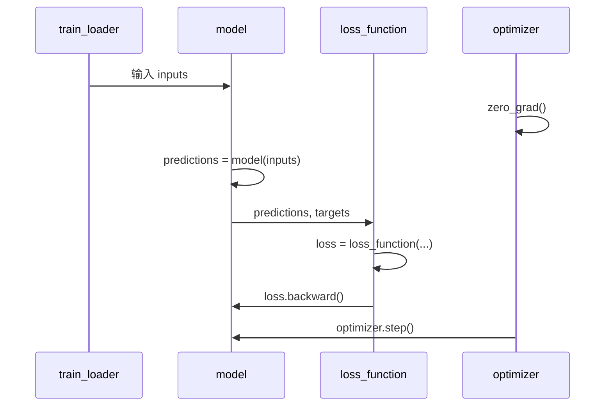

# 标准训练循环的规范写法

有了 nn.Module 模型后，训练循环有一套业界通用的固定写法顺序。



## 核心要点

* 固定顺序：`optimizer.zero_grad()` → `predictions = model(inputs)` → `loss = loss_function(...)` → `loss.backward()` → `optimizer.step()`
* `optimizer.zero_grad(set_to_none=True)` 比默认清零更推荐，效率更高
* `device = torch.device("cuda" if torch.cuda.is_available() else "cpu")` 是选择设备的标准写法
* 模型和数据都要 `.to(device)`，否则会报设备不一致的错误
* `nn.MSELoss()`、`torch.optim.AdamW(...)` 是常见的损失函数和优化器组合

## 代码示例

```python
device = torch.device("cuda" if torch.cuda.is_available() else "cpu")
model = LinearRegressionModel().to(device)
loss_function = nn.MSELoss()
optimizer = torch.optim.AdamW(model.parameters(), lr=1e-3)

for epoch in range(100):
    model.train()
    inputs, targets = x.to(device), y.to(device)

    optimizer.zero_grad(set_to_none=True)
    predictions = model(inputs)
    loss = loss_function(predictions, targets)
    loss.backward()
    optimizer.step()
```

---

## 本章测验

### 第 1 题

标准训练循环中，五个步骤的正确顺序是什么？

- A. loss.backward() → zero_grad() → forward → loss → step()
- B. zero_grad() → forward → loss → loss.backward() → optimizer.step()
- C. forward → optimizer.step() → loss → loss.backward() → zero_grad()
- D. optimizer.step() → zero_grad() → forward → loss → loss.backward()

<details>
<summary>选择答案后查看结果</summary>

正确答案：B

答案解析：标准顺序是先清空梯度，再做前向传播得到预测值，计算损失，反向传播得到梯度，最后用 optimizer.step() 更新参数。

</details>

### 第 2 题

`optimizer.zero_grad(set_to_none=True)` 相比默认写法，主要优势是什么？

- A. 会让模型准确率更高
- B. 效率更高，是更推荐的清空梯度方式
- C. 可以跳过反向传播这一步
- D. 会自动调整学习率

<details>
<summary>选择答案后查看结果</summary>

正确答案：B

答案解析：设置 set_to_none=True 会把梯度直接置为 None 而不是填零，通常内存和计算效率更高，是官方更推荐的写法。

</details>

### 第 3 题

为什么模型和数据都要调用 `.to(device)`？

- A. 这样可以让代码更简洁
- B. 保证模型参数和输入数据在同一个设备上，否则运算会报错
- C. 这样可以自动开启混合精度训练
- D. 这是为了兼容旧版本的 PyTorch

<details>
<summary>选择答案后查看结果</summary>

正确答案：B

答案解析：PyTorch 要求参与同一次运算的 Tensor 必须在同一设备（如都在 GPU 或都在 CPU），因此模型和输入数据都需要显式移动到同一 device。

</details>

### 第 4 题

在训练循环中，`loss.backward()` 应该在下面哪一步之后执行？

- A. optimizer.step() 之后
- B. loss = loss_function(predictions, targets) 之后
- C. optimizer.zero_grad() 之前
- D. 整个 epoch 循环结束之后

<details>
<summary>选择答案后查看结果</summary>

正确答案：B

答案解析：必须先算出 loss，才能对 loss 调用 backward() 求出梯度；backward 需要在 zero_grad 之后、optimizer.step() 之前完成。

</details>

### 第 5 题

如果代码里漏写了 `optimizer.step()`，会发生什么？

- A. 训练速度会变快
- B. 梯度会计算出来，但参数永远不会被更新，损失基本不会下降
- C. 程序会直接崩溃报错
- D. 模型会自动使用默认学习率更新

<details>
<summary>选择答案后查看结果</summary>

正确答案：B

答案解析：optimizer.step() 是真正把梯度应用到参数上的一步，如果漏掉，backward 算出的梯度不会被使用，参数保持不变，损失通常不会有实质性下降。

</details>

<!-- QUIZ_DATA_START
{
  "chapter": "08",
  "questions": [
    {"id": 1, "question": "标准训练循环中，五个步骤的正确顺序是什么？", "options": {"A": "loss.backward() → zero_grad() → forward → loss → step()", "B": "zero_grad() → forward → loss → loss.backward() → optimizer.step()", "C": "forward → optimizer.step() → loss → loss.backward() → zero_grad()", "D": "optimizer.step() → zero_grad() → forward → loss → loss.backward()"}, "answer": "B", "explanation": "标准顺序是先清空梯度，再做前向传播得到预测值，计算损失，反向传播得到梯度，最后用 optimizer.step() 更新参数。"},
    {"id": 2, "question": "optimizer.zero_grad(set_to_none=True) 相比默认写法，主要优势是什么？", "options": {"A": "会让模型准确率更高", "B": "效率更高，是更推荐的清空梯度方式", "C": "可以跳过反向传播这一步", "D": "会自动调整学习率"}, "answer": "B", "explanation": "设置 set_to_none=True 会把梯度直接置为 None 而不是填零，通常内存和计算效率更高，是官方更推荐的写法。"},
    {"id": 3, "question": "为什么模型和数据都要调用 .to(device)？", "options": {"A": "这样可以让代码更简洁", "B": "保证模型参数和输入数据在同一个设备上，否则运算会报错", "C": "这样可以自动开启混合精度训练", "D": "这是为了兼容旧版本的 PyTorch"}, "answer": "B", "explanation": "PyTorch 要求参与同一次运算的 Tensor 必须在同一设备（如都在 GPU 或都在 CPU），因此模型和输入数据都需要显式移动到同一 device。"},
    {"id": 4, "question": "在训练循环中，loss.backward() 应该在下面哪一步之后执行？", "options": {"A": "optimizer.step() 之后", "B": "loss = loss_function(predictions, targets) 之后", "C": "optimizer.zero_grad() 之前", "D": "整个 epoch 循环结束之后"}, "answer": "B", "explanation": "必须先算出 loss，才能对 loss 调用 backward() 求出梯度；backward 需要在 zero_grad 之后、optimizer.step() 之前完成。"},
    {"id": 5, "question": "如果代码里漏写了 optimizer.step()，会发生什么？", "options": {"A": "训练速度会变快", "B": "梯度会计算出来，但参数永远不会被更新，损失基本不会下降", "C": "程序会直接崩溃报错", "D": "模型会自动使用默认学习率更新"}, "answer": "B", "explanation": "optimizer.step() 是真正把梯度应用到参数上的一步，如果漏掉，backward 算出的梯度不会被使用，参数保持不变，损失通常不会有实质性下降。"}
  ]
}
QUIZ_DATA_END -->
