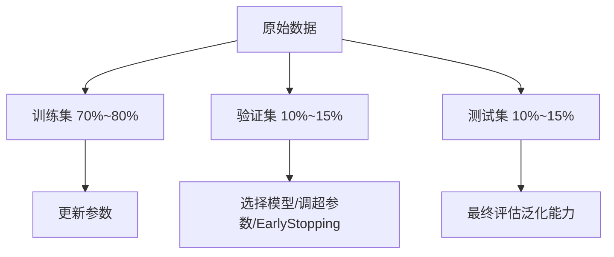

# 训练集、验证集与测试集的划分

数据通常需要拆成三部分，各自承担不同职责。



## 核心要点

* 训练集：用于计算梯度、更新参数
* 验证集：用于选择模型、调整超参数、判断是否过拟合、Early Stopping；不参与参数更新
* 测试集：只在模型开发基本完成后使用一次，评估最终泛化能力
* 推荐比例：训练集 70%~80%，验证集 10%~15%，测试集 10%~15%
* 不要根据测试集反复调参，否则测试集实际上就变成了验证集，失去评估最终效果的意义

## 常见误区

```text
错误做法：反复根据测试集结果调整模型 → 测试集失去客观评估的价值
正确做法：调参只看验证集，测试集只在最后使用一次
```

---

## 本章测验

### 第 1 题

训练集的主要作用是什么？

- A. 判断模型是否过拟合
- B. 计算梯度、更新模型参数
- C. 评估模型最终的泛化能力
- D. 调整学习率等超参数

<details>
<summary>选择答案后查看结果</summary>

正确答案：B

答案解析：训练集是唯一直接参与参数更新的数据集合，模型通过在训练集上反复前向传播和反向传播来学习参数。

</details>

### 第 2 题

验证集在训练过程中主要用来做什么？

- A. 更新模型参数
- B. 选择模型、调整超参数、判断是否过拟合
- C. 只在项目全部结束后使用一次
- D. 替代训练集参与梯度计算

<details>
<summary>选择答案后查看结果</summary>

正确答案：B

答案解析：验证集不参与参数更新，而是用来在训练过程中评估当前模型的效果，从而决定是否调整超参数、是否触发 Early Stopping 等。

</details>

### 第 3 题

为什么不建议根据测试集结果反复调整模型？

- A. 测试集数据量太小，没有参考价值
- B. 反复根据测试集调参会让测试集失去客观评估最终效果的意义
- C. 测试集只能用来计算训练损失
- D. 这样做会导致程序报错

<details>
<summary>选择答案后查看结果</summary>

正确答案：B

答案解析：如果反复根据测试集结果调整模型，测试集实际上就变成了另一个验证集，不再能客观反映模型在真正未见数据上的表现。

</details>

### 第 4 题

下面哪一个数据集划分比例最符合文中推荐？

- A. 训练集 30%，验证集 30%，测试集 40%
- B. 训练集 95%，验证集 3%，测试集 2%
- C. 训练集 75%，验证集 12%，测试集 13%
- D. 训练集 50%，验证集 25%，测试集 25%

<details>
<summary>选择答案后查看结果</summary>

正确答案：C

答案解析：文中推荐的大致比例是训练集 70%~80%、验证集 10%~15%、测试集 10%~15%，选项 C 最接近这个范围。

</details>

### 第 5 题

Early Stopping 通常依据哪个数据集的表现来决定是否提前停止训练？

- A. 训练集
- B. 验证集
- C. 测试集
- D. 原始未划分的数据

<details>
<summary>选择答案后查看结果</summary>

正确答案：B

答案解析：Early Stopping 是根据验证集上的指标（如验证损失）是否持续改善来判断的，如果验证效果不再提升就提前停止，避免过拟合。

</details>

<!-- QUIZ_DATA_START
{
  "chapter": "09",
  "questions": [
    {"id": 1, "question": "训练集的主要作用是什么？", "options": {"A": "判断模型是否过拟合", "B": "计算梯度、更新模型参数", "C": "评估模型最终的泛化能力", "D": "调整学习率等超参数"}, "answer": "B", "explanation": "训练集是唯一直接参与参数更新的数据集合，模型通过在训练集上反复前向传播和反向传播来学习参数。"},
    {"id": 2, "question": "验证集在训练过程中主要用来做什么？", "options": {"A": "更新模型参数", "B": "选择模型、调整超参数、判断是否过拟合", "C": "只在项目全部结束后使用一次", "D": "替代训练集参与梯度计算"}, "answer": "B", "explanation": "验证集不参与参数更新，而是用来在训练过程中评估当前模型的效果，从而决定是否调整超参数、是否触发 Early Stopping 等。"},
    {"id": 3, "question": "为什么不建议根据测试集结果反复调整模型？", "options": {"A": "测试集数据量太小，没有参考价值", "B": "反复根据测试集调参会让测试集失去客观评估最终效果的意义", "C": "测试集只能用来计算训练损失", "D": "这样做会导致程序报错"}, "answer": "B", "explanation": "如果反复根据测试集结果调整模型，测试集实际上就变成了另一个验证集，不再能客观反映模型在真正未见数据上的表现。"},
    {"id": 4, "question": "下面哪一个数据集划分比例最符合文中推荐？", "options": {"A": "训练集 30%，验证集 30%，测试集 40%", "B": "训练集 95%，验证集 3%，测试集 2%", "C": "训练集 75%，验证集 12%，测试集 13%", "D": "训练集 50%，验证集 25%，测试集 25%"}, "answer": "C", "explanation": "文中推荐的大致比例是训练集 70%~80%、验证集 10%~15%、测试集 10%~15%，选项 C 最接近这个范围。"},
    {"id": 5, "question": "Early Stopping 通常依据哪个数据集的表现来决定是否提前停止训练？", "options": {"A": "训练集", "B": "验证集", "C": "测试集", "D": "原始未划分的数据"}, "answer": "B", "explanation": "Early Stopping 是根据验证集上的指标（如验证损失）是否持续改善来判断的，如果验证效果不再提升就提前停止，避免过拟合。"}
  ]
}
QUIZ_DATA_END -->
