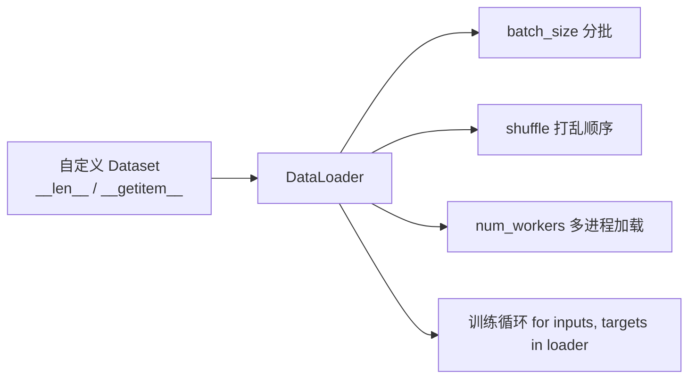

# Dataset 与 DataLoader

自定义 Dataset 描述单条数据如何读取，DataLoader 负责批量、打乱和多进程加载。



## 核心要点

* 自定义 Dataset 需要实现两个方法：`__len__`（返回数据总量）和 `__getitem__`（按索引返回一条数据）
* `DataLoader(dataset, batch_size=32, shuffle=True, num_workers=0)` 是常见用法
* `shuffle=True` 通常只在训练集上使用，验证/测试集一般不打乱
* `num_workers` 控制用几个子进程并行读取数据，能缓解数据读取成为瓶颈的问题
* Windows 下使用多进程 DataLoader 时，主程序必须放在 `if __name__ == "__main__":` 中

## 代码示例

```python
from torch.utils.data import Dataset, DataLoader

class RegressionDataset(Dataset):
    def __init__(self, features, targets):
        self.features = features
        self.targets = targets

    def __len__(self):
        return len(self.features)

    def __getitem__(self, index):
        return self.features[index], self.targets[index]

dataset = RegressionDataset(x, y)
train_loader = DataLoader(dataset, batch_size=32, shuffle=True, num_workers=0)

for inputs, targets in train_loader:
    ...
```

---

## 本章测验

### 第 1 题

自定义 Dataset 类必须实现哪两个方法？

- A. `forward` 和 `backward`
- B. `__len__` 和 `__getitem__`
- C. `train` 和 `eval`
- D. `step` 和 `zero_grad`

<details>
<summary>选择答案后查看结果</summary>

正确答案：B

答案解析：`__len__` 返回数据集的总条数，`__getitem__` 根据索引返回对应的一条数据，这两个方法是自定义 Dataset 的基本要求。

</details>

### 第 2 题

`DataLoader` 相比直接使用 `Dataset`，主要增加了什么能力？

- A. 定义单条数据如何读取
- B. 批量加载、打乱顺序、支持多进程读取
- C. 计算损失函数
- D. 自动选择优化器

<details>
<summary>选择答案后查看结果</summary>

正确答案：B

答案解析：Dataset 只负责描述单条数据怎么取，DataLoader 在其基础上实现分批打包、随机打乱以及利用多进程加速数据读取。

</details>

### 第 3 题

`shuffle=True` 通常应该用在哪个数据集上？

- A. 训练集
- B. 验证集
- C. 测试集
- D. 训练集、验证集、测试集都必须打乱

<details>
<summary>选择答案后查看结果</summary>

正确答案：A

答案解析：训练集打乱顺序有助于避免模型学到数据的排列规律、提高泛化能力；验证集和测试集通常不需要打乱，保持顺序便于稳定评估。

</details>

### 第 4 题

`num_workers` 参数的作用是什么？

- A. 控制模型的层数
- B. 控制用多少个子进程并行加载数据
- C. 控制学习率的大小
- D. 控制损失函数的类型

<details>
<summary>选择答案后查看结果</summary>

正确答案：B

答案解析：num_workers 决定用几个子进程去并行读取和预处理数据，当数据读取（如图像解码）比较慢、拖慢 GPU 利用率时，适当增大它能有效缓解瓶颈。

</details>

### 第 5 题

在 Windows 系统上使用多进程 DataLoader（num_workers>0）时，需要注意什么？

- A. 不需要任何特殊处理，和 Linux 完全一样
- B. 主程序的启动代码必须放在 `if __name__ == "__main__":` 中
- C. 必须关闭 shuffle
- D. batch_size 必须设置为 1

<details>
<summary>选择答案后查看结果</summary>

正确答案：B

答案解析：Windows 下多进程的启动方式和 Linux 不同，如果不把训练主逻辑放进 `if __name__ == "__main__":` 保护，使用多进程 DataLoader 容易出现反复递归启动等问题。

</details>

<!-- QUIZ_DATA_START
{
  "chapter": "10",
  "questions": [
    {"id": 1, "question": "自定义 Dataset 类必须实现哪两个方法？", "options": {"A": "forward 和 backward", "B": "__len__ 和 __getitem__", "C": "train 和 eval", "D": "step 和 zero_grad"}, "answer": "B", "explanation": "__len__ 返回数据集的总条数，__getitem__ 根据索引返回对应的一条数据，这两个方法是自定义 Dataset 的基本要求。"},
    {"id": 2, "question": "DataLoader 相比直接使用 Dataset，主要增加了什么能力？", "options": {"A": "定义单条数据如何读取", "B": "批量加载、打乱顺序、支持多进程读取", "C": "计算损失函数", "D": "自动选择优化器"}, "answer": "B", "explanation": "Dataset 只负责描述单条数据怎么取，DataLoader 在其基础上实现分批打包、随机打乱以及利用多进程加速数据读取。"},
    {"id": 3, "question": "shuffle=True 通常应该用在哪个数据集上？", "options": {"A": "训练集", "B": "验证集", "C": "测试集", "D": "训练集、验证集、测试集都必须打乱"}, "answer": "A", "explanation": "训练集打乱顺序有助于避免模型学到数据的排列规律、提高泛化能力；验证集和测试集通常不需要打乱，保持顺序便于稳定评估。"},
    {"id": 4, "question": "num_workers 参数的作用是什么？", "options": {"A": "控制模型的层数", "B": "控制用多少个子进程并行加载数据", "C": "控制学习率的大小", "D": "控制损失函数的类型"}, "answer": "B", "explanation": "num_workers 决定用几个子进程去并行读取和预处理数据，当数据读取（如图像解码）比较慢、拖慢 GPU 利用率时，适当增大它能有效缓解瓶颈。"},
    {"id": 5, "question": "在 Windows 系统上使用多进程 DataLoader（num_workers>0）时，需要注意什么？", "options": {"A": "不需要任何特殊处理，和 Linux 完全一样", "B": "主程序的启动代码必须放在 if __name__ == \"__main__\": 中", "C": "必须关闭 shuffle", "D": "batch_size 必须设置为 1"}, "answer": "B", "explanation": "Windows 下多进程的启动方式和 Linux 不同，如果不把训练主逻辑放进 if __name__ == \"__main__\": 保护，使用多进程 DataLoader 容易出现反复递归启动等问题。"}
  ]
}
QUIZ_DATA_END -->
